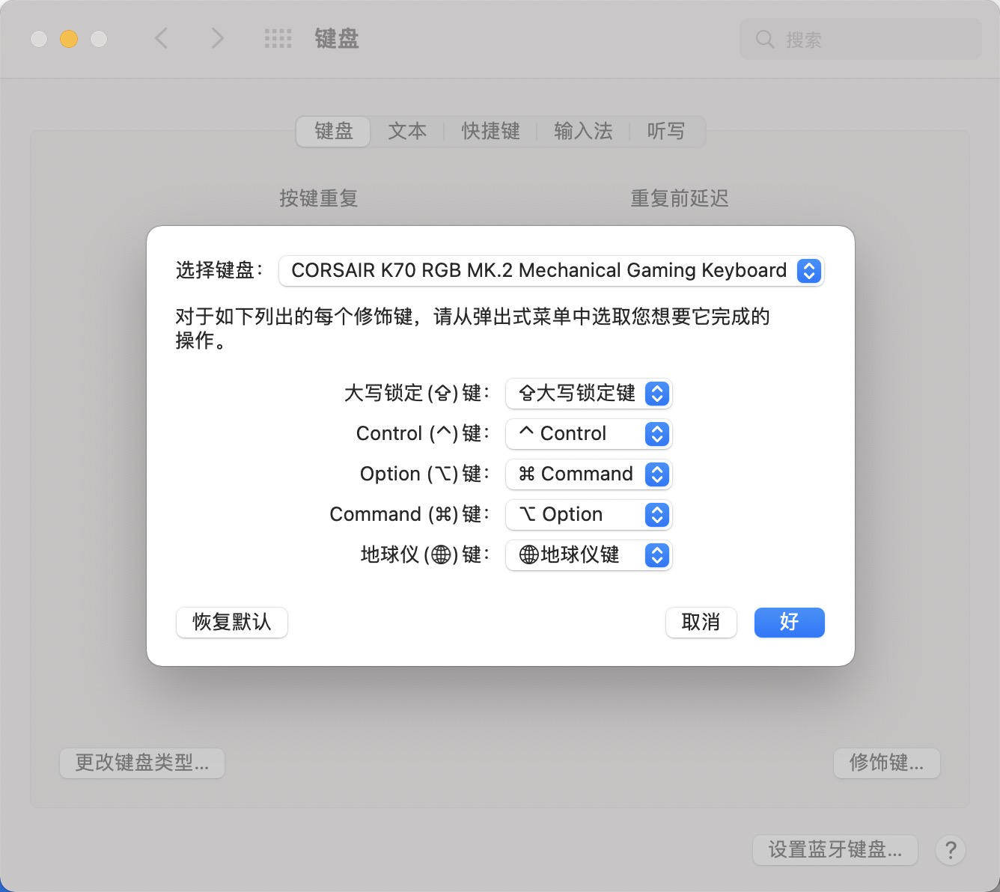

## M1芯片报错

需要将一系列的go/goland之类的切换为arm结构安装，go1.16之后才支持m1芯片。


## mac键盘映射问题

将option和command互换。




## M1执行go test 出现warning

该缺陷已修复，报错原因为：`kIOMasterPortDefault`已经被替换为`kIOMainPortDefault`，手动替换即可。

已经更新到0.0.2版本，[Deprecation warnings when building on macOS 12.0](https://github.com/karalabe/usb/issues/25)，利用go get 指定版本，并删除../../../../../pkg/mod/github.com/karalabe/usb目录下的老版本。但go tool似乎会指定老版本并下载。

```shell
# github.com/karalabe/usb
In file included from ../../../../../pkg/mod/github.com/karalabe/usb@v0.0.0-20190919080040-51dc0efba356/libs.go:50:
../../../../../pkg/mod/github.com/karalabe/usb@v0.0.0-20190919080040-51dc0efba356/libusb/libusb/os/darwin_usb.c:253:39: warning: 'kIOMasterPortDefault' is deprecated: first deprecated in macOS 12.0 [-Wdeprecated-declarations]
/Library/Developer/CommandLineTools/SDKs/MacOSX12.1.sdk/System/Library/Frameworks/IOKit.framework/Headers/IOKitLib.h:123:19: note: 'kIOMasterPortDefault' has been explicitly marked deprecated here
In file included from ../../../../../pkg/mod/github.com/karalabe/usb@v0.0.0-20190919080040-51dc0efba356/libs.go:50:
../../../../../pkg/mod/github.com/karalabe/usb@v0.0.0-20190919080040-51dc0efba356/libusb/libusb/os/darwin_usb.c:390:26: warning: 'kIOMasterPortDefault' is deprecated: first deprecated in macOS 12.0 [-Wdeprecated-declarations]
/Library/Developer/CommandLineTools/SDKs/MacOSX12.1.sdk/System/Library/Frameworks/IOKit.framework/Headers/IOKitLib.h:123:19: note: 'kIOMasterPortDefault' has been explicitly marked deprecated here
In file included from ../../../../../pkg/mod/github.com/karalabe/usb@v0.0.0-20190919080040-51dc0efba356/libs.go:50:
../../../../../pkg/mod/github.com/karalabe/usb@v0.0.0-20190919080040-51dc0efba356/libusb/libusb/os/darwin_usb.c:441:60: warning: 'kIOMasterPortDefault' is deprecated: first deprecated in macOS 12.0 [-Wdeprecated-declarations]
/Library/Developer/CommandLineTools/SDKs/MacOSX12.1.sdk/System/Library/Frameworks/IOKit.framework/Headers/IOKitLib.h:123:19: note: 'kIOMasterPortDefault' has been explicitly marked deprecated here
In file included from ../../../../../pkg/mod/github.com/karalabe/usb@v0.0.0-20190919080040-51dc0efba356/libs.go:51:
../../../../../pkg/mod/github.com/karalabe/usb@v0.0.0-20190919080040-51dc0efba356/hidapi/mac/hid.c:693:34: warning: 'kIOMasterPortDefault' is deprecated: first deprecated in macOS 12.0 [-Wdeprecated-declarations]
/Library/Developer/CommandLineTools/SDKs/MacOSX12.1.sdk/System/Library/Frameworks/IOKit.framework/Headers/IOKitLib.h:123:19: note: 'kIOMasterPortDefault' has been explicitly marked deprecated here

```


## proto编译报错

```shell
 $ protoc -I=. \
        -I/Users/liruoxin/goproject/src \
        --gogofaster_out=:. \
        receipt.proto
        
protoc-gen-gogofaster: program not found or is not executable
Please specify a program using absolute path or make sure the program is available in your PATH system variable
--gogofaster_out: protoc-gen-gogofaster: Plugin failed with status code
(base)
```


拉一下这个包`go get -u github.com/gogo/protobuf/protoc-gen-gogofaster`，默认安装到$GOBIN目录下，记得将GOBIN目录添加到PATH目录`export PATH=$GOBIN:$PATH`（或者将该二进制文件copy到/usr/local/bin）