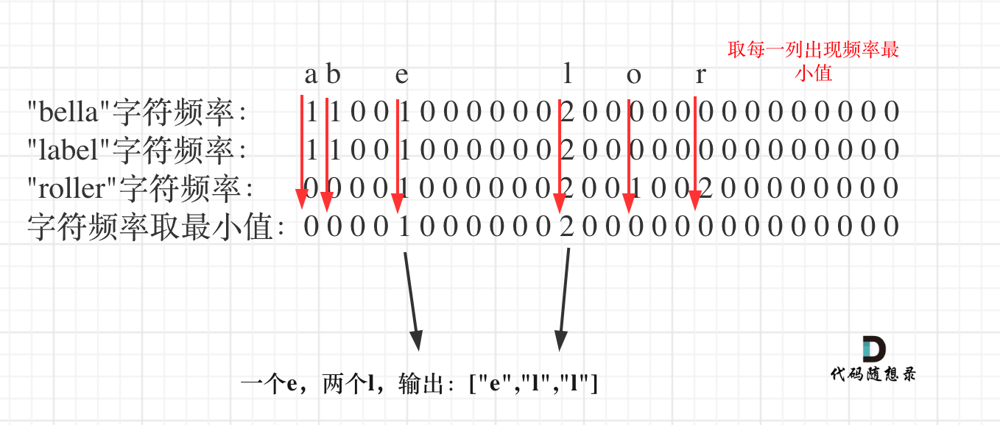

#### [1002. 查找常用字符](https://leetcode-cn.com/problems/find-common-characters/)

给定仅有小写字母组成的字符串数组 A，返回列表中的每个字符串中都显示的全部字符（包括重复字符）组成的列表。例如，如果一个字符在每个字符串中出现 3 次，但不是 4 次，则需要在最终答案中包含该字符 3 次。

你可以按任意顺序返回答案。

 

```
示例 1：

输入：["bella","label","roller"]
输出：["e","l","l"]

示例 2：

输入：["cool","lock","cook"]
输出：["c","o"]

提示：

1 <= A.length <= 100
1 <= A[i].length <= 100
`A[i][j] `是小写字母
```


#### 解题思路：

**“小写字符”，“出现频率”， 这些关键字都是为哈希法量身定做的。**

整体思路就是统计出搜索字符串里26个字符的出现的频率，然后取每个字符频率最小值，最后转成输出格式就可以了。算法流程如下：

1. 先统计第一个字符串所有字符出现的次数。
2. 接下来，把其他字符串里字符的出现次数也统计出来一次放在hashOtherStr中。
3. 对每次的hash 和 hashOtherStr 取最小值，这是本题关键所在，此时取最小值，就是一个字符在所有字符串里出现的最小次数了。
4. 此时hash里统计着字符在所有字符串里出现的最小次数，那么把hash转正题目要求的输出格式就可以了。




**代码演示：**

```java
import java.util.ArrayList;
import java.util.List;

class Solution {
    public List<String> commonChars(String[] A) {
        int[] hash = new int[26];
        List<String> res = new ArrayList<>();
        for (int i = 0; i < A[0].length(); i++) {
            hash[A[0].charAt(i) - 'a']++;
        }
        for (int i = 1; i < A.length; i++) {
            int[] hashOtherStr = new int[26];
            //记录当前的A[i]对应的字符串的hash表
            for (int j = 0; j < A[i].length(); j++) {
                hashOtherStr[A[i].charAt(j) - 'a']++;
            }
            //更新hash表，只要有一个A[i]对应的某个字符没有出现（比如a），则hashOtherStr[0]==0
            //hash[0]就会更新为0，所以hash表最终输出的是所有的字符串出现的公共字符频率最小的次数
            for (int k = 0; k < 26; k++) {
                hash[k] = Math.min(hash[k], hashOtherStr[k]);
            }
        }
        //根据hash表存储到list中，注意list类型为string
        //根据String.valueOf将char转换为String
        for (int i = 0; i < 26; i++) {
            while (hash[i] != 0) {
                String s = String.valueOf((char)(i+'a'));
                res.add(s);
                hash[i]--;
            }
        }
        return res;
    }
}
```

