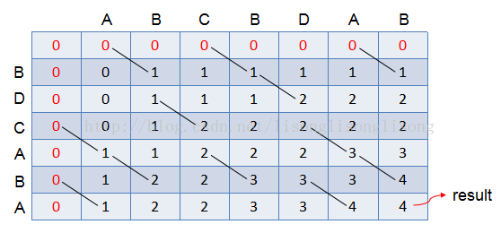
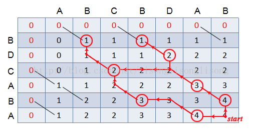

#### [1143. 最长公共子序列](https://leetcode-cn.com/problems/longest-common-subsequence/)

#### 最长公共子序列:

给定两个字符串 text1 和 text2，返回这两个字符串的最长公共子序列的长度。

一个字符串的 子序列 是指这样一个新的字符串：它是由原字符串在不改变字符的相对顺序的情况下删除某些字符（也可以不删除任何字符）后组成的新字符串。
例如，"ace" 是 "abcde" 的子序列，但 "aec" 不是 "abcde" 的子序列。两个字符串的「公共子序列」是这两个字符串所共同拥有的子序列。

若这两个字符串没有公共子序列，则返回 0。

 

```
示例 1:

输入：text1 = "abcde", text2 = "ace" 
输出：3  
解释：最长公共子序列是 "ace"，它的长度为 3。
示例 2:

输入：text1 = "abc", text2 = "abc"
输出：3
解释：最长公共子序列是 "abc"，它的长度为 3。
示例 3:

输入：text1 = "abc", text2 = "def"
输出：0
解释：两个字符串没有公共子序列，返回 0。


提示:

1 <= text1.length <= 1000
1 <= text2.length <= 1000
输入的字符串只含有小写英文字符。
```


**解题思路：**

最长公共子序列（Longest Common Subsequence，简称 LCS）是一道非常经典的面试题目，因为它的解法是典型的二维动态规划，大部分比较困难的字符串问题都和这个问题一个套路，比如说编辑距离。而且，这个算法稍加改造就可以用于解决其他问题，所以说LCS算法是值得掌握的。

所谓子序列，就是要保留原始顺序，但可以是不连续的。审题之后你可能会有疑问，这个问题为啥就是动态规划来解决呢？因为子序列类型的问题，穷举出所有可能的结果都不容易，而动态规划算法做的就是穷举 + 剪枝，它俩天生一对儿。所以可以说只要涉及子序列问题，十有八九都需要动态规划来解决。

1. **明确 dp 数组的含义**

   对于两个字符串的动态规划问题，套路是通用的。

   比如说对于字符串 s1 和 s2，它们的长度分别是 m、n，一般来说都要构造一个这样的 DP table：int[][] dp = new int[m+1][n+1]。

   这里**为什么要加1**，原因是你可以不加1，但是不加1你就会用其它限制条件来确保这个index是有效的，而当你加1之后你就不需要去判断只是让索引为0的行和列表示空串。


2. **定义 base case**
   我们专门让索引为0的行和列表示空串，dp[0][...] 和 dp[...][0] 都应该初始化为0，这就是base case。

3. **找状态转移方程**
   这是动态规划最难的一步，我们来通过案例推导出来。求 s1 和 s2 的最长公共子序列，不妨称这个子序列为 lcs。那么对于 s1 和 s2 中的每个字符，有什么选择？很简单，两种选择，要么在 lcs 中，要么不在。

   

这个「在」和「不在」就是选择，关键是，应该如何选择呢？如果某个字符应该在 lcs 中，那么这个字符肯定同时存在于 s1 和 s2 中，所以本题的思路是这样：

- 用两个指针 i 和 j 从后往前遍历 s1 和 s2，如果 s1[i]==s2[j]，那么这个字符一定在 lcs 中，去找它们前面各退一格的值加1即可：`dp[i+1][j+1] = dp[i][j] + 1;`
- 对比的这两个字符不相同的，那么我们要取它的「要么是s1往前退一格，要么是s2往前退一格，两个的最大值」
  dp[i + 1][j + 1] = Math.max(dp[i+1][j], dp[i][j+1]);

动态数组如下，其中d[2][4] 的含义就是：对于 `"ac"` 和 `"babc"`，它们的 LCS 长度是 2。我们最终想得到的答案应该是 `dp[3][6]`。：


代码演示：

```java
class Solution {
    public int  longestCommonSubsequence(String text1, String text2) {
        char[] s1 = text1.toCharArray();
        char[] s2 = text2.toCharArray();
        int length1 = s1.length;
        int length2 = s2.length;
        //dp[i][0] 都应该初始化为0,增加一行一列相当于空串，让base case也能使用状态转移方程
        int[][] dp = new int[length1+1][length2+1];
        for (int i = 1; i < length1 +1; i++) {
            for (int j = 1; j < length2 +1; j++) {
                //因为s1[0]为第一个字符
                if (s1[i-1] == s2[j-1]){
                    // 这边找到一个 lcs 的元素，继续往前找
                    dp[i][j] = 1+ dp[i-1][j-1];
                }else {
                    //谁能让 lcs 最长，就听谁的
                    dp[i][j] = Math.max(dp[i-1][j],dp[i][j-1]);
                }
            }
        }
        return dp[length1][length2];
    }
}
```

> 时间复杂度：O(mn),m、n分别为字符串长度；
> 空间复杂度：O(mn), 即dp数组大小。


#### 输出最长公共子序列：

给定两个序列，例如 str1 = “ABCBDAB”、Y = “BDCABA”，求它们的最长公共子序列的长度。

下面是求解时的动态规划表，可以看出 X 和 Y 的最长公共子序列的长度为4：



输出一个最长公共子序列并不难，难点在于输出所有的最长公共子序列，因为 LCS 通常不唯一。总之，我们需要在动态规划表上进行回溯 —— 从`dp[m][n]`，即右下角的格子，开始进行判断：

1. 如果格子`dp[i][j]`对应的`str[i-1] == str[j-1]`，则把这个字符放入 LCS 中，并跳入`dp[i-1][j-1]`中继续进行判断；
2. 如果格子`dp[i][j]`对应的 `X[i-1] ≠ Y[j-1]`，则比较`table[i-1][j]`和`dp[i][j-1]`的值，跳入值较大的格子继续进行判断；
3. 直到 i 或 j 小于等于零为止，倒序输出 LCS 。

**如果出现`dp[i-1][j]`等于`dp[i][j-1]`的情况，说明最长公共子序列有多个，故两边都要进行回溯（这里用到递归）。**



从上图的红色路径显示，str1 和 str2 的最长公共子序列有 3 个，分别为 “BDAB”、“BCAB”、“BCBA”。

**代码演示：**

```java
import java.util.Scanner;
import java.util.HashSet;

public class Solution {
    public static void main(String [] args){
        Scanner sc = new Scanner(System.in);

        String str1 = sc.nextLine();
        String str2 = sc.nextLine();
        char [] s1 = str1.toCharArray();
        char [] s2 = str2.toCharArray();
        int [][] dp = getMaxLCSLength(s1, s2);
        int len = dp[s1.length][s2.length];
        String lcs_str = "";
        traceBack(dp, s1, s2, s1.length,s2.length,lcs_str);
        System.out.println(len);
    }

    //求最长公共子序列的长度，返回dp数组
    public static int[][] getMaxLCSLength(char [] arr1, char [] arr2){
        int len1 = arr1.length;
        int len2 = arr2.length;
        int [][] dp = new int[len1+1][len2+1];//此处的动态规划数组长度要比原长度多加1，需要多存储一行0和一列0
        for(int i = 1;i<=len1;i++){
            for(int j = 1;j<=len2;j++){
                if(arr1[i-1] == arr2[j-1]){//注意这里若是arr1[i] == arr2[j]，就会发生数组越界
                    dp[i][j] = dp[i-1][j-1] + 1;
                }else {
                    dp[i][j] = Math.max(dp[i-1][j], dp[i][j-1]);
                }
            }
        }
        //return dp[len1][len2];
        return dp;
    }

    //功能：回溯，求出所有的最长公共子序列，并放入set中
    public static void traceBack(int [][] dp, char [] arr1, char [] arr2, int i, int j, String lcs_str) {
        HashSet<String> set = new HashSet<String>();
        while (i>0 && j>0) {
            if (arr1[i-1] == arr2[j-1]) {
                lcs_str += arr1[i-1];
                i--;
                j--;
            }
            else {
                if (dp[i][j-1]>dp[i-1][j])
                    j--;
                else if (dp[i][j-1]<dp[i-1][j])
                    i--;
                else {  // 相等的情况
                    traceBack(dp, arr1, arr2, i-1, j, lcs_str);
                    traceBack(dp, arr1, arr2, i, j-1, lcs_str);
                }
            }
        }
        set.add(reverse(lcs_str));
        //输出最长公共子序列
        for(String s : set) {
            System.out.println(s);
        }
    }

    //功能：字符串逆序
    public static String reverse(String str) {
        StringBuffer strBuf = new StringBuffer(str).reverse();
        return strBuf.toString();
    }
}
```


#### 最长公共子串：

计算两个字符串的最大公共子串（Longest Common Substring）的长度，字符不区分大小写。

```
输入：

输入两个字符串

输出：

输出一个整数

样例输入：

asdfas 
werasdfaswer

样例输出：

6
```


**解题思路：**

这里的**最大公共子串要求的字串是连续**的。

求子串的方法和求子序列方法类似：

- 当`str1[i] == str2[j]`时，子序列长度`dp[i][j] = dp[i - 1][j - 1] + 1`；

- 当`str1[i] ！= str2[j]`时，`dp[i][j]`长度要为0，而不是`max{dp[i - 1][j], dp[i][j - 1]}`。

**代码演示：**

```java
class Solution {
    public static void main(String[] args) {
        String str1 = "asdfas";
        String str2 = "werasdfaswer";
        System.out.println(longestCommonSubstring(str1,str2));
    }
    public static int longestCommonSubstring(String text1, String text2) {
        char[] s1 = text1.toCharArray();
        char[] s2 = text2.toCharArray();
        int length1 = s1.length;
        int length2 = s2.length;
        int max = 0;
        //dp[i][0] 都应该初始化为0,增加一行一列相当于空串，让base case也能使用状态转移方程
        int[][] dp = new int[length1+1][length2+1];
        for (int i = 1; i < length1 +1; i++) {
            for (int j = 1; j < length2 +1; j++) {
                //因为s1[0]为第一个字符
                if (s1[i-1] == s2[j-1]){
                    // 这边找到一个 lcs 的元素，继续往前找
                    dp[i][j] = 1+ dp[i-1][j-1];
                    max = Math.max(max,dp[i][j]);
                }else {
                    //因为最大子串必须是连续的，动态转移方程有所改变
                    dp[i][j] = 0;
                }
            }
        }
        return max;
    }
}
```


**空间优化：**

因为下一行的取值只与上一行有关，所以可以将二维数组优化成一维数组，不过要注意第二层必须要**逆序遍历**。


```java
class Solution {
    public static void main(String[] args) {
        String str1 = "asdfas";
        String str2 = "werasdfaswer";
        System.out.println(longestCommonSubstring(str1,str2));
    }
    public static int longestCommonSubstring(String text1, String text2) {
        char[] s1 = text1.toCharArray();
        char[] s2 = text2.toCharArray();
        int length1 = s1.length;
        int length2 = s2.length;
        int max = 0;
        int[] dp = new int[Math.max(length1,length2)+1];
        for (int i = 1; i <= length1; i++) {
            for (int j = length2; j > 0; j--) {
                if (s1[i - 1] == s2[j - 1]) {
                    dp[j] = dp[j - 1] + 1;//此时dp[j-1]还是上次循环中的值，因为还没被重新赋值
                    max = Math.max(max, dp[j]);
                } else {
                    dp[j] = 0;
                }
            }
        }
        return max;
    }
}
```


常数优化（但是增加了时间复杂度）：

```java
class Solution {
    public static void main(String[] args) {
        String str1 = "asdfas";
        String str2 = "werasdfaswer";
        System.out.println(longestCommonSubstring(str1,str2));
    }

    public static int longestCommonSubstring(String text1, String text2) {
        char[] s1 = text1.toCharArray();
        char[] s2 = text2.toCharArray();
        int length1 = s1.length;
        int length2 = s2.length;‘
        //设置tmp记录出现的公共子串长度
        int max = 0, tmp = 0;
        for (int i = 0; i < length1; i++) {
            for (int j = 0; j < length2; j++) {
                tmp = 0;
                //出现公共子串，tmp++，max记录最长tmp，下一个循环把tmp置为0
                while (i + tmp < length1 && j + tmp < length2) {
                    if (s1[i + tmp] == s2[j + tmp]) {
                        tmp++;
                    } else {
                        break;
                    }
                }
                if (tmp > max) {
                    max = tmp;
                }
            }
            if (max == length2 || length1 - i < max) {
                break;
            }
        }
        return max;
    }
}
```


#### 输出最长公共子串：

```java
class Solution {
    public static void main(String[] args) {
        String str1 = "asdfas";
        String str2 = "werasdfaswer";
        System.out.println(longestCommonSubstring(str1,str2));
    }
    public static int longestCommonSubstring(String text1, String text2) {
        char[] s1 = text1.toCharArray();
        char[] s2 = text2.toCharArray();
        int length1 = s1.length;
        int length2 = s2.length;
        int maxLen = length1 > length2 ? length1 : length2;
        char[] maxStr = maxLen == length1 ? s1 : s2;

        int[] max = new int[maxLen];// 保存最长子串长度的数组
        int[] maxIndex = new int[maxLen];// 保存最长子串长度最大索引的数组
        int[] dp = new int[maxLen+1];
        for (int i = 1; i <= length1; i++) {
            for (int j = length2; j > 0; j--) {
                if (s1[i - 1] == s2[j - 1]) {
                    dp[j] = dp[j - 1] + 1;//此时dp[j-1]还是上次循环中的值，因为还没被重新赋值
                } else {
                    dp[j] = 0;
                }
                // 如果是大于那暂时只有一个是最长的,而且要把后面的清0;
                if (dp[j] > max[0]) {
                    max[0] = dp[j];
                    maxIndex[0] = j;

                    for (int k = 1; k < maxLen; k++) {
                        max[k] = 0;
                        maxIndex[k] = 0;
                    }
                }
                // 有多个是相同长度的子串
                else if (dp[j] == max[0]) {
                    for (int k = 1; k < maxLen; k++) {
                        if (max[k] == 0) {
                            max[k] = dp[j];
                            maxIndex[k] = j;
                            break; // 在后面加一个就要退出循环了
                        }
                    }
                }
            }
        }
        //打印最长子字符串
        for (int j = 0; j < maxLen; j++) {
            if (max[j] > 0) {
                System.out.println("第" + (j + 1) + "个公共子串:");
                for (int i = maxIndex[j] - max[j] ; i < maxIndex[j]; i++)
                    System.out.print(maxStr[i]);
                System.out.println(" ");
            }
        }
        return max[0];
    }
}
```

