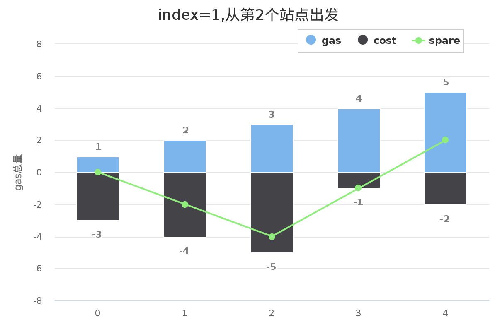
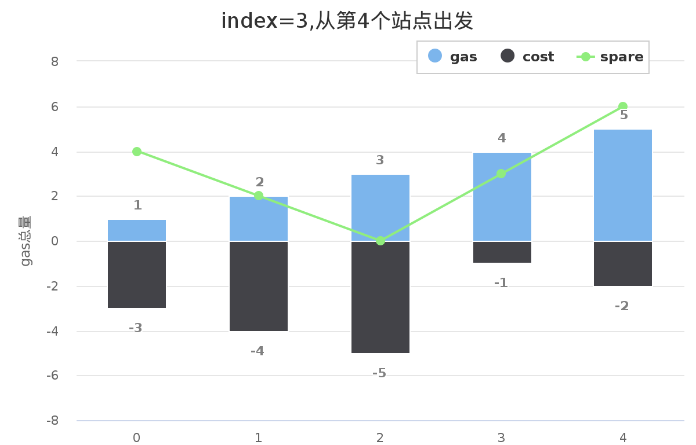

#### [134. 加油站](https://leetcode-cn.com/problems/gas-station/)

在一条环路上有 N 个加油站，其中第 i 个加油站有汽油 gas[i] 升。

你有一辆油箱容量无限的的汽车，从第 i 个加油站开往第 i+1 个加油站需要消耗汽油 cost[i] 升。你从其中的一个加油站出发，开始时油箱为空。

如果你可以绕环路行驶一周，则返回出发时加油站的编号，否则返回 -1。

说明: 

如果题目有解，该答案即为唯一答案。
输入数组均为非空数组，且长度相同。
输入数组中的元素均为非负数。

```
示例 1:

输入: 
gas  = [1,2,3,4,5]
cost = [3,4,5,1,2]

输出: 3

解释:
从 3 号加油站(索引为 3 处)出发，可获得 4 升汽油。此时油箱有 = 0 + 4 = 4 升汽油
开往 4 号加油站，此时油箱有 4 - 1 + 5 = 8 升汽油
开往 0 号加油站，此时油箱有 8 - 2 + 1 = 7 升汽油
开往 1 号加油站，此时油箱有 7 - 3 + 2 = 6 升汽油
开往 2 号加油站，此时油箱有 6 - 4 + 3 = 5 升汽油
开往 3 号加油站，你需要消耗 5 升汽油，正好足够你返回到 3 号加油站。
因此，3 可为起始索引。
```


```
示例 2:

输入: 
gas  = [2,3,4]
cost = [3,4,3]

输出: -1

解释:
你不能从 0 号或 1 号加油站出发，因为没有足够的汽油可以让你行驶到下一个加油站。
我们从 2 号加油站出发，可以获得 4 升汽油。 此时油箱有 = 0 + 4 = 4 升汽油
开往 0 号加油站，此时油箱有 4 - 3 + 2 = 3 升汽油
开往 1 号加油站，此时油箱有 3 - 3 + 3 = 3 升汽油
你无法返回 2 号加油站，因为返程需要消耗 4 升汽油，但是你的油箱只有 3 升汽油。
因此，无论怎样，你都不可能绕环路行驶一周。
```

#### 解题思路

以该题为例：
gas  = [1,2,3,4,5]
cost = [3,4,5,1,2]
下图绿色折线图即总油量剩余值spare，不同起点对应的绿色折线图位置不同，若要满足题目的要求：跑完全程再回到起点，总油量剩余值的任意部分**都需要在X轴以上**，且跑到终点时：**总剩余汽油量 >= 0**。








​	为了让绿色折线图任意部分都在 X 轴以上，我们需要根据起点不同向上移动绿色折线图，直到所有点都在X轴或X轴以上。此时对应的起点即为出发点。我们会发现，起点不同时整体折线图的形状是没有变的，改变的是y值，相当于将折线图在Y轴方向上下平移。那么，当最小点minSpare落在X轴上时（也就是使得最小点y=0时），整体折线在X轴上方，y值恒大于等于0，也就是剩余油量一直不为负，可以绕行一圈。

**计算思路：**

1. 首先判断总gas能不能大于等于总cost，如果总gas不够，一切都白搭（即spare < 0，return -1）；
2. 找总（gas-cost）的最低点minIndex，不管正负（当然如果最低点都是正的话那肯定能跑完了）；
3. 找到minIndex后，如果有解，那么解就是最低点的下一个点minIndex+1，因为总（gas-cost）是大于等于0的，所以前面损失的gas我从最低点下一个点开始都会拿回来。

代码演示：

```java
public int canCompleteCircuit(int[] gas, int[] cost) {
    int len = gas.length;
    //记录sum(gas-cost)
    int spare = 0;
    //记录最低的sum(gas-cost)
    int minSpare = Integer.MAX_VALUE;
    //记录处于最低的sum(gas-cost)的加油站位置
    int minIndex = 0;

    for (int i = 0; i < len; i++) {
        spare += gas[i] - cost[i];
        if (spare < minSpare) {
            minSpare = spare;
            minIndex = i;
        }
    }
	//spare < 0时无解
    // 加油站是环形的
    return spare < 0 ? -1 : (minIndex + 1) % len;
}

```

> 时间复杂度：O(n)
>
> 空间复杂度：O(1)

