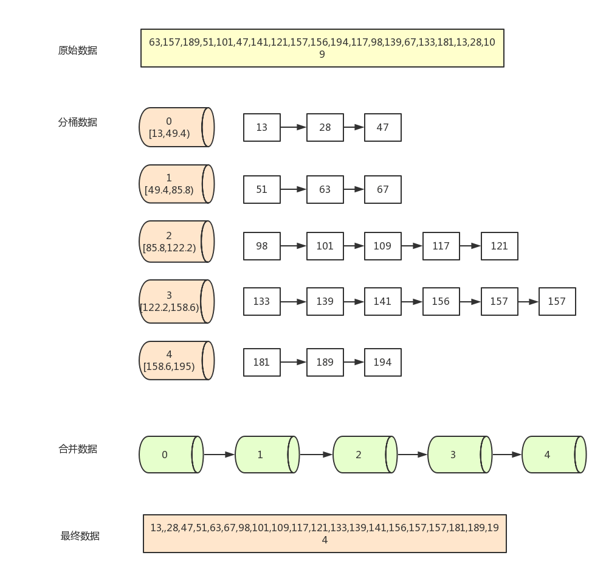

#### [164. 最大间距](https://leetcode-cn.com/problems/maximum-gap/)

给定一个无序的数组，找出数组在排序之后，相邻元素之间最大的差值。

如果数组元素个数小于 2，则返回 0。

```
示例 1:

输入: [3,6,9,1]
输出: 3
解释: 排序后的数组是 [1,3,6,9], 其中相邻元素 (3,6) 和 (6,9) 之间都存在最大差值 3。

示例 2:

输入: [10]
输出: 0
解释: 数组元素个数小于 2，因此返回 0。

说明:

你可以假设数组中所有元素都是非负整数，且数值在 32 位有符号整数范围内。
请尝试在线性时间复杂度和空间复杂度的条件下解决此问题。
```

#### 解题思路

题目要求**在线性时间复杂度和空间复杂度的条件下解决此问题**。但传统的基于比较的排序算法（快速排序、归并排序等）均需要 O*(*N*log*N) 的时间复杂度。我们必须使用其他的排序算法。例如基数排序和桶排序。


**方法一：基数排序**

​	基数排序也是非比较的排序算法，对每一位进行排序，从最低位开始排序，复杂度为O(kn),为数组长度，k为数组中的数的最大的位数；

​	基数排序是按照低位先排序，然后收集；再按照高位排序，然后再收集；依次类推，直到最高位。有时候有些属性是有优先级顺序的，先按低优先级排序，再按高优先级排序。最后的次序就是高优先级高的在前，高优先级相同的低优先级高的在前。基数排序基于分别排序，分别收集，所以是稳定的。

**算法描述**

- 取得数组中的最大数，并取得位数；
- arr为原始数组，从最低位开始取每个位组成radix数组；
- 对radix进行计数排序（利用计数排序适用于小范围数的特点）；

**动图演示**

 


**基数排序模板：**

```java
　　/**
     * 基数排序
     */
    public static int[] RadixSort(int[] array) {
        if (array == null || array.length < 2)
            return array;
        // 1.先算出最大数的位数；
        int max = array[0];
        for (int i = 1; i < array.length; i++) {
            max = Math.max(max, array[i]);
        }
        int maxDigit = 0;
        while (max != 0) {
            max /= 10;
            maxDigit++;
        }
        int mod = 10, div = 1;
        ArrayList<ArrayList<Integer>> bucketList = new ArrayList<ArrayList<Integer>>();
        for (int i = 0; i < 10; i++)
            bucketList.add(new ArrayList<Integer>());
        for (int i = 0; i < maxDigit; i++, mod *= 10, div *= 10) {
            for (int j = 0; j < array.length; j++) {
                int num = (array[j] % mod) / div;
                bucketList.get(num).add(array[j]);
            }
            int index = 0;
            for (int j = 0; j < bucketList.size(); j++) {
                for (int k = 0; k < bucketList.get(j).size(); k++)
                    array[index++] = bucketList.get(j).get(k);
                bucketList.get(j).clear();
            }
        }
        return array;
    } 
```

**代码演示**：

```java
import java.util.ArrayList;
import java.util.Arrays;

class Solution {
    public int maximumGap(int[] nums) {
        if (nums == null || nums.length < 2)
            return 0;
        // 1.先算出最大数的位数；
        int max = nums[0];
        for (int i = 1; i < nums.length; i++) {
            max = Math.max(max, nums[i]);
        }
        int maxDigit = 0;
        while (max != 0) {
            max /= 10;
            maxDigit++;
        }
        int mod = 10, div = 1;
        ArrayList<ArrayList<Integer>> bucketList = new ArrayList<ArrayList<Integer>>();
        for (int i = 0; i < 10; i++)
            bucketList.add(new ArrayList<Integer>());
        for (int i = 0; i < maxDigit; i++, mod *= 10, div *= 10) {
            for (int j = 0; j < nums.length; j++) {
                int num = (nums[j] % mod) / div;
                bucketList.get(num).add(nums[j]);
            }
            int index = 0;
            for (int j = 0; j < bucketList.size(); j++) {
                for (int k = 0; k < bucketList.get(j).size(); k++)
                    nums[index++] = bucketList.get(j).get(k);
                bucketList.get(j).clear();
            }
        }
        int res = 0;
        for (int i = 0; i < nums.length - 1; i++) {
            res = Math.max(res, nums[i+1] - nums[i]);
        }
        return res;
    }
}
```

> - 时间复杂度：O(*N*)，其中 *N* 是数组的长度。
> - 空间复杂度：O(*N*)，其中 *N* 是数组的长度。


**方法二：桶排序**

桶排序是计数排序的升级版。它利用了函数的映射关系，高效与否的关键就在于这个映射函数的确定。

​	桶排序 (Bucket sort)的工作的原理：假设输入数据服从均匀分布，将数据分到有限数量的桶里，每个桶再分别排序（有可能再使用别的排序算法或是以递归方式继续使用桶排序进行排


**算法描述**

- 人为设置一个BucketSize，作为每个桶所能放置多少个不同数值（例如当BucketSize==5时，该桶可以存放｛1,2,3,4,5｝这几种数字，但是容量不限，即可以存放100个3）；
- 遍历输入数据，并且把数据一个一个放到对应的桶里去；
- 对每个不是空的桶进行排序，可以使用其它排序方法，也可以递归使用桶排序；
- 从不是空的桶里把排好序的数据拼接起来。 

**注意，如果递归使用桶排序为各个桶排序，则当桶数量为1时要手动减小BucketSize增加下一循环桶的数量，否则会陷入死循环，导致内存溢出。**


**图片演示**




**桶排序模板**

```java
    /**
     * 桶排序
     */
    public static ArrayList<Integer> BucketSort(ArrayList<Integer> array, int bucketSize) {
        if (array == null || array.size() < 2)
            return array;
        int max = array.get(0), min = array.get(0);
        // 找到最大值最小值
        for (int i = 0; i < array.size(); i++) {
            if (array.get(i) > max)
                max = array.get(i);
            if (array.get(i) < min)
                min = array.get(i);
        }
        int bucketCount = (max - min) / bucketSize + 1;
        ArrayList<ArrayList<Integer>> bucketArr = new ArrayList<>(bucketCount);
        ArrayList<Integer> resultArr = new ArrayList<>();
        for (int i = 0; i < bucketCount; i++) {
            bucketArr.add(new ArrayList<Integer>());
        }
        for (int i = 0; i < array.size(); i++) {
            bucketArr.get((array.get(i) - min) / bucketSize).add(array.get(i));
        }
        for (int i = 0; i < bucketCount; i++) {
            if (bucketSize == 1) { // 如果带排序数组中有重复数字时  感谢 @见风任然是风 朋友指出错误
                for (int j = 0; j < bucketArr.get(i).size(); j++)
                    resultArr.add(bucketArr.get(i).get(j));
            } else {
                if (bucketCount == 1)
                    bucketSize--;
                ArrayList<Integer> temp = BucketSort(bucketArr.get(i), bucketSize);
                for (int j = 0; j < temp.size(); j++)
                    resultArr.add(temp.get(j));
            }
        }
        return resultArr;
    }
```

**算法分析**

桶排序最好情况下使用线性时间O(n)，桶排序的时间复杂度，取决与对各个桶之间数据进行排序的时间复杂度，因为其它部分的时间复杂度都为O(n)。很显然，桶划分的越小，各个桶之间的数据越少，排序所用的时间也会越少。但相应的空间消耗就会增大。 

> - 最佳情况：T(n) = O(n+k)
> - 最差情况：T(n) = O(n+k)
> - 平均情况：T(n) = O(n<sup>2</sup>)
> - 空间复杂度：O(n+k)　　


**代码演示：**

```Java
import java.util.Arrays;

class Solution {
    public int maximumGap(int[] nums) {
        int n = nums.length;
        if (n < 2) {
            return 0;
        }
        int minVal = Arrays.stream(nums).min().getAsInt();
        int maxVal = Arrays.stream(nums).max().getAsInt();
        int d = Math.max(1, (maxVal - minVal) / (n - 1));
        int bucketSize = (maxVal - minVal) / d + 1;

        int[][] bucket = new int[bucketSize][2];
        for (int i = 0; i < bucketSize; ++i) {
            Arrays.fill(bucket[i], -1); // 存储 (桶内最小值，桶内最大值) 对， (-1, -1) 表示该桶是空的
        }
        for (int i = 0; i < n; i++) {
            int idx = (nums[i] - minVal) / d;
            if (bucket[idx][0] == -1) {
                bucket[idx][0] = bucket[idx][1] = nums[i];
            } else {
                bucket[idx][0] = Math.min(bucket[idx][0], nums[i]);
                bucket[idx][1] = Math.max(bucket[idx][1], nums[i]);
            }
        }

        int res = 0;
        int prev = -1;
        for (int i = 0; i < bucketSize; i++) {
            if (bucket[i][0] == -1) {
                continue;
            }
            if (prev != -1) {
                res = Math.max(res, bucket[i][0] - bucket[prev][1]);
            }
            prev = i;
        }
        return res;
    }
}

```

