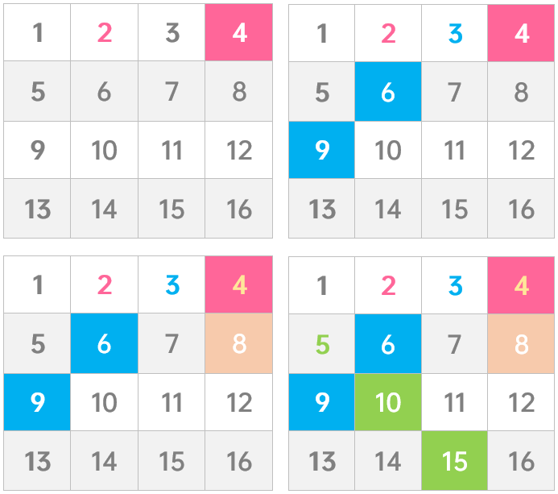
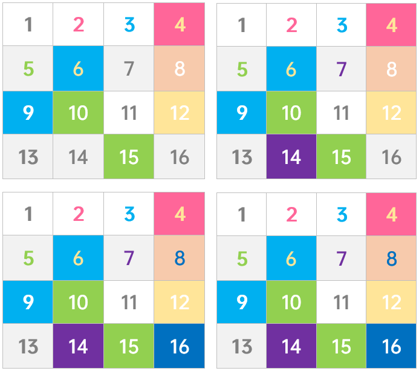
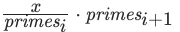
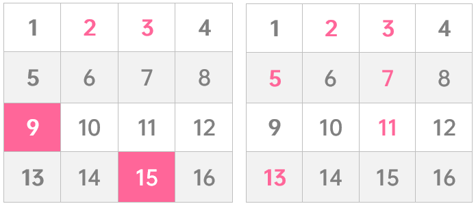

#### [204. 计数质数](https://leetcode-cn.com/problems/count-primes/)

统计所有小于非负整数 n 的质数的数量。

```
示例 1：

输入：n = 10
输出：4
解释：小于 10 的质数一共有 4 个, 它们是 2, 3, 5, 7 。
示例 2：

输入：n = 0
输出：0
示例 3：

输入：n = 1
输出：0


提示：

0 <= n <= 5 * 106
```

#### 解题思路

**1. 暴力解(超时)**

很直观的思路是我们枚举每个数判断其是不是质数。

1. 将其对每一个比其小的数进行取余运算，并对取余为零的情况进行计数。

2. 遍历时我们只需要枚举 `[2, x ] `中的所有数即可，这样单次检查的时间复杂度从O(n) 降低至了 O(\sqrt{n})。

   ```java
   class Solution {
       public int countPrimes(int n) {
           int res = 0;
           for (int i = 2; i < n; ++i) {
               boolean isPrime = true;
                for (int j = 2; j * j <= i; j++) {
                    if(i % j == 0) {
                        isPrime = false;
                        break;
                    }
                }
               if(isPrime) res++;
           }
           return res;
       }
   }
   ```

   > 时间复杂度：O(n\sqrt{n})
   >
> 空间复杂度：O(1)。

   

**2. 埃氏筛**

这是一个古老的筛素数的方法。方法如下：

1. 初始化长度 O(n) 的标记数组，表示这个数组是否为质数。数组初始化所有的数都是质数.
2. 从 2 开始将当前数字的倍数全都标记为合数。标记到 \sqrt{n} 时停止即可。


注意每次找当前素数 x 的倍数时，是从x<sup>2</sup>开始的。因为如果x>2，那么 2∗x 肯定被素数 2 给过滤了，最小未被过滤的肯定是 x<sup>2</sup>。

```java
class Solution {  
    public int countPrimes(int n) {
        boolean[] isPrime = new boolean[n];
        Arrays.fill(isPrime, true);
        // 从 2 开始枚举到 sqrt(n)。
        for (int i = 2; i * i < n; i++) {
            // 如果当前是素数
            if (isPrime[i]) {
                // 就把从 i*i 开始，i 的所有倍数都设置为 false。
                for (int j = i * i; j < n; j+=i) {
                    isPrime[j] = false;
                }
            }
        }
        // 计数
        int res = 0;
        for (int i = 2; i < n; i++) {
            if (isPrim[i]) {
                res++;
            }
        }
        return res;
    }
}
```

> 时间复杂度：O(n log (log n))。证明不需要掌握，知道结论即可。
> 空间复杂度：O(n)，用来标记是否为质数。

**3. 线性筛**

- 线性筛提供完全无重复标记的解法，用空间换时间
- 根据《算术基本定理》：[每一个合数都可以以唯一形式被写成质数的乘积](https://tristone13th.github.io/archivers/%E6%95%B0%E7%9A%84%E5%94%AF%E4%B8%80%E5%88%86%E8%A7%A3%E5%AE%9A%E7%90%86%E5%8F%8A%E8%AF%81%E6%98%8E)。换言之
  - 两个或两个以上质数的乘积，只可以组成一个合数
- n以内，从2起，遇质数放质数数组。遇数，该数与质数数组中每数相乘、
  - 数为质数：质数 * 质数 = 合数
  - 数为合数：合数可拆为质数 * 质数 ... = 质数 * 质数 ... * 质数 = 合数
- 只要作为因子的每个质数都不同，那么合数一定不同，不会重复
  - 当前数能被质数数组中的某质数整除，当前数一定是包含该质数的合数
  - 合数拆分时，因子中，会出现两个相同质数，不能保证合数不同
  - 质数数组中后面质数都比该质数大。该质数 * >它的质数 = 合数后面一定会遇到
- 所以当前数能被质数数组中的某质数整除，直接终止循环即可。过程如图





**核心点在于**：如果 x 可以被 primes~i~整除，那么对于合数y=x*primes~i+1~而言，它一定在后面遍历到这个数的时候会被标记，其他同理，这保证了每个合数只会被其「最小的质因数」筛去，即每个合数被标记一次。

**代码演示**

```java
class Solution {
    public int countPrimes(int n) {
    
        List<Integer> primes = new ArrayList<Integer>();
        int[] isPrime = new int[n];
        Arrays.fill(isPrime, 1);
        for (int i = 2; i < n; ++i) {
            if (isPrime[i] == 1) {
                primes.add(i);
            }
            for (int j = 0; j < primes.size() && i * primes.get(j) < n; ++j) {
                isPrime[i * primes.get(j)] = 0;
                if (i % primes.get(j) == 0) {
                    break;
                }
            }
        }
        return primes.size();
    }
}
```

> 时间复杂度：O(n)。

> 空间复杂度：O(n)。
>
>方法3的时间复杂度虽然比方法2低，但是leetcode的用时却是方法3更高的，原因大概是方法3的for循环的第二重循环原则上是O(1)的复杂度，但实际可能会比O(log (log n))的步骤更多。


**4. 奇数筛**

- 质数一定是奇数，偶数一定不是质数。只用在奇数范围标记合数，未标记是质数
- 奇数 乘以 偶数 一定是 偶数。只用奇数 乘以 奇数，确保在奇数范围内标记
- 用上面的两条优化埃氏筛解法，过程如图:



**代码演示（Go）**

```go
func countPrimes(n int) int {
	var isPrime []int = make([]int, n)
	for i, _ := range isPrime {
		isPrime[i] = 1
	}
	b := math.Sqrt(float64(n))
	if n <= 2 {
		return 0
	}
	res := 1
     //i , j 都忽略偶数，所以递归条件是i+2而不是i++
	for i := 3; i < n; i+=2 {
        //判断是否是奇数
		if isPrime[i] == 1 {
			res++
			if float64(i) <= b {
				for j := i; i*j < n; j+=2 {
                    //奇数*奇数的奇数是合数
					isPrime[i*j] = 0
				}
			}
		}
	}
	return res
}
```

> 时间复杂度：O*(*n log (log n))。证明不需要掌握，知道结论即可。
>
空间复杂度：O(n)，用来标记是否为合数。