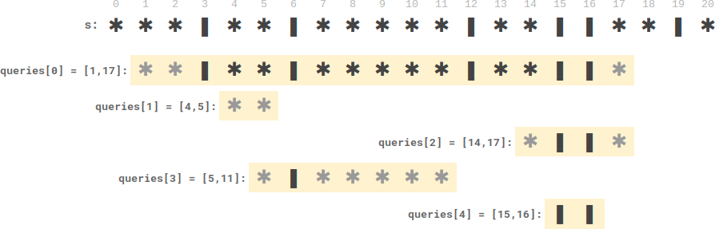

#### [2055. 蜡烛之间的盘子](https://leetcode-cn.com/problems/plates-between-candles/)

给你一个长桌子，桌子上盘子和蜡烛排成一列。给你一个下标从 **0** 开始的字符串 `s` ，它只包含字符 `'*'` 和 `'|'` ，其中 `'*'` 表示一个 **盘子** ，`'|'` 表示一支 **蜡烛** 。

同时给你一个下标从 **0** 开始的二维整数数组 `queries` ，其中 `queries[i] = [lefti, righti]` 表示 **子字符串** `s[lefti...righti]` （**包含左右端点的字符**）。对于每个查询，你需要找到 **子字符串中** 在 **两支蜡烛之间** 的盘子的 **数目** 。如果一个盘子在 **子字符串中** 左边和右边 **都** 至少有一支蜡烛，那么这个盘子满足在 **两支蜡烛之间** 。

- 比方说，`s = "||**||**|*"` ，查询 `[3, 8]` ，表示的是子字符串 `"*||***\**\***|"` 。子字符串中在两支蜡烛之间的盘子数目为 `2` ，子字符串中右边两个盘子在它们左边和右边 **都** 至少有一支蜡烛。

请你返回一个整数数组 `answer` ，其中 `answer[i]` 是第 `i` 个查询的答案。

 

**示例 1:**


```
输入：s = "**|**|***|", queries = [[2,5],[5,9]]
输出：[2,3]
解释：
- queries[0] 有两个盘子在蜡烛之间。
- queries[1] 有三个盘子在蜡烛之间。
```

**示例 2:**



```
输入：s = "***|**|*****|**||**|*", queries = [[1,17],[4,5],[14,17],[5,11],[15,16]]
输出：[9,0,0,0,0]
解释：
- queries[0] 有 9 个盘子在蜡烛之间。
- 另一个查询没有盘子在蜡烛之间。
```

 

**提示：**

- `3 <= s.length <= 105`
- `s` 只包含字符 `'*'` 和 `'|'` 。
- `1 <= queries.length <= 105`
- `queries[i].length == 2`
- `0 <= lefti <= righti < s.length`


#### 解题思路

重点是对蜡烛所在位置进行预处理，思路有点像前几天做的[2104. 子数组范围和](https://leetcode-cn.com/problems/sum-of-subarray-ranges/)。

对于每个查询 `que = [left, right]` ：

- 首先要**确定查询区间内位于最左侧和最右侧的蜡烛位置**，即 `left` 右侧(包括 `left`) 最近的蜡烛位置，以及 `right` 左侧(包括 `right`) 最近的蜡烛位置。
    - 我们分别用两个辅助数组 `lcandle` 和 `rcandle` 来记录，其中，`lcandle[i]` 表示在位置 `i` 左侧(包括 `i` )，离 `i` 最近的蜡烛的位置;
    - `rcandle[i]` 表示在位置 `i` 右侧(包括 `i` )，离 `i` 最近的蜡烛的位置。
- 解析每个查询 `que = [left, right]` ，`lidx`应为`left`右侧(包括 `left` )，离 `left` 最近的蜡烛的位置，即`rcandle[left]`；同理，`ridx`应为`right`左侧(包括 `rihgr` )，离 `right` 最近的蜡烛的位置，即`lcandle[right]`。
- 然后，当我们找到查询区间内最左侧和最右侧的两个蜡烛的位置 `lidx` 和 `ridx` 之后，那么在 `lidx` 和 `ridx` 之间的盘子个数（即查询区间内两个蜡烛之间的盘子个数）即为二者之差。
    - 使用第三个辅助数组 `recordPlate` 来记录每个位置之前的盘子个数，即 `x	[i]` 表示在位置 `i` 之前的盘子个数。
- 最后，查询区间内两个蜡烛之间的盘子个数为 `recordPlate[ridx] - recordPlate[lidx]`。

#### 代码演示

```go
func platesBetweenCandles(s string, queries [][]int) []int {
	
	n := len(s)
    recordPlate := make([]int, n)
    lcandle := make([]int, n)
    sum, candle := 0, -1
	for i, val := range s {
        if val == '*' {
            sum++
        } else {
            candle = i
        }
		// 记录当前位置之前有多少盘子
        recordPlate[i] = sum
		// 记录左边的蜡烛的所在位置,如果当前为盘子，返回的是离自己左侧最近的蜡烛位置
        lcandle[i] = candle
    }
	rcandle := make([]int, n)
	candle = -1
	for j := n-1; j>=0; j-- {
		if s[j] == '|' {
			candle = j
		}
		rcandle[j] = candle
	}
	res := make([]int,len(queries))
	for i, query :=range queries {
		// 首先确定查询区间内，最左侧和最右侧两个蜡烛的位置
		left, right := query[0], query[1]
		// left 右侧离 left 最近的蜡烛位置
		lidx := rcandle[left]    
		// right 左侧离 right 最近的蜡烛位置
		ridx := lcandle[right]   
		// 不满足条件默认为0
		if lidx < ridx && lidx >= 0 {
			res[i] = recordPlate[ridx]-recordPlate[lidx]
		}
	}
	return res
}
```

> 时间复杂度：O(n+q)，其中 n 为数组长度，q 为询问数量。我们需要 O(n) 的时间预处理。对于每一个询问，我们需要 O(1) 的时间计算答案。
>
> 空间复杂度：O(n)，其中 nn 为数组长度。我们需要O(n) 的空间保存预处理的结果。注意返回值不计入空间复杂度。
>