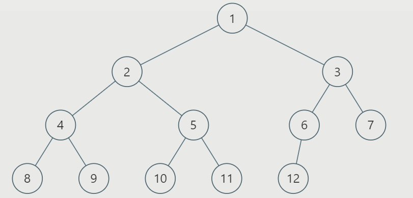
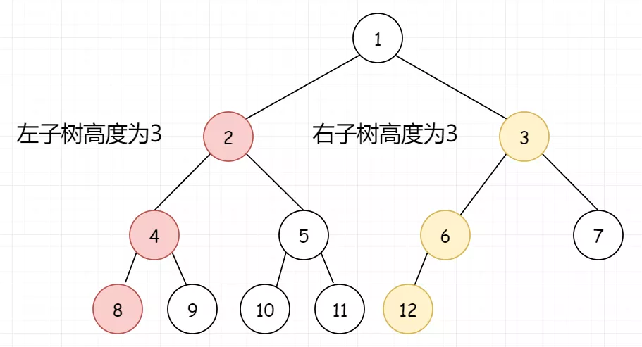
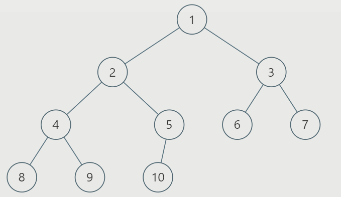

#### [222. 完全二叉树的节点个数](https://leetcode-cn.com/problems/count-complete-tree-nodes/)

给出一个完全二叉树，求出该树的节点个数。

```
说明：
完全二叉树的定义如下：在完全二叉树中，除了最底层节点可能没填满外，其余每层节点数都达到最大值，并且最下面一层的节点都集中在该层最左边的若干位置。若最底层为第 h 层，则该层包含 1~ 2h 个节点。

示例:

输入: 
    1
   / \
  2   3
 / \  /
4  5 6

输出: 6
```

#### 解题思路

假如我们有树如下：



我们看到根节点的左右子树高度都为3，那么说明左子树是一颗满二叉树。因为节点已经填充到右子树了，左子树必定已经填满了。所以左子树的节点总数我们可以直接得到，是2<sup>left</sup> - 1，加上当前这个root节点，则正好是2<sup>3</sup>，即 8。然后只需要再对右子树进行递归统计即可。



那假如我们的树是这样：



我们看到左子树高度为3，右子树高度为2。说明此时最后一层不满，但倒数第二层已经满了，可以直接得到右子树的节点个数。同理，右子树节点+root节点，总数为2<sup>right</sup>，即2<sup>2</sup>。再对左子树进行递归查找。


所以算法思路如下：

1. 如果右子树的高度等于左子树高度，说明左子树是完美二叉树，可以通过公式(2<sup>(leftLevel-1)</sup>)-1计算即可，不需要全部遍历，然后再通过递归的方式计算右子树。
2. 如果右子树的高度不等于左子树高度-1，说明右子树是完美二叉树，只不过比上面那种少了一层，也可以通过公式(2<sup>(rightLevel-1)</sup>)-1计算，然后再通过递归的方式计算左子树。

**代码演示：**

```java
/**
 * Definition for a binary tree node.
 * public class TreeNode {
 *     int val;
 *     TreeNode left;
 *     TreeNode right;
 *     TreeNode(int x) { val = x; }
 * }
 */
class Solution {
    public int countNodes(TreeNode root) {
        if(root == null) return 0;
        int leftLevel = countLevel(root.left);
        int rightLevel = countLevel(root.right);
        if (leftLevel == rightLevel) {
            //此时一定是左子树是满节点，右子树不确定，需要递归遍历
            //注意这里的计算，左子树的数量是实际上是(1 << (height - 1))-1，
            //不要把根节点给忘了，再加上1就是(1 << (height - 1))
            return countNodes(root.right) + (1 << leftLevel);
        }else {
            //此时一定是右子树是满节点，左子树不确定，需要递归遍历
            return countNodes(root.left) + (1 << rightLevel);
        }
    }
    
    //非递归
    public int countNodes(TreeNode root) {
        int count = 0;
        if(root  == null) return 0;
        int leftLevel = countLevel(root.left);
        while (root != null) {
            //注意非递归时，rightLevel需要每次都求一次，不然可能存在小于0的情况
            int rightLevel = countLevel(root.right);
            //如果右子树的高度是树的高度减1，那么左子树就是满二叉树
            if (leftLevel == rightLevel) {//左子树是满二叉树
                count += (1 << leftLevel);
                root = root.right;
            } else {//右子树是满二叉树
                count += (1 << rightLevel);
                root = root.left;
            }
            leftLevel--;
        }
        return count;
    }

    public int countLevel(TreeNode root) {
        int level = 0;
        while (root != null) {
            level++;
            root = root.left;
        }
        return level;
    }
}


```

> 时间复杂度：O(log<sup>2</sup>n)，其中 n 是完全二叉树的节点数。
> 首先需要 O(h)的时间得到完全二叉树的左右层数，其中 h 是完全二叉树的最大层数。
> 在递归遍历左子树（或者右子树）
>  )。由于每次递归遍历都会计算层数，所以时间复杂度为O(h)*O(h)，即O(log<sup>2</sup>n)。
>
> 空间复杂度：非递归O(1)。只需要维护有限的额外空间。
>