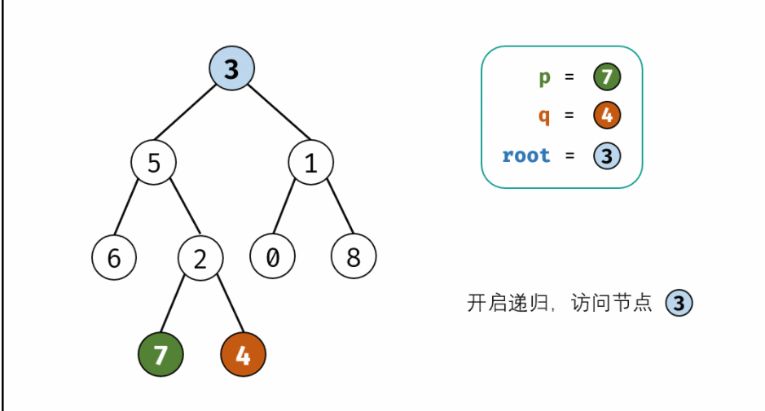

#### [236. 二叉树的最近公共祖先](https://leetcode-cn.com/problems/lowest-common-ancestor-of-a-binary-tree/)

给定一个二叉树, 找到该树中两个指定节点的最近公共祖先。

百度百科中最近公共祖先的定义为：“对于有根树 T 的两个结点 p、q，最近公共祖先表示为一个结点 x，满足 x 是 p、q 的祖先且 x 的深度尽可能大（一个节点也可以是它自己的祖先）。”

例如，给定如下二叉树:  root = [3,5,1,6,2,0,8,null,null,7,4]


 

```
示例 1:

输入: root = [3,5,1,6,2,0,8,null,null,7,4], p = 5, q = 1
输出: 3
解释: 节点 5 和节点 1 的最近公共祖先是节点 3。

示例 2:

输入: root = [3,5,1,6,2,0,8,null,null,7,4], p = 5, q = 4
输出: 5

解释: 节点 5 和节点 4 的最近公共祖先是节点 5。因为根据定义最近公共祖先节点可以为节点本身。


说明:

所有节点的值都是唯一的。
p、q 为不同节点且均存在于给定的二叉树中
```


1. 递归：

   - 递归解析：
     1. 终止条件：
        1. 当越过叶节点，则直接返回 null ；
        2. 当 root 等于 p, q，则直接返回 root ；
     2. 递推工作：
        1. 开启递归左子节点，返回值记为 left ；
        2. 开启递归右子节点，返回值记为 right ；
     3. 返回值： 根据 left和 right ，可展开为四种情况；
        1. 当 left 和 right 同时为空 ：说明 root 的左 / 右子树中都不包含 p,q，返回 null ；
        2. 当 left 和 right 同时不为空 ：说明 p, q分列在root 的 异侧 （分别在 左 / 右子树），因此 root为最近公共祖先，返回 root ；
        3. 当 left为空 ，right不为空 ：p,qp,q 都不在 root 的左子树中，直接返回 right 。具体可分为两种情况：
           1. p,q其中一个在 root 的 右子树 中，此时 right指向 p（假设为 p ）；
           2. p,q 两节点都在 root 的 右子树 中，此时的 right 指向 最近公共祖先节点 ；
        4. 当 left不为空 ， right 为空 ：与情况 3. 同理；
   
   
   
   **动画图解：**
   
   

```java
class Solution {
    public TreeNode lowestCommonAncestor(TreeNode root, TreeNode p, TreeNode q) {
        if(root == null || root == p || root == q) return root;
        TreeNode left = lowestCommonAncestor(root.left, p, q);
        TreeNode right = lowestCommonAncestor(root.right, p, q);
        //如果左子树为空，说明公共祖先在右子树
        if(left == null) return right;
        //如果右子树为空，说明公共祖先在左子树
        if(right == null) return left;
        //如果left和right都不为空，说明这两个节点一个在root的左子树上一个在root的右子树上，
        //我们只需要返回root结点即可。
        return root;
    }
}

```

> 时间复杂度 O(N) ： 其中 N 为二叉树节点数；最差情况下，需要递归遍历树的所有节点。
> 空间复杂度 O(N) ： 最差情况下，递归深度达到 N ，系统使用 O(N) 大小的额外空间。


2.迭代

```java
public TreeNode lowestCommonAncestor(TreeNode root, TreeNode p, TreeNode q) {
    //记录遍历到的每个节点的父节点。
    Map<TreeNode, TreeNode> parent = new HashMap<>();
    Queue<TreeNode> queue = new LinkedList<>();
    parent.put(root, null);//根节点没有父节点，所以为空
    queue.add(root);
    //直到两个节点都找到为止。
    while (!parent.containsKey(p) || !parent.containsKey(q)) {
        //队列是一边进一边出，这里poll方法是出队
        TreeNode node = queue.poll();
        if (node.left != null) {
            //左子节点不为空，记录下他的父节点
            parent.put(node.left, node);
            //左子节点不为空，把它加入到队列中
            queue.add(node.left);
        }
        //右节点同上
        if (node.right != null) {
            parent.put(node.right, node);
            queue.add(node.right);
        }
    }
    Set<TreeNode> ancestors = new HashSet<>();
    //记录下p和他的祖先节点，从p节点开始一直到根节点。
    while (p != null) {
        ancestors.add(p);
        p = parent.get(p);
    }
    //查看p和他的祖先节点是否包含q节点，如果不包含再看是否包含q的父节点
    while (!ancestors.contains(q))
        q = parent.get(q);
    return q;
}
```

