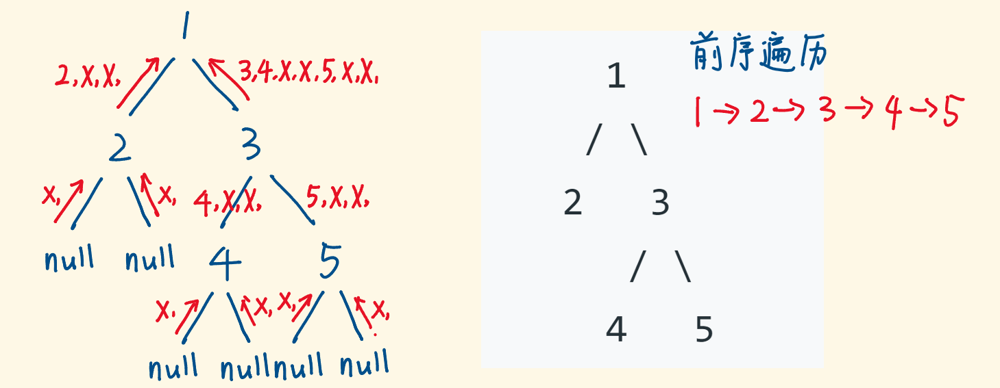
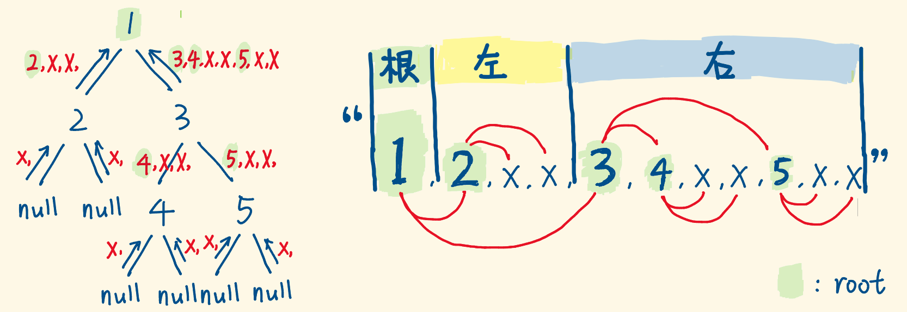

#### [297. 二叉树的序列化与反序列化](https://leetcode.cn/problems/serialize-and-deserialize-binary-tree/)

序列化是将一个数据结构或者对象转换为连续的比特位的操作，进而可以将转换后的数据存储在一个文件或者内存中，同时也可以通过网络传输到另一个计算机环境，采取相反方式重构得到原数据。

请设计一个算法来实现二叉树的序列化与反序列化。这里不限定你的序列 / 反序列化算法执行逻辑，你只需要保证一个二叉树可以被序列化为一个字符串并且将这个字符串反序列化为原始的树结构。

提示: 输入输出格式与 LeetCode 目前使用的方式一致，详情请参阅 LeetCode 序列化二叉树的格式。你并非必须采取这种方式，你也可以采用其他的方法解决这个问题。

 

示例 1：


输入：root = [1,2,3,null,null,4,5]
输出：[1,2,3,null,null,4,5]

```
示例 2：

输入：root = []
输出：[]
示例 3：

输入：root = [1]
输出：[1]
示例 4：

输入：root = [1,2]
输出：[1,2]


提示：

树中结点数在范围 [0, 104] 内
-1000 <= Node.val <= 1000
```


#### 解题思路

##### DFS（递归）

（图源：https://leetcode.cn/problems/serialize-and-deserialize-binary-tree/solution/shou-hui-tu-jie-gei-chu-dfshe-bfsliang-chong-jie-f/）

递归遍历一棵树，重点关注当前节点，它的子树的遍历交给递归完成：

- serialize函数：分别序列化左右子树，返回字符串。
    选择前序遍历，是因为 根|左|右根∣左∣右 的打印顺序，在反序列化时更容易定位出根节点的值。
    遇到 null 节点也要翻译成特定符号，反序列化时才知道这里是 null。

    

- deserialize函数：也是递归前序遍历的序列化字符串，就像下图：

    

    - 定义函数 buildTree 用于还原二叉树，传入由序列化字符串转成的 slice 数组。
    - 逐个 pop 出 list 的首项，构建当前子树的根节点，顺着 slice，构建顺序是根节点，左子树，右子树。
    - 如果弹出的字符为 "x"，则返回 null 节点。
    -  如果弹出的字符是数值，则创建root节点，并递归构建root的左右子树，最后返回root。


#### 代码演示

```go
/**
 * Definition for a binary tree node.
 * type TreeNode struct {
 *     Val int
 *     Left *TreeNode
 *     Right *TreeNode
 * }
 */

type Codec struct {
    
}

func Constructor() Codec {
    return Codec{}
}

// Serializes a tree to a single string.
func (this *Codec) serialize(root *TreeNode) string {
	sb := &strings.Builder{}
	var dfs func(*TreeNode)
	// 前序遍历写
	dfs = func(node *TreeNode) {
		if node == nil {
			sb.WriteString("null,")
			return
		}
		sb.WriteString(strconv.Itoa(node.Val))
		sb.WriteByte(',')
		dfs(node.Left)
		dfs(node.Right)
	}
	dfs(root)
	return sb.String()
}

func buildTree(slice *[]string) *TreeNode {
	rootVal := (*slice)[0]
    // 如遍历左子树， 必须先要把slice长度减一，不然直接return，null这个元素还是会被反复读
	*slice = (*slice)[1:]
	if rootVal == "null" {
		return nil
	}
	Val, _ := strconv.Atoi(rootVal)
	root := &TreeNode{Val: Val}
	root.Left = buildTree(slice)
	root.Right = buildTree(slice)
	return root
}

// Deserializes your encoded data to tree.
func (this *Codec) deserialize(data string) *TreeNode {
	slice := strings.Split(data, ",")
	return buildTree(&slice)
}

/**
 * Your Codec object will be instantiated and called as such:
 * ser := Constructor();
 * deser := Constructor();
 * data := ser.serialize(root);
 * ans := deser.deserialize(data);
 */
```

> 时间复杂度：在序列化和反序列化函数中，我们只访问每个节点一次，因此时间复杂度为 O(n)，其中 n 是节点数，即树的大小。
> 空间复杂度：在序列化和反序列化函数中，我们递归会使用栈空间，故渐进空间复杂度为 O(n)。