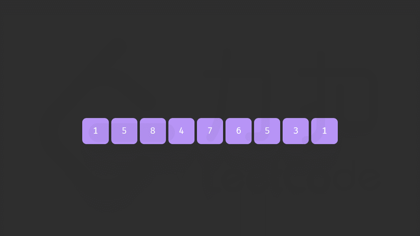

#### [31. 下一个排列](https://leetcode-cn.com/problems/next-permutation/)

实现获取下一个排列的函数，算法需要将给定数字序列重新排列成字典序中下一个更大的排列。

如果不存在下一个更大的排列，则将数字重新排列成最小的排列（即升序排列）。

必须原地修改，只允许使用额外常数空间。

```
以下是一些例子，输入位于左侧列，其相应输出位于右侧列。
1,2,3 → 1,3,2
3,2,1 → 1,2,3
1,1,5 → 1,5,1
```


### 解题思路

“下一个排列”的定义是：给定数字序列的字典序中下一个更大的排列。如果不存在下一个更大的排列，则将数字重新排列成最小的排列（即升序排列）。

我们可以将该问题形式化地描述为：给定若干个数字，将其组合为一个整数。如何将这些数字重新排列，以得到下一个更大的整数。如 123 下一个更大的数为 132。如果没有更大的整数，则输出最小的整数。

```
以 1,2,3,4,5,6 为例，其排列依次为：


123456
123465
123546
...
654321
```


可以看到有这样的关系：123456 < 123465 < 123546 < ... < 654321。

**算法推导**
如何得到这样的排列顺序？这是本文的重点。我们可以这样来分析：

- 我们希望**下一个数比当前数大**，这样才满足“下一个排列”的定义。因此只需要将后面的「大数」与前面的「小数」交换，就能得到一个更大的数。比如 123456，将 5 和 6 交换就能得到一个更大的数 123465。
- 我们还希望**下一个数增加的幅度尽可能的小**，这样才满足“下一个排列与当前排列紧邻“的要求。为了满足这个要求，我们需要：
  - 在尽可能靠右的低位进行交换，需要**从后向前**查找
  - 将一个 **尽可能小的「大数」** 与前面的「小数」交换。比如 123465，下一个排列应该把 5 和 4 交换而不是把 6 和 4 交换
  - 将「大数」换到前面后，需要将**「大数」后面的所有数重置为升序**，升序排列就是最小的排列。以 123465 为例：首先按照上一步，交换 5 和 4，得到 123564；然后需要将 5 之后的数重置为升序，得到 123546。显然 123546 比 123564 更小，123546 就是 123465 的下一个排列

以上就是求“下一个排列”的分析过程。

**算法过程**
标准的“下一个排列”算法可以描述为：

1. 从后向前查找第一个相邻升序的元素对` (i,i+1)`，满足 `A[i] < A[i+1]`。此时 `[i+1,end) `必然是降序。
2. 在`[i+1,end) `从后向前查找第一个满足 `A[i] < A[j] `的 j。A[i]、A[j] 分别就是上文所说的「小数」、「大数」。
3. 将 A[i] 与 A[j] 交换。
4. 可以断定这时` [j,end) `必然是降序，逆置 `[j,end)`，使其升序。
5. 如果在步骤 1 找不到符合的相邻元素对，说明当前` [begin,end) `为一个降序顺序，则直接跳到步骤 4。

**动图演示**




**代码演示**

```java
class Solution {
    public void nextPermutation(int[] nums) {
        if (nums.length <= 1) return;
        //nums[i]标识一个小数
        int i = nums.length - 2;
        //nums[i]标识一个尽可能小的大数
        int j = nums.length - 1;

        // find: A[i]<A[j]
        while (i >= 0 && nums[i] >= nums[i+1]) {
            i--;
        }

        if (i >= 0) { // 不是最后一个排列
            // find: A[i]<A[k]
            while (nums[i] >= nums[j]) {
                j--;
            }
            swap(nums,i,j);
        }
        reverse(nums,i+1);
    }


    public void swap(int[] nums, int i, int j) {
        int temp = nums[i];
        nums[i] = nums[j];
        nums[j] = temp;
    }

    public void reverse(int[] nums, int start) {
        int left = start, right = nums.length - 1;
        while (left < right) {
            swap(nums, left, right);
            left++;
            right--;
        }
    }

}
```

> 时间复杂度：O(N)，其中 N 为给定序列的长度。我们至多只需要扫描两次序列，以及进行一次反转操作。
>
> 空间复杂度：O(1)，只需要常数的空间存放若干变量。
>