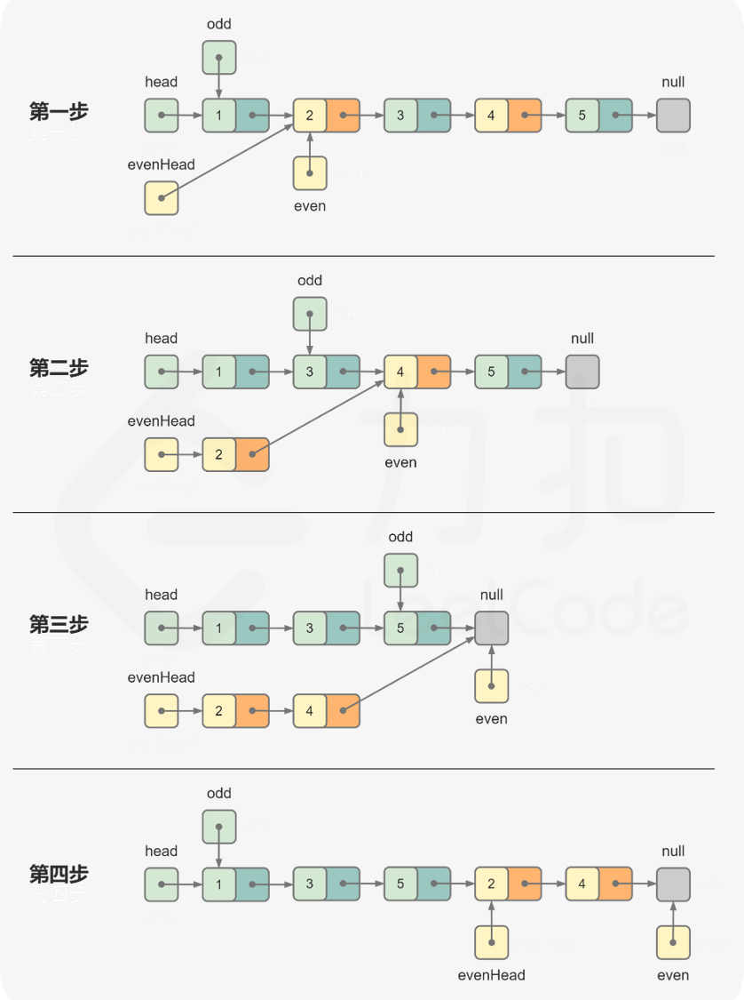

#### [328. 奇偶链表](https://leetcode-cn.com/problems/odd-even-linked-list/)

给定一个单链表，把所有的奇数节点和偶数节点分别排在一起。请注意，这里的奇数节点和偶数节点指的是节点编号的奇偶性，而不是节点的值的奇偶性。

请尝试使用原地算法完成。你的算法的空间复杂度应为 O(1)，时间复杂度应为 O(nodes)，nodes 为节点总数。

```
示例 1:
输入: 1->2->3->4->5->NULL
输出: 1->3->5->2->4->NULL

示例 2:
输入: 2->1->3->5->6->4->7->NULL 
输出: 2->3->6->7->1->5->4->NULL

说明:
应当保持奇数节点和偶数节点的相对顺序。
链表的第一个节点视为奇数节点，第二个节点视为偶数节点，以此类推。
```


#### 解题思路

**分离节点后合并**

- 如果链表为空，则直接返回链表。
- 将奇数节点和偶数节点分离成奇数链表和偶数链表，然后将偶数链表连接在奇数链表之后，合并后的链表即为结果链表。
- 设置哑结点`dummy`，`dummy.next = head`（因为本题不会修改head其实也可以不用设置）。维护两个指针 odd 和 even 分别指向奇数节点和偶数节点，初始时 `odd = dummy.next，even = dummy.next.next`。通过迭代的方式将奇数节点和偶数节点分离成两个链表，每一步首先更新奇数节点，然后更新偶数节点。
- 原始链表的头节点 head 也是奇数链表的头节点以及结果链表的头节点，head 的后一个节点是偶数链表的头节点。令 evenHead = even，则 evenHead 是偶数链表的头节点。
- 更新奇数节点和偶数节点。`odd.next = odd.next.next;  even.next = even.next.next;   odd = odd.next;  even = even.next;`
- 重复上述操作，直到全部节点分离完毕。全部节点分离完毕的条件是 even 为空节点或者 even.next 为空节点，此时 odd 指向最后一个奇数节点（即奇数链表的最后一个节点）。
- 最后令 odd.next = evenHead，将偶数链表连接在奇数链表之后，即完成了奇数链表和偶数链表的合并，结果链表的头节点仍然是 head。


**动画图解：**




**代码演示：**

```java
/**
 * Definition for singly-linked list.
 * public class ListNode {
 *     int val;
 *     ListNode next;
 *     ListNode() {}
 *     ListNode(int val) { this.val = val; }
 *     ListNode(int val, ListNode next) { this.val = val; this.next = next; }
 * }
 */
class Solution {
    public ListNode oddEvenList(ListNode head) {
        if (head == null) return head;
        ListNode dummy = new ListNode(0, head);
        ListNode odd = dummy.next;
        ListNode even = dummy.next.next;
        ListNode evenHead = even;
        while (even != null && even.next!=null) {
            odd.next = odd.next.next;
            even.next = even.next.next;
            odd = odd.next;
            even = even.next;
        }
        odd.next = evenHead;
        return dummy.next;
    }
}
```

> - 时间复杂度：O(n)，其中 n是链表的节点数。需要遍历链表中的每个节点，并更新指针。
> - 空间复杂度：O(1)。只需要维护有限的指针。