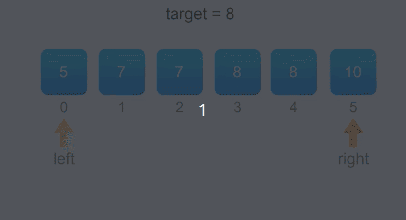

#### [34. 在排序数组中查找元素的第一个和最后一个位置](https://leetcode-cn.com/problems/find-first-and-last-position-of-element-in-sorted-array/)

给定一个按照升序排列的整数数组 nums，和一个目标值 target。找出给定目标值在数组中的开始位置和结束位置。

如果数组中不存在目标值 target，返回 [-1, -1]。

进阶：

你可以设计并实现时间复杂度为 O(log n) 的算法解决此问题吗？

```
示例 1：

输入：nums = [5,7,7,8,8,10], target = 8
输出：[3,4]
示例 2：

输入：nums = [5,7,7,8,8,10], target = 6
输出：[-1,-1]
示例 3：

输入：nums = [], target = 0
输出：[-1,-1]


提示：

0 <= nums.length <= 105
-109 <= nums[i] <= 109
nums 是一个非递减数组
-109 <= target <= 109

```

#### 解题思路

由于数组已经排序，因此整个数组是单调递增的，我们可以利用二分法来加速查找的过程。考虑 `target `开始和结束位置，其实我们要找的就是数组中「第一个等于 `target `的位置」（记为`leftIdx`）和「第一个大于 `target` 的位置减一」（记为 `rightIdx`）。

1. 二分查找中，寻找 `leftIdx `即为在数组中寻找第一个大于等于 `target `的下标，寻找 `rightIdx `即为在数组中寻找第一个大于 `target` 的下标，然后将下标减一。
2. 两者的判断条件不同，为了代码的复用，我们定义 `binarySearch(nums, target, lower)`表示在 `nums` 数组中二分查找 `target `的位置，如果 `lower` 为 true，则查找第一个大于等于 `target`的下标，否则查找第一个大于`target` 的下标。
3. 因为 `target` 可能不存在数组中，因此我们需要重新校验我们得到的两个下标`leftIdx `和 `rightIdx`，看是否符合条件，如果符合条件就返回 `[leftIdx,rightIdx]`，不符合就返回 `[−1,−1]`。



**代码演示（JAVA）**

```java
class Solution {
    public int[] searchRange(int[] nums, int target) {
        int leftIdx = binarySearch(nums, target, true);
        int rightIdx = binarySearch(nums, target, false) - 1;
        if (leftIdx <= rightIdx && rightIdx < nums.length && nums[leftIdx] == target && nums[rightIdx] == target) {
            return new int[]{leftIdx, rightIdx};
        } 
        return new int[]{-1, -1};
    }

    public int binarySearch(int[] nums, int target, boolean lower) {
        //因为当数组只有一个元素时，binarySearch(nums, target, false)的ans==1，但right最多==0，故初始化ans应该为nums.length
        int left = 0, right = nums.length - 1, ans = nums.length;
        while (left <= right) {
            int mid = (left + right) / 2;
            if (nums[mid] > target || (lower && nums[mid] >= target)) {
                right = mid - 1;
                ans = mid;
            } else {
                left = mid + 1;
            }
        }
        return ans;
    }
}
```

**代码演示（GO）**

```go
func searchRange(nums []int, target int) []int {
	leftIdx := binarySearch(nums,target,true)
	rightIdx := binarySearch(nums,target,false) - 1
	if leftIdx <= rightIdx && rightIdx < len(nums) && nums[leftIdx] == target && nums[rightIdx] == target {
		return []int{leftIdx,rightIdx}
	}
	return []int{-1, -1}
}

func binarySearch(nums []int, target int, lower bool) int {
	left := 0
	right := len(nums) - 1
	ans := len(nums)
	for left <= right {
		mid := (left + right) / 2
		if nums[mid] > target || (lower && nums[mid] >= target) {
			right = mid - 1
			ans = mid
		}else {
			left = mid + 1
		}
	}
	return ans
}
```

> 时间复杂度： O(log n) ，其中 n 为数组的长度。二分查找的时间复杂度为O(log n)，一共会执行两次，因此总时间复杂度为O(log n)。
>
> 空间复杂度：O(1) 。只需要常数空间存放若干变量。
>