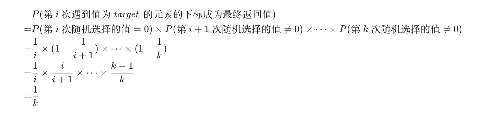

#### [398. 随机数索引](https://leetcode-cn.com/problems/random-pick-index/)

给定一个可能含有重复元素的整数数组，要求随机输出给定的数字的索引。 您可以假设给定的数字一定存在于数组中。

注意：
数组大小可能非常大。 使用太多额外空间的解决方案将不会通过测试。

```
示例:

int[] nums = new int[] {1,2,3,3,3};
Solution solution = new Solution(nums);

// pick(3) 应该返回索引 2,3 或者 4。每个索引的返回概率应该相等。
solution.pick(3);

// pick(1) 应该返回 0。因为只有nums[0]等于1。
solution.pick(1);
```

#### 解题思路

##### 方法一：哈希表

如果不考虑数组的大小，我们可以在构造函数中，用一个哈希表 hashMap 记录 nums 中相同元素的下标。

对于pick 操作，我们可以从 pos 中取出 target 对应的下标列表，然后随机选择其中一个下标并返回。


##### 方法二：水塘取样

如果数组以文件形式存储（读者可假设构造函数传入的是个文件路径），且文件大小远超内存大小，我们是无法通过读文件的方式，将所有下标保存在内存中的，因此需要找到一种空间复杂度更低的算法。

水塘抽样实现每次抽样概率相等均为 1/k ，对于前k个数，我们全部保留，对于第 i（i>k）个数，我们以 k/i 的概率保留第i个数，并以1/k概率与前面已选择的k个数中的任意一个 target。 详细公式推导参见知乎 [水塘抽样](https://leetcode-cn.com/link/?target=https%3A%2F%2Fzhuanlan.zhihu.com%2Fp%2F29178293)。

证明如下：



#### 代码演示

##### 方法一：

```go
type Solution struct {
	hashMap map[int][]int
}

func Constructor(nums []int) Solution {
	hashMap := make(map[int][]int)
	for i, num := range nums {
		if _, ok := hashMap[num]; !ok {
			hashMap[num] = make([]int, 0)
		}
		hashMap[num] = append(hashMap[num], i)
	}
	return Solution{
		hashMap: hashMap,
	}
}

func (this *Solution) Pick(target int) int {
	indexs := this.hashMap[target]
	res := indexs[rand.Intn(len(indexs))]
	return res
}
```

> 时间复杂度：初始化为 O(n)，pick 为 O(1)，其中 n 是 nums 的长度。
>
> 空间复杂度：O(n)。我们需要 O(n) 的空间存储 n 个下标。
>


##### 方法二：

```go
type Solution []int

func Constructor(nums []int) Solution {
    return nums
}

func (nums Solution) Pick(target int) int {
    cnt,res := 0, 0
    for i, num := range nums {
        if num == target {
            cnt++ // 第 cnt 次遇到 target
            if rand.Intn(cnt) == 0 {
                res = i
            }
        }
    }
    return res
}
```

> 时间复杂度：初始化为 O(1)，pick 为 O(n)，其中 n 是 nums 的长度。
>
> 空间复杂度：O(1)。我们只需要常数的空间保存若干变量。
>