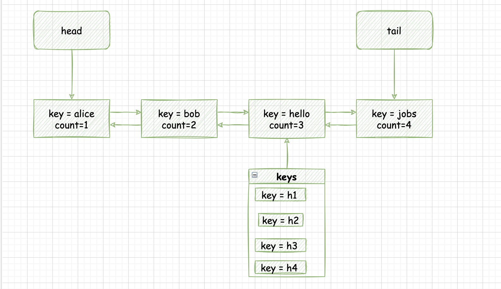

#### [432. 全 O(1) 的数据结构](https://leetcode-cn.com/problems/all-oone-data-structure/)[432. 全 O(1) 的数据结构](https://leetcode-cn.com/problems/all-oone-data-structure/)

请你设计一个用于存储字符串计数的数据结构，并能够返回计数最小和最大的字符串。

实现 AllOne 类：

AllOne() 初始化数据结构的对象。
inc(String key) 字符串 key 的计数增加 1 。如果数据结构中尚不存在 key ，那么插入计数为 1 的 key 。
dec(String key) 字符串 key 的计数减少 1 。如果 key 的计数在减少后为 0 ，那么需要将这个 key 从数据结构中删除。测试用例保证：在减少计数前，key 存在于数据结构中。
getMaxKey() 返回任意一个计数最大的字符串。如果没有元素存在，返回一个空字符串 "" 。
getMinKey() 返回任意一个计数最小的字符串。如果没有元素存在，返回一个空字符串 "" 。

```
示例：

输入
["AllOne", "inc", "inc", "getMaxKey", "getMinKey", "inc", "getMaxKey", "getMinKey"]
[[], ["hello"], ["hello"], [], [], ["leet"], [], []]
输出
[null, null, null, "hello", "hello", null, "hello", "leet"]

解释
AllOne allOne = new AllOne();
allOne.inc("hello");
allOne.inc("hello");
allOne.getMaxKey(); // 返回 "hello"
allOne.getMinKey(); // 返回 "hello"
allOne.inc("leet");
allOne.getMaxKey(); // 返回 "hello"
allOne.getMinKey(); // 返回 "leet"


提示：

1 <= key.length <= 10
key 由小写英文字母组成
测试用例保证：在每次调用 dec 时，数据结构中总存在 key
最多调用 inc、dec、getMaxKey 和 getMinKey 方法 5 * 104 次
```

#### 解题思路

一开始觉得就是定义数据结构然后构造器。结果发现需要全部O(1)复杂度，瞬间懵逼。golang中map的增删是O(1)，但是取最大最小值得遍历；参考 **[实现一个 LRUCache（手写双向链表入门题）](https://leetcode-cn.com/link/?target=https%3A//mp.weixin.qq.com/s?__biz%3DMzU4NDE3MTEyMA%3D%3D%26mid%3D2247490403%26idx%3D1%26sn%3Ddd361a87d74eec4ca9ef97efe016c906)**，可以**通过自定义节点并手写双链表来实现**，其思想为  **[LFUCache](https://leetcode-cn.com/link/?target=https%3A//mp.weixin.qq.com/s?__biz%3DMzU4NDE3MTEyMA%3D%3D%26mid%3D2247486856%26idx%3D1%26sn%3D59b2ed57e4a75eac0e63fc0cf08bed5d) **，大佬果然是大佬，学无止境。此题的解题步骤为：



- **定义Node的数据结构**，链表中的每个节点存储一个字符串集合 keys，和一个正整数 count，表示 keys 中的字符串均出现 count 次。
- 链表从头到尾的每个节点的 count 值单调递增（但不一定连续）。
- 每个节点还需存储指向上一个节点的指针 prev 和指向下一个节点的指针 next。这个可以通过golang的list结构实现。

另外还要用一个**哈希表 nodes** 维护每个字符串当前所处的链表节点。

**对于 inc 操作：**

- 若 `key` 不在链表中：若链表为空或头节点的 `count>1`，则先插入一个 `count=1` 的新节点至链表头部，然后将 key 插入到头节点的 `keys` 中。
- 若 `key` 在链表中：设 `key` 所在节点为 `cur`，若 `cur.next` 为空或 `cur.next.count>cur.count+1`（即节点不连续），则：
    - 先插入一个 `count=cur.count+1` 的新节点至 `cur` 之后，然后将 `key` 插入到 `cur.next.keys` 中。
    - 最后，将 `key` 从 `cur.keys` 中移除，若移除后 `cur.keys` 为空，则将 `cur` 从链表中移除。
- 更新`nodes` 中 `key` 所处的节点。

**对于 `dec` 操作**，测试用例保证 `key` 在链表中：

- 若 `key` 仅出现一次：将其从`nodes` 中移除。若`keys`为空，删除该节点；
- 若 `key` 出现不止一次：设 `key` 所在节点为 `cur`，
    - 若 `cur.prev` 为空或 `cur.prev.count<cur.count−1`，则先插入一个 `count=cur.count−1` 的新节点至 `cur` 之前，
    - 然后将 `key` 插入到`cur.prev.keys` 中。更新 `key` 所处的节点。
    - 最后，将key 从cur.keys 中移除，若移除后 `cur.keys` 为空，则将 `cur` 从链表中移除。

**对于 `getMaxKey` 操作**，在链表不为空时，返回链表尾节点的 `keys` 中的任一元素，否则返回空字符串。

**对于 `getMinKey` 操作，** 在链表不为空时，返回链表头节点的 `keys` 中的任一元素，否则返回空字符串。


##### 代码演示

```go
type node struct {
    keys  map[string]struct{}
    count int
}

type AllOne struct {
    *list.List
    nodes map[string]*list.Element
}

func Constructor() AllOne {
    return AllOne{list.New(), map[string]*list.Element{}}
}

func (l *AllOne) Inc(key string) {
    if cur := l.nodes[key]; cur != nil {
        curNode := cur.Value.(node)
        if nxt := cur.Next(); nxt == nil || nxt.Value.(node).count > curNode.count+1 {
            l.nodes[key] = l.InsertAfter(node{map[string]struct{}{key: {}}, curNode.count + 1}, cur)
        } else {
            nxt.Value.(node).keys[key] = struct{}{}
            l.nodes[key] = nxt
        }
        delete(curNode.keys, key)
        if len(curNode.keys) == 0 {
            l.Remove(cur)
        }
    } else { // key 不在链表中
        if l.Front() == nil || l.Front().Value.(node).count > 1 {
            l.nodes[key] = l.PushFront(node{map[string]struct{}{key: {}}, 1})
        } else {
            l.Front().Value.(node).keys[key] = struct{}{}
            l.nodes[key] = l.Front()
        }
    }
}

func (l *AllOne) Dec(key string) {
    cur := l.nodes[key]
    curNode := cur.Value.(node)
    if curNode.count > 1 {
        if pre := cur.Prev(); pre == nil || pre.Value.(node).count < curNode.count-1 {
            l.nodes[key] = l.InsertBefore(node{map[string]struct{}{key: {}}, curNode.count - 1}, cur)
        } else {
            pre.Value.(node).keys[key] = struct{}{}
            l.nodes[key] = pre
        }
    } else { // key 仅出现一次，将其移出 nodes
        delete(l.nodes, key)
    }
    delete(curNode.keys, key)
    if len(curNode.keys) == 0 {
        l.Remove(cur)
    }
}

func (l *AllOne) GetMaxKey() string {
    if b := l.Back(); b != nil {
        for key := range b.Value.(node).keys {
            return key
        }
    }
    return ""
}

func (l *AllOne) GetMinKey() string {
    if f := l.Front(); f != nil {
        for key := range f.Value.(node).keys {
            return key
        }
    }
    return ""
}


/**
 * Your AllOne object will be instantiated and called as such:
 * obj := Constructor();
 * obj.Inc(key);
 * obj.Dec(key);
 * param_3 := obj.GetMaxKey();
 * param_4 := obj.GetMinKey();
 */
```

> 时间复杂度：所有操作均为 O(1)，这里将字符串长度视作常数。
>
> 空间复杂度：O(C)，其中 C 是调用 inc 的次数。最坏情况下每次调用 inc 传入的字符串均不相同，我们需要 O(C) 大小的哈希表来存储所有字符串。
>

