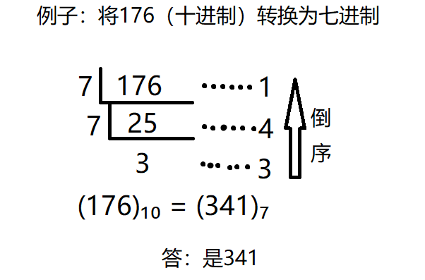

#### [504. 七进制数](https://leetcode-cn.com/problems/base-7/)

给定一个整数 num，将其转化为 7 进制，并以字符串形式输出。

```
示例 1:

输入: num = 100
输出: "202"
示例 2:

输入: num = -7
输出: "-10"


提示：

-107 <= num <= 107
```


#### 解题思路

统一的十进制转换为N进制方式：**除N取余法**：

即每次将整数部分除以N，余数为该位权上的数，而商继续除以N，余数又为上一个位权上的数，这个步骤一直持续下去，直到商为0为止，最后读数时候，从最后一个余数读起，一直到最前面的一个余数。

如图所示：




#### 代码演示

```go
func convertToBase7(num int) string {
	str := make([]string, 0)
	var negative bool
	if num == 0 {
		return "0"
	}
    // 负数转换为正数，然后加个“-”
	if num < 0 {
		num = -num
		negative = true
	}
	for num > 0 {
		str = append(str, strconv.Itoa(num%7))
		num = num/7
	}
    // 因为是倒序，在末尾添加”-“即可
	if negative {
		str = append(str, "-")
	}
	var builder strings.Builder
	for j:=len(str)-1; j >= 0; j-- {
		builder.WriteString(str[j])
	}
	return builder.String()
```

> 时间复杂度：O(log|num|)，其中 |num| 表示 num 的绝对值。循环中最多做 O(log|num|) 次除法。
>
> 空间复杂度： O(log|num|) 。字符数组的长度最多为  O(log|num|)  。部分语言可以直接修改字符串，空间复杂度为 O(1)。
>