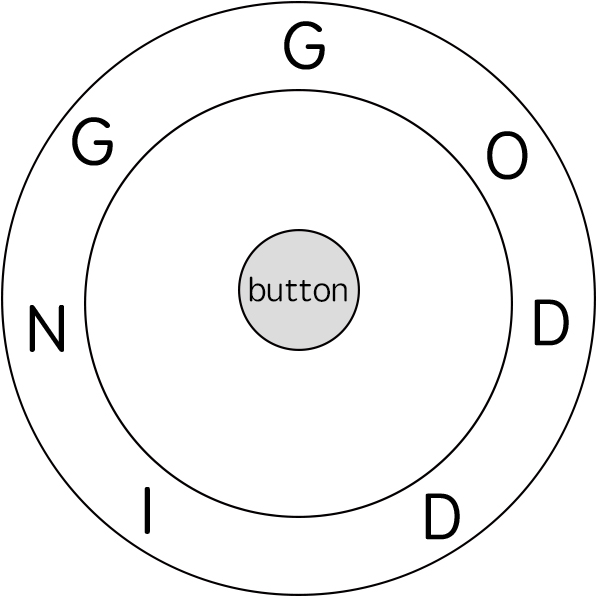

#### [514. 自由之路](https://leetcode-cn.com/problems/freedom-trail/)

电子游戏“辐射4”中，任务“通向自由”要求玩家到达名为“Freedom Trail Ring”的金属表盘，并使用表盘拼写特定关键词才能开门。

给定一个字符串 ring，表示刻在外环上的编码；给定另一个字符串 key，表示需要拼写的关键词。您需要算出能够拼写关键词中所有字符的最少步数。

最初，ring 的第一个字符与12:00方向对齐。您需要顺时针或逆时针旋转 ring 以使 key 的一个字符在 12:00 方向对齐，然后按下中心按钮，以此逐个拼写完 key 中的所有字符。

旋转 ring 拼出 key 字符 key[i] 的阶段中：

您可以将 ring 顺时针或逆时针旋转一个位置，计为1步。旋转的最终目的是将字符串 ring 的一个字符与 12:00 方向对齐，并且这个字符必须等于字符 key[i] 。
如果字符 key[i] 已经对齐到12:00方向，您需要按下中心按钮进行拼写，这也将算作 1 步。按完之后，您可以开始拼写 key 的下一个字符（下一阶段）, 直至完成所有拼写。
示例：



```
输入: ring = "godding", key = "gd"

输出: 4

解释:
 对于 key 的第一个字符 'g'，已经在正确的位置, 我们只需要1步来拼写这个字符。 
 对于 key 的第二个字符 'd'，我们需要逆时针旋转 ring "godding" 2步使它变成 "ddinggo"。
 当然, 我们还需要1步进行拼写。
 因此最终的输出是 4。
 
提示：
ring 和 key 的字符串长度取值范围均为 1 至 100；
两个字符串中都只有小写字符，并且均可能存在重复字符；
字符串 key 一定可以由字符串 ring 旋转拼出。
```


#### 解题思路

- 定义`dp[i][j] `表示从前往后拼写出key 的第 i 个字符， ring 的第 j 个字符与 12:00 方向对齐的最少步数（下标均从 0 开始）。
- 只有当字符串ring 的第 j 个字符需要和 key 的第 i 个字符相同时才能拼写出key 的第 i 个字符，因此对于 key 的第 i 个字符，需要考虑计算的ring 的第 j 个字符只有`key[i]` 在 ring 中出现的下标集合。我们对每个字符维护一个位置数组`pos[i]`，表示字符 i 在ring 中出现的位置集合。
- 对于状态 `dp[i][j]`，需要枚举上一次与 12:00 方向对齐的位置 *k*，因此可以列出如下的转移方程：


- 其中 `min{abs(j−k),n−abs(j−k)}+1`表示在当前第 k 个字符与 12:00 方向对齐时第 j 个字符旋转到 12:00 方向并按下拼写的最少步数。

- 最后答案res为`for (int i = 0; i < n; i++) res = Math.min(dp[m-1][i], res);`

- 这样的做法需要开辟 O(mn) 的空间来存放 dp 值。考虑到每次转移状态`dp[i][] `只会从 `dp[i−1][]` 转移过来，因此我们可以利用滚动数组优化第一维的空间复杂度。

  

**示意图：**


**【关于无穷大0x3f3f3f的一些知识】**

1. `0x3f3f3f3f`的十进制是`1061109567`，也就是10<sup>9</sup>级别的（和`0x7fffffff`一个数量级），而一般场合下的数据都是小于10<sup>9</sup>的，所以它可以作为无穷大使用而不致出现数据大于无穷大的情形。
2. 另一方面，由于一般的数据都不会大于10<sup>9</sup>，所以当我们把无穷大加上一个数据时，它并不会溢出（这就满足了“无穷大加一个有穷的数依然是无穷大”），事实上`0x3f3f3f3f+0x3f3f3f3f=2122219134`，这非常大但却没有超过32-bit int的表示范围，所以`0x3f3f3f3f`还满足了我们“无穷大加无穷大还是无穷大”的需求。
3. 最后，`0x3f3f3f3f`还能给我们带来一个意想不到的额外好处：如果我们想要将某个数组清零，我们通常会使用`memset(a,0,sizeof(a))`这样的代码来实现（方便而高效），但是当我们想将某个数组全部赋值为无穷大时（例如解决图论问题时邻接矩阵的初始化），就不能使用`memset`函数而得自己写循环了（写这些不重要的代码真的很痛苦），我们知道这是因为`memset`是按字节操作的，它能够对数组清零是因为0的每个字节都是0，现在好了，如果我们将无穷大设为`0x3f3f3f3f`，那么奇迹就发生了，`0x3f3f3f3f`的每个字节都是`0x3f`！所以要把一段内存全部置为无穷大，我们只需要`memset(a,0x3f,sizeof(a))`。 所以在通常的场合下，`const int INF = 0x3f3f3f3f;`真的是一个非常棒的选择。


**代码演示：**

```java
import java.util.ArrayList;
import java.util.Arrays;
import java.util.List;

class Solution {
    public int findRotateSteps(String ring, String key) {
        int n = ring.length(), m = key.length();
        //pos记录26个字母对应的位置
        //比如 a 在ring中是在1,3,5几个数组下标位置有对应元素，则po[0] = {1,3,5}
        List<Integer>[] pos = new List[26];
        for (int i = 0; i < 26; ++i) {
            pos[i] = new ArrayList<Integer>();
        }
        for (int i = 0; i < n; ++i) {
            pos[ring.charAt(i) - 'a'].add(i);
        }
        //dp[i][j]表示key中的第i个元素对应在ring中的第j个数组下标位置
        int[][] dp = new int[m][n];
        for (int i = 0; i < m; ++i) {
            //用大数填充数组的行列
            Arrays.fill(dp[i], 0x3f3f3f);
        }
        for (int i : pos[key.charAt(0) - 'a']) {
            //初始化dp[0][i]每个位置顺时针为i，逆时针为n-i
            dp[0][i] = Math.min(i, n - i) + 1;
        }
        for (int i = 1; i < m; ++i) {
            for (int j : pos[key.charAt(i) - 'a']) {
                for (int k : pos[key.charAt(i - 1) - 'a']) {
                    //对于状态 dp[i][j]，需要枚举上一次与 12:00方向对齐的位置 k
                    // Math.min(Math.abs(j - k), n - Math.abs(j - k)) + 1 表示在当前第 k 个字符与 12:00 方向对齐时第 j 个字符旋转到 12:00 方向并按下拼写的最少步数
                    dp[i][j] = Math.min(dp[i][j], dp[i - 1][k] + Math.min(Math.abs(j - k), n - Math.abs(j - k)) + 1);
                }
            }
        }
        //初始化res，最后求出最小值
        int res = Integer.MAX_VALUE;
        for (int i = 0; i < n; i++) {
            res = Math.min(dp[m-1][i], res);
        }
        return res;
    }
}
```

> 时间复杂度：O(mn <sup>2</sup>)，其中` m` 为字符串 `key` 的长度，`n` 为字符串 `ring` 的长度。一共有 `O(mn)` 个状态要计算，每次转移的时间复杂度为 `O(n)`，因此时间复杂度为 O(mn<sup>2</sup>)。
> 由于维护了位置数组`pos` 加速了状态的计算与转移，因此 O(mn<sup>2</sup>) 是一个较松的上界，很多情况下的时间复杂度都会低于 O(mn<sup>2</sup>)。
>
> 空间复杂度：O(mn)。需要使用O(mn) 的空间来存放dp 数组，以及使用 O(n) 的空间来存放pos 数组，因此总空间复杂度为 O(mn)。如果利用滚动数组，则可以将 dp 数组的空间复杂度降低到 O(n)，总空间复杂度降低到 O(n)。
>


**解法二：利用滚动数组优化空间复杂度：**

```java
import java.util.ArrayList;
import java.util.Arrays;
import java.util.List;

class Solution {
    public int findRotateSteps(String ring, String key) {
        int n = ring.length(), m = key.length();
        //pos记录26个字母对应的位置
        //比如 a 在ring中是在1,3,5几个数组下标位置有对应元素，则po[0] = {1,3,5}
        ArrayList<Integer>[] pos = new ArrayList[26];
        for (int i = 0; i < 26; ++i) {
            pos[i] = new ArrayList<Integer>();
        }
        for (int i = 0; i < n; ++i) {
            pos[ring.charAt(i) - 'a'].add(i);
        }
        //curDp[]记录当前的dp
        //nextDp[]记录key中下一个的dp
        int[] curDp = new int[n];
        int[] nextDp = new int[n];
        //prePosIndex记录key的上一个元素在pos中对应的位置
        //ring = “godding”, key = “gd”中，当key指向d时，prePosIndex为g在ring中的下标集合{0,6}
        ArrayList<Integer> prePosIndex = new ArrayList<Integer>();
        //初始化prePosIndex
        prePosIndex.add(0);
        for (int i = 0; i < m; i++) {
            //j为满足key中下标i的元素在pos中的集合
            for (int j : pos[key.charAt(i) - 'a']) {
                //为了比较最小值需要将nextDp[j]置为maxvalue
                nextDp[j] = Integer.MAX_VALUE;
                //上一g个与 12:00方向对齐的位置 k
                for (int k : prePosIndex) {
                    nextDp[j] = Math.min(nextDp[j], curDp[k] + Math.min(Math.abs(j - k), n - Math.abs(j - k)) + 1);
                }
            }
            //滚动数组
            int[] tmp = curDp;
            curDp = nextDp;
            nextDp = tmp;
            //同步更新prePosIndex
            prePosIndex = pos[key.charAt(i) - 'a'];
        }
        int res = Integer.MAX_VALUE;
        for (int prePos : prePosIndex) {
            res = Math.min(res, curDp[prePos]);
        }
        return res;
    }
}
```

> 时间复杂度：O(mn <sup>2</sup>)。
>
> 空间复杂度：O(n)。curDp、nextDp、pos为O(n)，prePosIndex为O(1)。