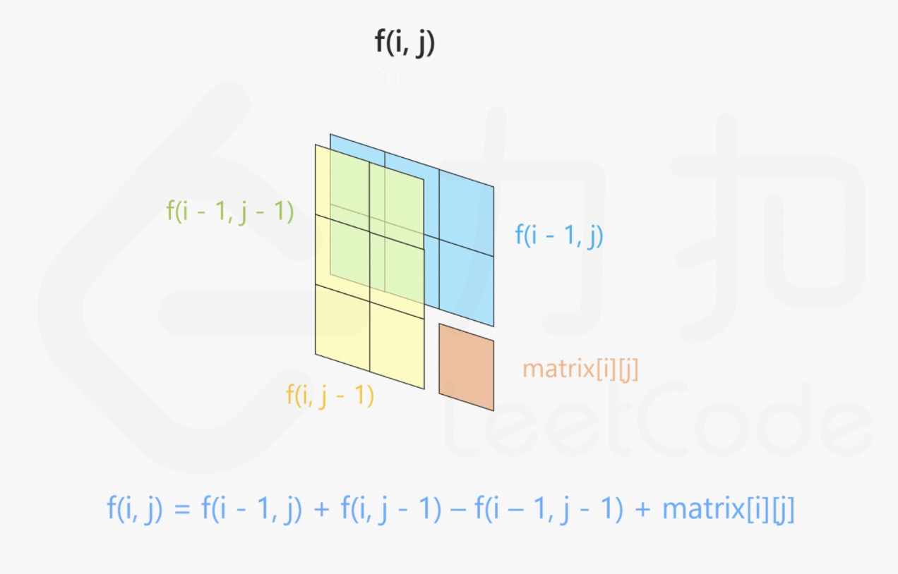
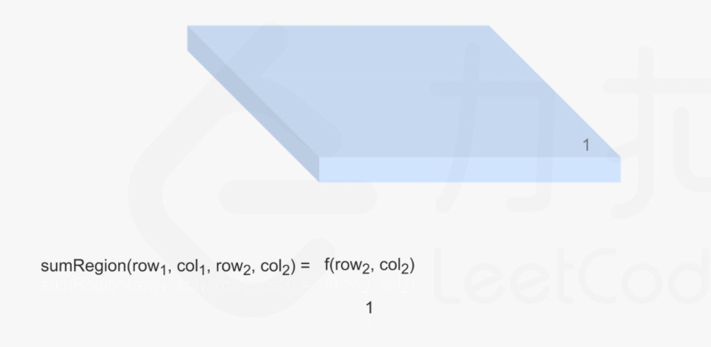
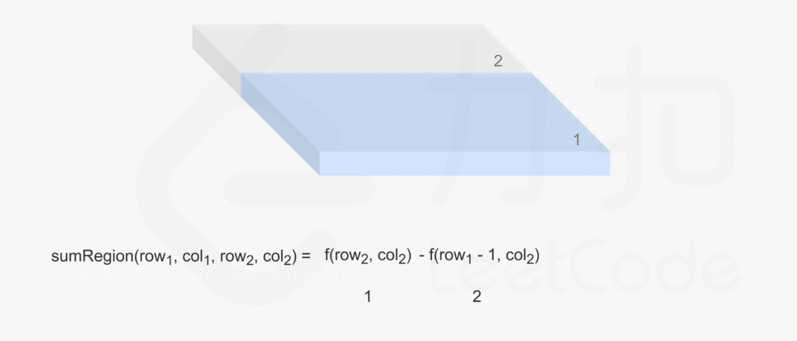
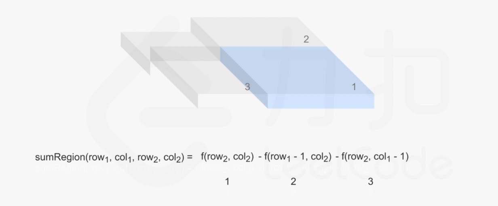
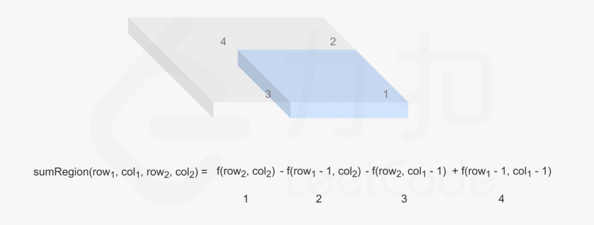

#### [661. 图片平滑器](https://leetcode-cn.com/problems/image-smoother/)

图像平滑器 是大小为 3 x 3 的过滤器，用于对图像的每个单元格平滑处理，平滑处理后单元格的值为该单元格的平均灰度。

每个单元格的  平均灰度 定义为：该单元格自身及其周围的 8 个单元格的平均值，结果需向下取整。（即，需要计算蓝色平滑器中 9 个单元格的平均值）。

如果一个单元格周围存在单元格缺失的情况，则计算平均灰度时不考虑缺失的单元格（即，需要计算红色平滑器中 4 个单元格的平均值）。


给你一个表示图像灰度的 m x n 整数矩阵 img ，返回对图像的每个单元格平滑处理后的图像 。

 

```
示例 1:


输入:img = [[1,1,1],[1,0,1],[1,1,1]]
输出:[[0, 0, 0],[0, 0, 0], [0, 0, 0]]
解释:
对于点 (0,0), (0,2), (2,0), (2,2): 平均(3/4) = 平均(0.75) = 0
对于点 (0,1), (1,0), (1,2), (2,1): 平均(5/6) = 平均(0.83333333) = 0
对于点 (1,1): 平均(8/9) = 平均(0.88888889) = 0
示例 2:


输入: img = [[100,200,100],[200,50,200],[100,200,100]]
输出: [[137,141,137],[141,138,141],[137,141,137]]
解释:
对于点 (0,0), (0,2), (2,0), (2,2): floor((100+200+200+50)/4) = floor(137.5) = 137
对于点 (0,1), (1,0), (1,2), (2,1): floor((200+200+50+200+100+100)/6) = floor(141.666667) = 141
对于点 (1,1): floor((50+200+200+200+200+100+100+100+100)/9) = floor(138.888889) = 138


提示:

m == img.length
n == img[i].length
1 <= m, n <= 200
0 <= img[i][j] <= 255
```

#### 解题思路

##### 二维前缀和

参考 [二维前缀和模板如何记忆](https://leetcode-cn.com/problems/range-sum-query-2d-immutable/solution/xia-ci-ru-he-zai-30-miao-nei-zuo-chu-lai-ptlo/)，图源leetcode。

**二维前缀和数组中的每一个格子记录的是「以当前位置为区域的右下角（区域左上角恒定为原数组的左上角）的区域和」**

`f[i][j] `是以 (i, j) 为右下角，(0, 0) 为左上角的区域和。

因此当我们要求 (x1, y1) 作为左上角，(x2, y2) 作为右下角 的区域和的时候，可以直接利用前缀和数组快速求解：

`sum[x2][y2] - sum[x1 - 1][y2] - sum[x2][y1 - 1] + sum[x1 - 1][y1 - 1]`













此题需要求得其实就是左上角 (row1, col1) = (i - 1, j - 1)以及其右下角 (row2, col2) = (i + 1, j + 1)所围成的区域和。

为了防止超出原矩阵，我们需要对边界分别取 `max` 和 `min`。

row1= max(0, i - 1)， col1 = max(0, j - 1)

row2= min(m-1, i + 1)， col2 = min(n-1, j + 1)

**注意！！！因为我们前缀和的记录下标是从1开始的，即row，col应该为数组对应下标i+1行,j+1列，因此(row1, col1) = (i - 1, j - 1)以及其右下角 (row2, col2) = (i + 1, j + 1)所围成的区域和对应的答案应该是**:

`ans[i][j]=sum[row2+1][col2+1] - sum[row1][col2+1] - sum[row2+1][col1] + sum[row1][col1]`

```go
func imageSmoother(img [][]int) [][]int {
    m, n := len(img), len(img[0])
    presum, ans := make([][]int, m + 2), make([][]int, m)
    presum[0] = make([]int , n + 2)
    for i := 1; i <= m; i++ {
        presum[i] = make([]int, n + 2)
        ans[i-1] = make([]int, n)
        // 为了保证前缀和和指定的行列的下标相对应，i,j从1开始
        for j := 1; j <= n; j++ {
            // 当前格子(i行j列)(和) = 上方的格子(和) + 左边的格子(和) - 左上角的格子(和) + 当前格子(值)
            //【和是指对应的前缀和，值是指原数组中的值】
            presum[i][j] = presum[i][j-1] + presum[i-1][j] - presum[i-1][j-1] + img[i-1][j-1]
       }
    }
    for i := 0; i < m; i++ {
        for j := 0; j < n; j++ {
            row1, row2, col1, col2 := max(0, i-1), min(m-1, i+1), max(0, j-1), min(n-1, j+1)
            // 因为i从0开始，所以ij对应的行数应该是(i+1,j+1)
            ans[i][j] = (presum[row2+1][col2+1] - presum[row1][col2+1] - presum[row2+1][col1] + presum[row1][col1]) / ((row2 - row1+1) * (col2 - col1+1))
        }
    }
    return ans
}

func max(a, b int) int {
    if a > b {
        return a
    }
    return b
}

func min(a, b int) int {
    if a < b {
        return a
    }
    return b
}
```

