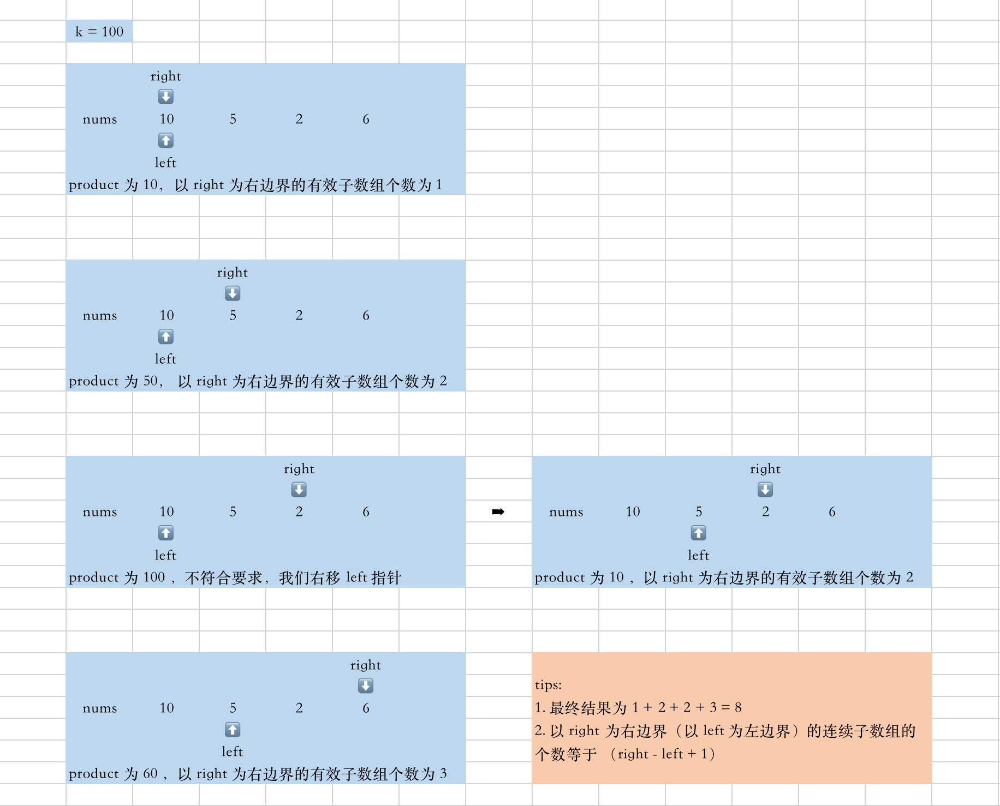
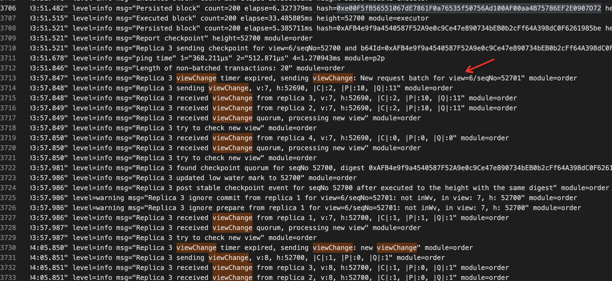
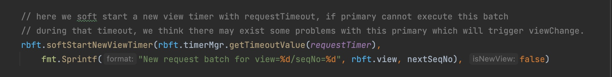

#### [713. 乘积小于 K 的子数组](https://leetcode-cn.com/problems/subarray-product-less-than-k/)

给你一个整数数组 nums 和一个整数 k ，请你返回子数组内所有元素的乘积严格小于 k 的连续子数组的数目。

```
示例 1：

输入：nums = [10,5,2,6], k = 100
输出：8
解释：8 个乘积小于 100 的子数组分别为：[10]、[5]、[2],、[6]、[10,5]、[5,2]、[2,6]、[5,2,6]。
需要注意的是 [10,5,2] 并不是乘积小于 100 的子数组。
示例 2：

输入：nums = [1,2,3], k = 0
输出：0


提示: 

1 <= nums.length <= 3 * 104
1 <= nums[i] <= 1000
0 <= k <= 106
```

#### 解题思路

一开始没有看到 【**连续子数组**】 这个限定，然后想了好久。有了这个限定后使用**双指针+滑动窗口**即可。

初始化 left、right 两个指针，我们计算 [left,right] 区间内的数字组成的乘积。注意到 nums[i] 和 k 的取值范围（1 <= nums[i] <= 1000，0 <= k <= 10^6），即使目前的乘积为 10^6，如果再来一个 1000，乘积为 10^9，不会超过 int 的取值范围，所以我们可以将乘积定义为 int 类型。
right 指针每划过一个数，我们就将该数字与前面的乘积进行累乘。 product *= nums[right++];
如果当前乘积 >= k，我们就开始移动 left 指针以期减少累乘的结果。 product /= nums[left++];
计算以 right 为右边界所形成的有效子数组的个数（right - left + 1）。（如下图示意，图源：https://leetcode-cn.com/problems/subarray-product-less-than-k/solution/by-programmercoding-hqm4/）



#### 代码演示

```go
func numSubarrayProductLessThanK(nums []int, k int) int {
    left, product, res := 0, 1, 0
    for right, val := range nums {
        product *= val
        for ; left <= right && product >= k; left++ {
            product /= nums[left]
        } 
        res += right-left+1

    }
    return res
}
```

> 时间复杂度：O(n)，其中 n 是数组nums 的长度。两个端点 left 和 right 的增加次数都不超过 n。
>
> 空间复杂度：O(1))。
>



您好，请教一下rbft的相关问题。我们在做跨链稳定性测试，在正常启动10个小时后发现rbft主节点发生了viewchange，看了一下日志是说的三阶段共识超时了。这个应该怎么解决呢？

