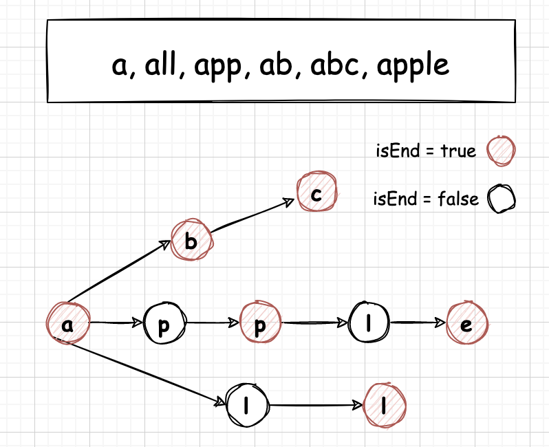

#### [720. 词典中最长的单词](https://leetcode-cn.com/problems/longest-word-in-dictionary/)

给出一个字符串数组 words 组成的一本英语词典。返回 words 中最长的一个单词，该单词是由 words 词典中其他单词逐步添加一个字母组成。

若其中有多个可行的答案，则返回答案中字典序最小的单词。若无答案，则返回空字符串。 

```
示例 1：

输入：words = ["w","wo","wor","worl", "world"]
输出："world"
解释： 单词"world"可由"w", "wo", "wor", 和 "worl"逐步添加一个字母组成。
示例 2：

输入：words = ["a", "banana", "app", "appl", "ap", "apply", "apple"]
输出："apple"
解释："apply" 和 "apple" 都能由词典中的单词组成。但是 "apple" 的字典序小于 "apply" 


提示：

1 <= words.length <= 1000
1 <= words[i].length <= 30
所有输入的字符串 words[i] 都只包含小写字母。
```


#### 解题思路

##### 方法一：哈希表

- 将单词从短到长排序；
- 利用哈希表标识所有的前缀，依次判断当前字符去掉一个字母后是否在哈希表中；
- 利用longest标识最长的字符串。


##### 方法二：前缀树

Trie，又称前缀树或字典树，是一棵有根树，其每个节点包含以下字段：

- 指向子节点的指针数组 children。对于本题而言，数组长度为 26，即小写英文字母的数量。此时 children[0] 对应小写字母 a，children[1] 对应小写字母 b，…，children[25] 对应小写字母 z。
- 布尔字段 isEnd，表示该节点是否为字符串的结尾。

**插入字符串**

我们从字典树的根开始，插入字符串。对于当前字符对应的子节点，有两种情况：

- 子节点存在。沿着指针移动到子节点，继续处理下一个字符。

- 子节点不存在。创建一个新的子节点，记录在children 数组的对应位置上，然后沿着指针移动到子节点，继续搜索下一个字符。

重复以上步骤，直到处理字符串的最后一个字符，然后将当前节点标记为字符串的结尾。

**查找前缀**

由题意可得，我们需要最长的单词从每个字符开始遍历，都对应字典树中的一个单词，即isEnd为True，如图所示



我们从字典树的根开始，查找前缀。对于当前字符对应的子节点，有两种情况：

- 子节点存在。沿着指针移动到子节点，并且标识符isEnd为true，继续搜索下一个字符。
- 子节点不存在。说明字典树中不包含该前缀，返回false。

重复以上步骤，直到搜索完前缀的最后一个字符，返回true。

若搜索到了前缀的末尾，就说明字典树中存在该前缀。此外，若前缀末尾对应节点的 isEnd 为真，则说明字典树中存在该字符串。

##### 代码演示

**方法一：哈希表**

```go
func longestWord(words []string) (longest string) {
    // 排序,长度相等时默认字符较前的较小
    sort.Slice(words, func(i, j int) bool {
        s, t := words[i], words[j]
        return len(s) < len(t) || len(s) == len(t) && s > t
    })
    // 初始化，单个字符去掉一个字符为空，也是最长的字符串
    hashMap := map[string]bool{"": true}
    for _, word := range words {
        // 如果新字符去掉一位能找到，最长字符赋值给它
        if _, ok := hashMap[word[:len(word)-1]]; ok {
            longest = word
            hashMap[word] = true
        }
    }
    return longest
}
想·
```


**方法二：字典树**

```go
type Trie struct {
	children [26]*Trie
	isEnd    bool
}
func (t *Trie) Insert(word string) {
	node := t
	for _, ch := range word {
		ch -= 'a'
		if node.children[ch] == nil {
			node.children[ch] = &Trie{}
		}
		node = node.children[ch]
	}
	// 标识每个单词的结尾
	node.isEnd = true
}

func (t *Trie) Search(word string) bool {
	node := t
	for _, ch := range word {
		ch -= 'a'
		// 如果当前的ch没有子节点，说明遍历到结尾了也没遍历到有isEnd的标识，返回false
		// 如果发现了isEnd，说明有一个前缀单词符合条件
		// 继续遍历，直到扩展后每一个单词都符合条件
		if node.children[ch] == nil || !node.children[ch].isEnd {
			return false
		}
		node = node.children[ch]
	}
	return true
}

func longestWord(words []string) string {
	t := &Trie{}
	longest := ""
	// 构造前缀树
	for _, word := range words {
		t.Insert(word)
	}
	for _, word := range words {
		// 找到了符合条件的单词，并且当前单词的长度最长（或者长度相等但单词位置更大）
		if t.Search(word) && (len(word) > len(longest) || len(word) == len(longest) && word < longest) {
			longest = word
		}
	}
	return longest
}
```

