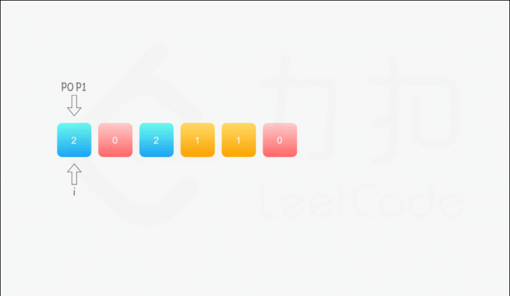

#### [75. 颜色分类](https://leetcode-cn.com/problems/sort-colors/)

本题是经典的[荷兰国旗问题](https://www.jianshu.com/p/356604b8903f)，由计算机科学家 [Edsger W. Dijkstra](https://baike.baidu.com/item/艾兹格·迪科斯彻) 首先提出。

给定一个包含红色、白色和蓝色，一共 n 个元素的数组，原地对它们进行排序，使得相同颜色的元素相邻，并按照红色、白色、蓝色顺序排列。

此题中，我们使用整数 0、 1 和 2 分别表示红色、白色和蓝色。

注意:
不能使用代码库中的排序函数来解决这道题。

```
示例:

输入: [2,0,2,1,1,0]
输出: [0,0,1,1,2,2]

进阶：

一个直观的解决方案是使用计数排序的两趟扫描算法。
首先，迭代计算出0、1 和 2 元素的个数，然后按照0、1、2的排序，重写当前数组。
你能想出一个仅使用常数空间的一趟扫描算法吗？
```

#### 解题思路（双指针）：

我们用指针 p~0~来交换 0，p~1~ 来交换 1，初始值都为 0。当我们从左向右遍历整个数组时：

- 如果找到了 1，那么将其与 nums[p~1~] 进行交换，并将 p~1~向后移动一个位置；
- 如果找到了 0，那么将其与 nums[p~0~] 进行交换，并将 p~0~向后移动一个位置。因为连续的 0 之后是连续的 1，因此如果我们将 0 与nums[p~0~] 进行交换，那么我们可能会把一个 1 交换出去。当 p~0~ < p~1~时，我们已经将一些 1 连续地放在头部，此时一定会把一个 1 交换出去，导致答案错误。因此，如果  p~0~ < p~1~，那么我们需要再将nums[i] 与 nums[p~1~] 进行交换，其中 i 是当前遍历到的位置，在进行了第一次交换后，nums[i] 的值为 1，我们需要将这个 1 放到「头部」的末端。在最后，无论是否有 p~0~ < p~1~ ，我们需要将 p~0~ 和p~1~均向后移动一个位置，而不是仅将 p~0~向后移动一个位置。

**动画图解：**




**代码演示：**

```java
class Solution {
    public void sortColors(int[] nums) {
        //p0为01的分界，默认指向第一个1
        //p1为12的分界，默认值想第一个2
        int p0 = 0;
        int p1 = 0;
        int len = nums.length;
        for (int i = 0; i < len; i++) {
            if (nums[i] == 0) {
                swap(nums, p0, i);
                //说明此时结构为0011220这种类型，第一趟swap是01的交换，还需要进行12的交换
                if (p0 < p1) {
                    swap(nums, p1, i);
                }
                p0++;
                p1++;
            }else if (nums[i] == 1) {
                swap(nums, p1, i);
                p1++;
            }
        }
    }
    private void swap(int[] nums, int index1, int index2) {
        int temp = nums[index1];
        nums[index1] = nums[index2];
        nums[index2] = temp;
    }

}
```

> - 时间复杂度：O*(*n*)，其中 n*是数组 nums 的长度。
> - 空间复杂度：O(1)。