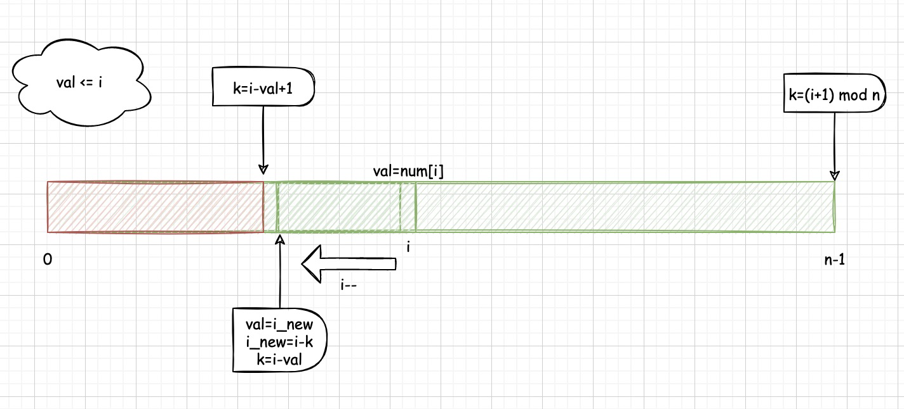
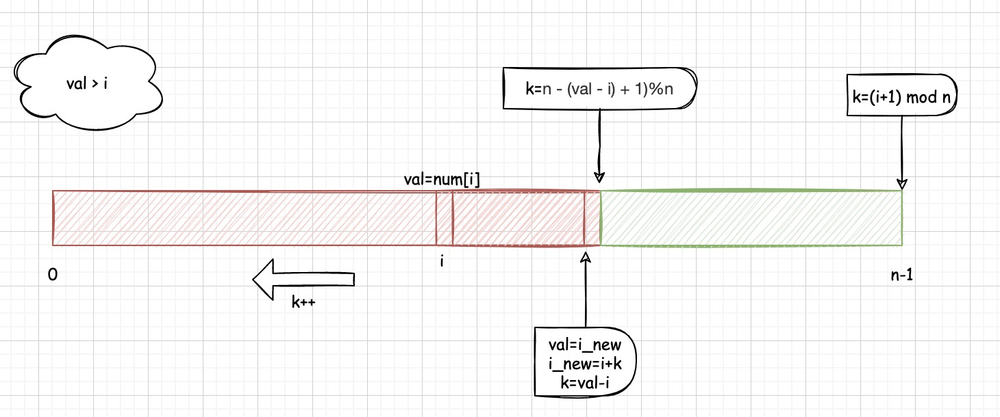

#### [798. 得分最高的最小轮调](https://leetcode-cn.com/problems/smallest-rotation-with-highest-score/)

给你一个数组 nums，我们可以将它按一个非负整数 k 进行轮调，这样可以使数组变为 `[nums[k], nums[k + 1], ... nums[nums.length - 1], nums[0], nums[1], ..., nums[k-1]]` 的形式。此后，任何值小于或等于其索引的项都可以记作一分。

例如，数组为 nums = [2,4,1,3,0]，我们按 k = 2 进行轮调后，它将变成 [1,3,0,2,4]。这将记为 3 分，因为 1 > 0 [不计分]、3 > 1 [不计分]、0 <= 2 [计 1 分]、2 <= 3 [计 1 分]，4 <= 4 [计 1 分]。
在所有可能的轮调中，返回我们所能得到的最高分数对应的轮调下标 k 。如果有多个答案，返回满足条件的最小的下标 k 。

 

```
示例 1：

输入：nums = [2,3,1,4,0]
输出：3
解释：
下面列出了每个 k 的得分：
k = 0,  nums = [2,3,1,4,0],    score 2
k = 1,  nums = [3,1,4,0,2],    score 3
k = 2,  nums = [1,4,0,2,3],    score 3
k = 3,  nums = [4,0,2,3,1],    score 4
k = 4,  nums = [0,2,3,1,4],    score 3
所以我们应当选择 k = 3，得分最高。
示例 2：

输入：nums = [1,3,0,2,4]
输出：0
解释：
nums 无论怎么变化总是有 3 分。
所以我们将选择最小的 k，即 0。


提示：

1 <= nums.length <= 105
0 <= nums[i] < nums.length
```

#### 解题思路

- 首先，我们统计一下nums中每个元素在哪个区间能得分，因为任何值小于或等于其索引的项都可以记作一分，即：nums[i]<=i时得分，因此：

    - 元素 x 记 1 分的下标范围是 [nums[i],n−1]，有 n - x 个下标；

    - 元素 x 不计分的下标范围是 [0,nums[i]−1]，有 x 个下标。

- 注意：所有的轮调计算可以当作左移计算，左移-1，为了避免出现负数往往移动会+n，因此所有计算当作没有+n的存在，最后避免出现负数 (index+n) mod n即可。

- 因此，维护一个数组shift表示产生分数贡献变化的分界点，将对应的移动值和变化记录下来，即shift[2]表示左移2次时，所有的元素的贡献相较于shift[1]的变化值。

    举例说明，shift[0]表示不移动时，所有元素的score，假设为5，shift[1]时，由于左移了1位，有些元素可能会从得分变为不得分，有些元素可能会从不得分变为得分，因此shift的记录规范为：遍历所有元素，该元素对shift的贡献如下：

    - 当`nums[i] <= i`(**注意num[i]>0恒成立**)时：

        - 该元素一开始所在位置就可以得分：`shift[0]++`；

        - 计算元素贡献取消的临界点：
            - k++时i--，当i-k=num[i]时，即k=i-num[i]，刚好nums[i] = i，因此`k= i - nums[i] + 1`时，刚好贡献从得分转为不得分，即`shift[i - nums[i] + 1]--;` 即 该元素在该临界点贡献变化值--；

        - 同理，计算元素从不得分到得分的临界点，这个很好计算，直接就是`(i+1) mod n`。此时贡献由不得分变为得分，`shift[(i+1) mod n]++`，贡献变化值++。

        

    - 当num[i]>i时：

        - 一开始不得分，左移也不得分，直到移到边界才会有变化，即`shift[(i+1) mod n]++`，贡献值变化++；
        - 继续左移，贡献变化从得分渐渐不得分，即`shift[n - (nums[i] - i) + 1)%n]--`，贡献值变化--。

​			

最后，贡献值变化累计的最大值的shift的下标即为最后的答案。比如shift[0]为基准值base，shift[1]=2,即左移1位相比0位增加2个贡献值，左移总贡献值为base+2。

#### 代码演示

```go
func bestRotation(nums []int) int {
    n := len(nums)
    shift := make([]int,n)
    for i:=0; i <= n-1; i++ {
         if (nums[i] <= i) {
            // nums[i] 一开始所在位置就可以得分
            // 不移动时 nums[i]就产生贡献
            shift[0]++; 
            // 临界值，贡献首次取消
            shift[(i - nums[i] + 1)%n]--; 
                // 直到移动到坐标小于0的位置； 变成移动到最右边； 贡献产生
            shift[(i+1)%n]++;
        } else {
            // 一开始所在位置不可得分；左移是没有用的；只有移动到边界时，才会产生变化
            shift[(i+1)%n]++;
            // 继续左移动；则会再次到达 值和下标相同的临界点； 继续左移一位则得分取消
            shift[(n - (nums[i] - i) + 1)%n]--;
        }
    }
    score := 0
    max := 0
    bestK:= 0
    for index,val :=range shift {
        score += val
        if score > max {
            max = score
            bestK = index
        }
    }
    return bestK 
}
```

> 时间复杂度：O(n)，其中 n 是数组 nums 的长度。需要遍历数组 nums 两次。
>
> 空间复杂度：O(n)，其中 n 是数组 nums 的长度。需要创建长度为 n 的数组 shift。
>