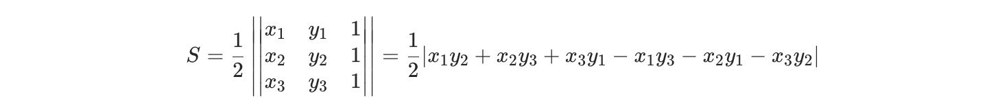
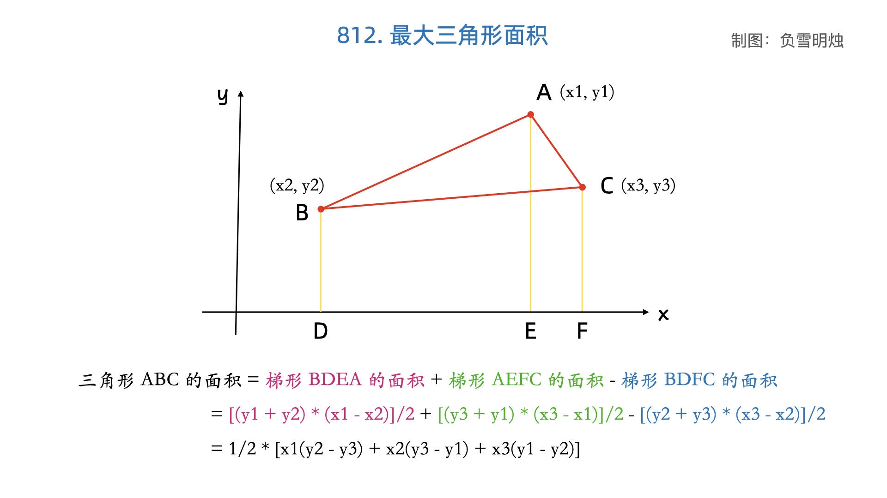

#### [812. 最大三角形面积](https://leetcode.cn/problems/largest-triangle-area/)

给定包含多个点的集合，从其中取三个点组成三角形，返回能组成的最大三角形的面积。

```
示例:
输入: points = [[0,0],[0,1],[1,0],[0,2],[2,0]]
输出: 2
解释: 
这五个点如下图所示。组成的橙色三角形是最大的，面积为2。
```


注意:

3 <= points.length <= 50.
不存在重复的点。
 -50 <= points[i][j] <= 50.
结果误差值在 10^-6 以内都认为是正确答案。


#### 解题思路

##### 方法一：简单模拟

计算任意三点的三角形面积公式推导如下：





#### 代码演示

```go
func triangleArea(x1, y1, x2, y2, x3, y3 int) float64 {
    return math.Abs(float64(x1*y2+x2*y3+x3*y1-x1*y3-x2*y1-x3*y2)) / 2
}

func largestTriangleArea(points [][]int) float64 {
    var ans float64
    for i, p := range points {
        for j, q := range points[i+1:] {
            for _, r := range points[j+1:] {
                ans = math.Max(ans, triangleArea(p[0], p[1], q[0], q[1], r[0], r[1]))
            }
        }
    }
    return ans
}
```

> 时间复杂度：O(n<sup>3</sup>)，其中 n 是数组 points 的长度。三重循环需要 O(n<sup>3</sup>)。
>
> 空间复杂度：O(1)。
>