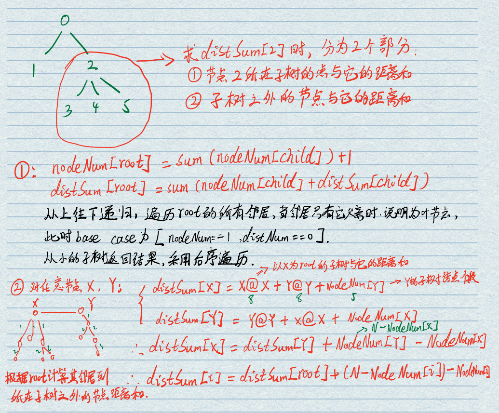

#### [834. 树中距离之和](https://leetcode-cn.com/problems/sum-of-distances-in-tree/)

给定一个无向、连通的树。树中有 N 个标记为 0...N-1 的节点以及 N-1 条边 。

第 i 条边连接节点 `edges[i][0] `和 `edges[i][1] `。

返回一个表示节点 i 与其他所有节点距离之和的列表 ans。

```
示例 1:

输入: N = 6, edges = [[0,1],[0,2],[2,3],[2,4],[2,5]]
输出: [8,12,6,10,10,10]
解释: 
如下为给定的树的示意图：
  0
 / \
1   2
   /|\
  3 4 5

我们可以计算出 dist(0,1) + dist(0,2) + dist(0,3) + dist(0,4) + dist(0,5) 
也就是 1 + 1 + 2 + 2 + 2 = 8。 因此，answer[0] = 8，以此类推。
说明: 1 <= N <= 10000
```

解题思路：

我们重复利用了distSum数组这个空间。它先是代表：节点到它所在子树的节点的距离和。后面就更新为：节点到其他所有节点的距离和。

本题的突破口，依然是——总是关注子树，关注子树，想到递归，子树是一种重复的结构，适合用递归求解，这道题巧妙地将目标拆分为两部分：

- 子树内的节点与 root 的距离和
- 子树外的节点与 root 的距离和
  用递归求解前者，这是主旋律，后者不用特地求，因为我们已知父节点的正确的 `distSum`，利用递推公式：

`distSum[i] =(distSum[root]  + (N - nodeNum[i]) - nodeNum[i]`

就能递推出当前节点的正确的 distSum，就像沿着一棵树在填表，这就是树形DP。



代码演示:

```java
class Solution {
    public List<List<Integer>> graph = new ArrayList<>();//邻接表
    int[] distSum; //距离和
    int[] nodeNum; //子树节点个数（包括自己）
    
    public int[] sumOfDistancesInTree(int N, int[][] edges) {
        for(int i = 0; i < N; i++) {
            graph.add(new ArrayList<Integer>());
        }
        //构建邻接表
        for(int i = 0; i < edges.length; i++) {
            int src = edges[i][0];
            int dst = edges[i][1];
            graph.get(src).add(dst);
            graph.get(dst).add(src);
        }
        distSum = new int[N];
        nodeNum = new int[N];
        //因为nodeNum至少为1
        Arrays.fill(nodeNum, 1);
        postOrder(0, -1);
        preOrder(0, -1);
        return distSum;
    }
    //求root到子树所有节点的距离和
    private void postOrder(int root, int parent) {
        List<Integer> neighbors = graph.get(root);
        for(Integer neighbor : neighbors) {
            if(neighbor == parent)
                continue; //如果邻接点是父节点，则跳过
            postOrder(neighbor, root);
            nodeNum[root] += nodeNum[neighbor];
            distSum[root] += distSum[neighbor] + nodeNum[neighbor];
        }
    }
    //根据root计算其邻居到所在子树之外的节点的距离和（包括root节点）
    private void preOrder(int root, int parent) {
        List<Integer> neighbors = graph.get(root);
        for(Integer neighbor : neighbors) {
            if(neighbor == parent)
                continue;
            distSum[neighbor] = distSum[root] - nodeNum[neighbor] + (graph.size() - nodeNum[neighbor]);
            preOrder(neighbor, root);
        }
    }
}
```

> 时间复杂度：O(N)，其中 N 是树中的节点个数。我们只需要遍历整棵树两次即可得到答案，其中每个节点被访问两次，因此时间复杂度为 O(2N)=O(N)。
>
> 空间复杂度：O(N)。
>