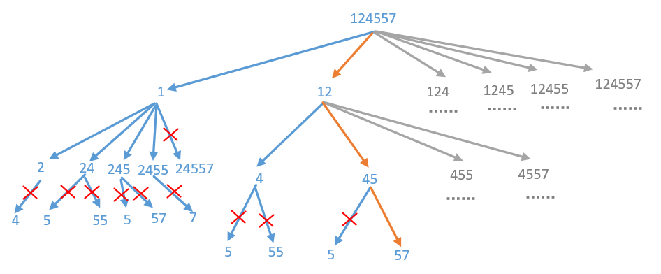

#### [842. 将数组拆分成斐波那契序列](https://leetcode-cn.com/problems/split-array-into-fibonacci-sequence/)

给定一个数字字符串 S，比如 S = "123456579"，我们可以将它分成斐波那契式的序列 [123, 456, 579]。

形式上，斐波那契式序列是一个非负整数列表 F，且满足：

0 <= F[i] <= 2<sup>31 - 1，（也就是说，每个整数都符合 32 位有符号整数类型）；
F.length >= 3；
对于所有的0 <= i < F.length - 2，都有 F[i] + F[i+1] = F[i+2] 成立。
另外，请注意，将字符串拆分成小块时，每个块的数字一定不要以零开头，除非这个块是数字 0 本身。

返回从 S 拆分出来的任意一组斐波那契式的序列块，如果不能拆分则返回 []。

```
示例 1：

输入："123456579"
输出：[123,456,579]
示例 2：

输入: "11235813"
输出: [1,1,2,3,5,8,13]
示例 3：

输入: "112358130"
输出: []
解释: 这项任务无法完成。
示例 4：

输入："0123"
输出：[]
解释：每个块的数字不能以零开头，因此 "01"，"2"，"3" 不是有效答案。
示例 5：

输入: "1101111"
输出: [110, 1, 111]
解释: 输出 [11,0,11,11] 也同样被接受。


提示：

1 <= S.length <= 200
字符串 S 中只含有数字。
```

#### 解题思路（回溯＋剪枝）

​	回溯算法其实就是不断尝试的过程，一旦尝试成功了，就算成功了，如果尝试失败了还会回到上一步，注意回到上一步的时候还要把状态还原到上一步的状态。关于回溯算法的解题思路参考[什么叫回溯算法](https://mp.weixin.qq.com/s?__biz=MzU0ODMyNDk0Mw==&mid=2247488558&idx=1&sn=bb600c06c773960b3f4536c4c6c8d948&chksm=fb41870ecc360e18db1ca13783050d1a2efb19579407587baeea9b258a92e4c90c7ad12cbc1a&token=1584592952&lang=zh_CN#rd)。

​	根据斐波那契式序列的要求，从第 3 个数开始，每个数都等于前 2 个数的和，因此从第 3 个数开始，需要判断拆分出的数是否等于前 2 个数的和，只有满足要求时才进行拆分，否则不进行拆分。参照示例1为例画的一个图，只不过数字缩短了，只有`124557`。



回溯过程中，还有三处可以进行剪枝操作。

- 拆分出的数如果不是 0，则不能以 0 开头，因此如果字符串剩下的部分以 0 开头，就不需要考虑拆分出长度大于 1 的数，因为长度大于 1 的数以 0 开头是不符合要求的，不可能继续拆分得到斐波那契式序列；

- 拆分出的数必须符合 32位有符号整数类型，即每个数必须在 [0,2<sup>31</sup> −1] 的范围内，如果拆分出的数大于2<sup>31</sup> −1，则不符合要求，长度更大的数的数值也一定更大，一定也大于2<sup>31</sup> −1，因此不可能继续拆分得到斐波那契式序列；
- 如果列表中至少有 2 个数，并且拆分出的数已经大于最后 2 个数的和，就不需要继续尝试拆分了。

**代码演示（Golang）：**

```go
import "math"

func splitIntoFibonacci(S string) []int {
	var res []int
	if backTrack([]byte(S),&res,0, 0, 0) {
        return res
    }
	return res
}

func backTrack(S []byte, res *[]int, preSum int, pre int, index int) bool {
	//边界条件判断，如果截取完了，并且res长度大于等于3，表示找到了一个组合。
	if index == len(S) && len(*res) >= 3 {
		return true
	}
	cur := 0
	for i := index; i < len(S); i++ {
		//两位以上的数字不能以0开头
		if S[index] == '0' && i > index {
			break
		}

		cur = cur * 10 + int(S[i] - '0')
		//剪枝，如果截取的数字大于int的最大值，则终止截取
		if cur > math.MaxInt32 { 
			break
		}

		length := len(*res)
		if length >=2 {
			//当前cur已经大于前两个之和了，就可以提前剪枝
			if cur > preSum {
				break
            //如果过小，继续循环
			}else if cur < preSum{
			    continue
		    }
		}
		//把数字num添加到集合res中
		*res = append(*res, cur)
		//如果找到了就直接返回
		if backTrack(S, res, pre+cur, cur, i+1) {
			return true
		}
		//如果没找到，就会走回溯这一步，然后把上一步添加到集合res中的数字给移除掉
		*res = (*res)[:len(*res)-1]
	}
	return false
}
```

> 时间复杂度：O(n log <sup>2</sup>C)，其中 n 是字符串的长度，C 是题目规定的整数范围2<sup>31</sup> −1 。在回溯的过程中，实际上真正进行「回溯」的只有前 2 个数，而从第 3 个数开始，整个斐波那契数列是可以被唯一确定的，整个回溯过程只起到验证（而不是枚举）的作用。对于前 2 个数，它们的位数不能超过|O(n log <sup>2</sup>C)|，那么枚举的空间为 O(n log <sup>2</sup>C)；对于后面的所有数，回溯的过程是没有「分支」的，因此时间复杂度为 O(n)，相乘即可得到总时间复杂度O(n log <sup>2</sup>C)。
>
> 空间复杂度：O(n)，其中 n 是字符串的长度。除了返回值以外，空间复杂度主要取决于回溯过程中的递归调用层数，最大为 n。
>