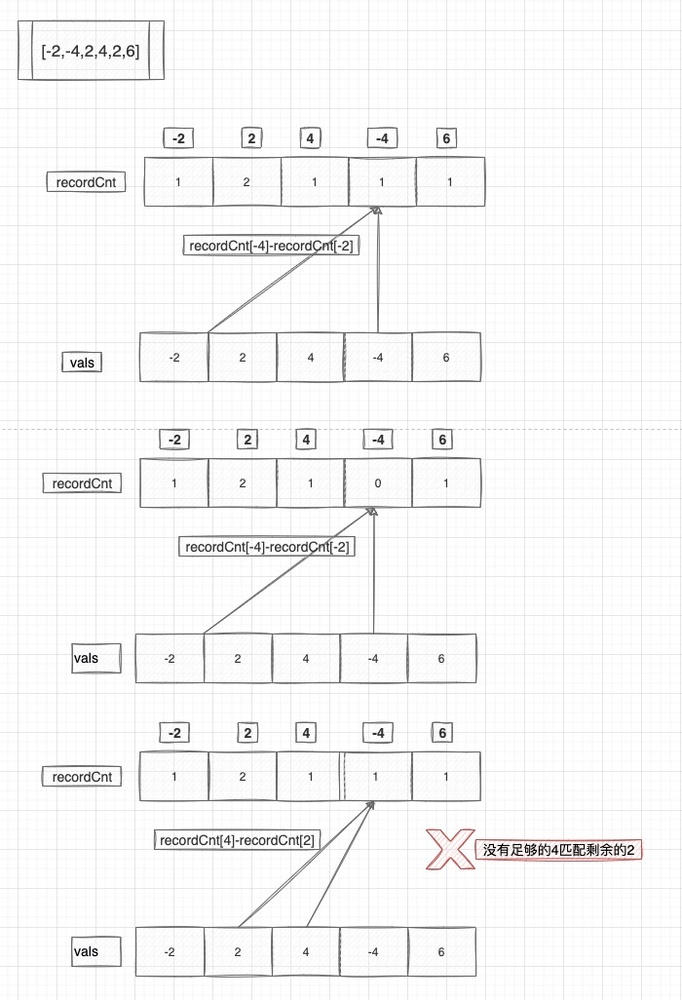

#### [954. 二倍数对数组](https://leetcode-cn.com/problems/array-of-doubled-pairs/)

给定一个长度为偶数的整数数组 arr，只有对 arr 进行重组后可以满足 “对于每个 0 <= i < len(arr) / 2，都有 arr[2 * i + 1] = 2 * arr[2 * i]” 时，返回 true；否则，返回 false。

 

```
示例 1：

输入：arr = [3,1,3,6]
输出：false
示例 2：

输入：arr = [2,1,2,6]
输出：false
示例 3：

输入：arr = [4,-2,2,-4]
输出：true
解释：可以用 [-2,-4] 和 [2,4] 这两组组成 [-2,-4,2,4] 或是 [2,4,-2,-4]


提示：

0 <= arr.length <= 3 * 104
arr.length 是偶数
-105 <= arr[i] <= 105
```


#### 解题思路

##### 哈希表

设 arr 的长度为 n，题目本质上是问 arr 能否分成 2n 对元素，每对元素中一个数是另一个数的两倍。

设 recordCnt[val] 表示 arr 中 val 的个数。

- 对于 arr 中的 0，它只能与 0 匹配。如果 recordCnt[0] 是奇数，那么必然无法满足题目要求。

- 去掉arr 中的 0。设 val 为 arr 中绝对值最小的元素，由于没有绝对值比 val 更小的数，因此 val 只能与 2val 匹配。
    - 如果此时 recordCnt[2*val]< recordCnt[val]，那么会有部分 val 无法找到它的另一半，即无法满足题目要求；
    - 否则将所有 val 和 recordCnt[val] 个 2val 从 arr 中去掉，继续判断剩余元素是否满足题目要求。不断重复此操作，如果某个时刻 arr 为空，则说明 arr 可以满足题目要求。

代码实现时，我们可以用一个哈希表来统计 recordCnt，并将其键值按绝对值从小到大排序，然后模拟上述操作，去掉元素的操作可以改为从 recordCnt 中减去对应值。



#### 代码演示

```go
func canReorderDoubled(arr []int) bool {
	recordCnt := make(map[int]int, len(arr))
	// 哈希表记录
	for _, val := range arr {
		recordCnt[val]++
	}
	// 排除奇数个0的存在
	if recordCnt[0]%2 == 1 {
		return false
	}

	vals := make([]int, 0, len(recordCnt))
	for val := range recordCnt {
		vals = append(vals, val)
	}
	sort.Slice(vals, func(i, j int) bool {
		// 按绝对值排序
		return abs(vals[i]) < abs(vals[j])
	})

	for _, val := range vals {
		// 无法找到足够的 2val 与 val 配对
		if recordCnt[2*val] < recordCnt[val] {
			return false
		}
		recordCnt[2*val] -= recordCnt[val]
	}
	return true
}

func abs(val int) int {
	if val < 0 {
		return -val
	}
	return val
}

```

> 时间复杂度：O(nlogn)，其中 n 是数组 arr 的长度。最坏情况下哈希表中有 n 个元素，对其排序需要 O(nlogn) 的时间。
>
> 空间复杂度：O(n)。最坏情况下哈希表中有 n 个元素，需要 O(n) 的空间。
>