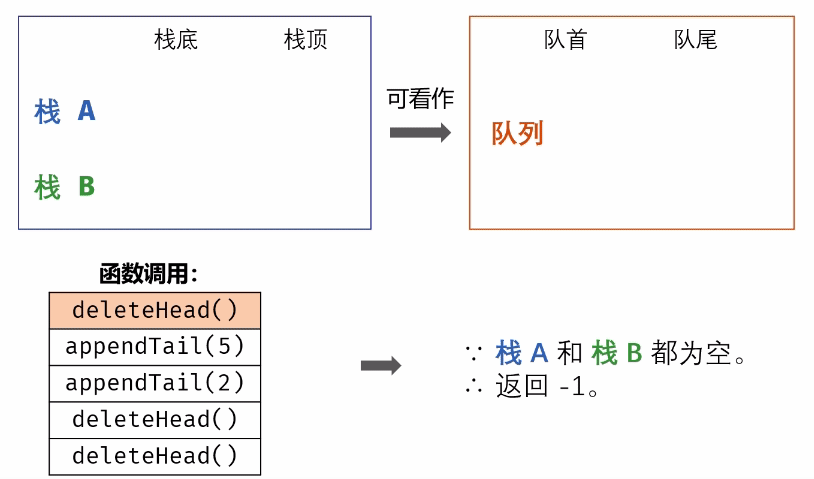

#### 原题链接：

https://leetcode-cn.com/problems/yong-liang-ge-zhan-shi-xian-dui-lie-lcof/、


#### 题目描述：

用两个栈实现一个队列。队列的声明如下，请实现它的两个函数 appendTail 和 deleteHead ，分别完成在队列尾部插入整数和在队列头部删除整数的功能。(若队列中没有元素，deleteHead 操作返回 -1 )

```
 示例 1：

输入：
["CQueue","appendTail","deleteHead","deleteHead"]
[[],[3],[],[]]
输出：[null,null,3,-1]
示例 2：

输入：
["CQueue","deleteHead","appendTail","appendTail","deleteHead","deleteHead"]
[[],[],[5],[2],[],[]]
输出：[null,-1,null,null,5,2]
提示：

1 <= values <= 10000
最多会对 appendTail、deleteHead 进行 10000 次调用


```

解题思路：

栈是先进后出，队列是先进先出，元素进出示例如图：


（图源：https://pic.leetcode-cn.com/b813bda09374058f18449b18cc6536a5b8670d5a7b65867eb65b32066c79c1ae-Picture0.png）

题目只要求实现 加入队尾appendTail() 和 删除队首deleteHead() 两个函数的正常工作，因此我们可以设计栈 A 用于加入队尾操作，栈 B 用于将元素倒序，从而实现删除队首元素。加入队尾 appendTail()函数： 将数字 val 加入栈 A 即可。
删除队首deleteHead()函数： 有以下三种情况。

- 当栈 B 不为空： B中仍有已完成倒序的元素，因此直接返回 B 的栈顶元素。
- 当 A 为空： 即两个栈都为空，无元素，因此返回 -1−1 。
- 否则将栈 A 元素全部转移至栈 B 中，实现元素倒序，并返回栈 B 的栈顶元素。

**动画图解：**




**代码演示：**

```go
type CQueue struct {
	stackIn []int   //存数据
    stackOut []int  //  取数据
}

func Constructor() CQueue {
	return CQueue{}
}

func (this *CQueue) AppendTail(value int) {
	this.stackIn = append(this.stackIn, value)
}

func (this *CQueue) DeleteHead() int {
	if len(this.stackIn) == 0 && len(this.stackOut)==0 {
		return -1
    }   
     // stackOut 栈为空，依次弹出stackIn 栈顶元素，入 stackOut 栈
    if len(this.stackOut) == 0 {
        for len(this.stackIn) > 0 {
            lastIndex := len(this.stackIn) - 1
            popValue := this.stackIn[lastIndex]
            this.stackIn = this.stackIn[:lastIndex] //出栈后元素-1
            this.stackOut = append(this.stackOut , popValue)
        }
    }

    // 弹出 out 栈顶元素
    lastIndex := len(this.stackOut) - 1  //记录StackOut栈顶指针
    popValue := this.stackOut[lastIndex]
    this.stackOut = this.stackOut[:lastIndex]
    return popValue
}

```

> **插入元素:**
>
> 时间复杂度：O(n)。插入元素时，对于已有元素，每个元素都要弹出栈两次，压入栈两次，因此是线性时间复杂度。
> 空间复杂度：O(n)。需要使用额外的空间存储已有元素。
>
> **删除元素**
>
> 时间复杂度：O(1)。判断元素个数和删除队列头部元素都使用常数时间。
> 空间复杂度：O(1)。从第一个栈弹出一个元素，使用常数空间。
>
> 
>
> 执行用时 :232 ms, 在所有 Go 提交中击败了94.59%的用户
>
> 内存消耗 :8.2 MB, 在所有 Go 提交中击败了100.00%的用户