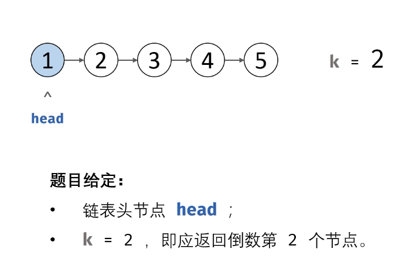

#### 原题链接：

https://leetcode-cn.com/problems/lian-biao-zhong-dao-shu-di-kge-jie-dian-lcof/


#### 题目描述：

输入一个链表，输出该链表中倒数第k个节点。为了符合大多数人的习惯，本题从1开始计数，即链表的尾节点是倒数第1个节点。例如，一个链表有6个节点，从头节点开始，它们的值依次是1、2、3、4、5、6。这个链表的倒数第3个节点是值为4的节点。

```
示例：

给定一个链表: 1->2->3->4->5, 和 k = 2.

返回链表 4->5.

```


#### 解题思路：

**双指针法：**

- 初始化： 前指针 former 、后指针 latter ，双指针都指向头节点 head 。
- 构建双指针距离： 前指针 former 先向前走 k步（结束后，双指针 former 和 latter 间相距 k 步）。
- 双指针共同移动： 循环中，双指针 former 和 latter 每轮都向前走一步，直至 former 走过链表 尾节点时跳出（跳出后， latter 与尾节点距离为 k-1，即 latter 指向倒数第 k 个节点）。
- 返回值： 返回 latter 即可。

动画图解：




**代码演示：**

```go
/**
 * Definition for singly-linked list.
 * type ListNode struct {
 *     Val int
 *     Next *ListNode
 * }
 */
func getKthFromEnd(head *ListNode, k int) *ListNode {
    	former, latter := head, head
	
	// former 先走k步
	for i := 0; i < k; i++ {
		former = former.Next
	}

	// latter 和 former 共同走 n - k 步，n代表链表长度，直到former走出链表
	for former != nil {
		former, latter = former.Next, latter.Next
	}

	return latter
}
```

> 执行用时 :0 ms, 在所有 Go 提交中击败了100.00%的用户
>
> 内存消耗 :2.2 MB, 在所有 Go 提交中击败了100.00%的用户