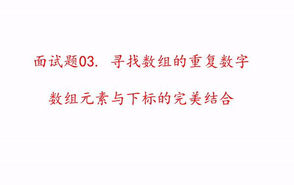

#### 原题链接：

https://leetcode-cn.com/problems/shu-zu-zhong-zhong-fu-de-shu-zi-lcof/


#### 题目描述：

找出数组中重复的数字。


在一个长度为 n 的数组 nums 里的所有数字都在 0～n-1 的范围内。数组中某些数字是重复的，但不知道有几个数字重复了，也不知道每个数字重复了几次。请找出数组中任意一个重复的数字。

示例 1：

```
输入：
[2, 3, 1, 0, 2, 5, 3]
输出：2 或 3 
```

#### 解题思路：

**解法一：构造map**

构造map，使得map的key用num来填充，map的value则用bool类型判断其是否出现过


**代码演示：**

```go
func findRepeatNumber(nums []int) int {
	hashMap := make(map[int]struct{}, 0)
	var res int
	for _, num := range nums {
		if _, ok := hashMap[num]; !ok {
			hashMap[num] = struct{}{}	
		} else {
			res = num
			break
		}	
	}
	return res
}
```

> **时间复杂度：O(n)，空间复杂度：O(n)**
>
> 执行用时 :44 ms, 在所有 Go 提交中击败了73.10%的用户
>
> 内存消耗 :7.9 MB, 在所有 Go 提交中击败了100.00%的用户


**解法二：利用数组下标原地置换**

- 因为数组下标是无重复的，利用数组下标来匹配对应的元素
- 从前往后遍历数组，每个元素都要求下标与元素的值一一对应
- 如在调换位置的过程中发现该位置的元素与别的位置的元素是相同的，那么就说明该数字重复，直接返回该数字



（图片来源：https://pic.leetcode-cn.com/811320fa207519efeac59b157842938b61e4ec059ab9bc0ffa392babbd42da97-ezgif.com-resize.gif）


**代码演示：**

Golang:

```go
func findRepeatNumber(nums []int) int {
	for i := 0; i < len(nums); {
        // 注意：在替换完一轮后不能马上i++， 因为同样要还保证替换后该位置的元素也是在正确的位置上
		if i == nums[i] {
			i++
			continue
		}
		if nums[i] == nums[nums[i]] {
			return nums[i]
		}
		nums[i], nums[nums[i]] = nums[nums[i]], nums[i]
	}
	return -1
}
```

> **时间复杂度：O(n)，空间复杂度：O(1)**
>
> 执行用时 :40 ms, 在所有 Go 提交中击败了93.42%的用户
>
> 内存消耗 :6.9 MB, 在所有 Go 提交中击败了100.00%的用户


Java:

```java
class Solution {
    public void swap(int i, int j , int[] nums){

        int temp;
        temp = nums[i];
        nums[i] = nums[j];
        nums[j] = temp;
    }

    public int findRepeatNumber(int[] nums) {

        for (int i=0; i<nums.length; i++){
            if(i!=nums[i] && nums[i]==nums[nums[i]]){
                return nums[i];
            }
            swap(nums[i], nums[nums[i]], nums);

        }
        return -1;
    }
}
```

> 执行用时：2 ms, 在所有 Java 提交中击败了70.56% 的用户
>
> 内存消耗：47.7 MB, 在所有 Java 提交中击败了100.00% 的用户