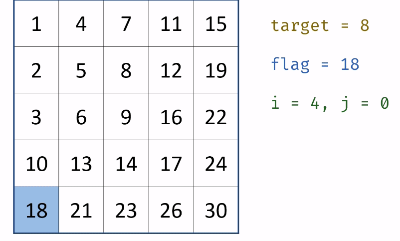

####　原题链接：

https://leetcode-cn.com/problems/er-wei-shu-zu-zhong-de-cha-zhao-lcof/


#### 题目描述：

在一个 n * m 的二维数组中，每一行都按照从左到右递增的顺序排序，每一列都按照从上到下递增的顺序排序。请完成一个函数，输入这样的一个二维数组和一个整数，判断数组中是否含有该整数。

 

```
示例:

现有矩阵 matrix 如下：

[
  [1,   4,  7, 11, 15],
  [2,   5,  8, 12, 19],
  [3,   6,  9, 16, 22],
  [10, 13, 14, 17, 24],
  [18, 21, 23, 26, 30]
]
给定 target = 5，返回 true。

给定 target = 20，返回 false。

 

限制：

0 <= n <= 1000

0 <= m <= 1000


```

#### 解题思路：

从矩阵 matrix 左下角元素（索引设为 (i, j) ）开始遍历，并与目标值对比：

- 当 matrix[i][j]> target 时： 行索引向上移动一格（即 i--），即消去矩阵第 i 行元素； 当 matrix[i][j] < target 时： 列索引向右移动一格（即 j++），即消去矩阵第 j 列元素；
  当 matrix[i][j] == target 时： 返回 true 。
  若行索引或列索引越界，则代表矩阵中无目标值，返回 false 。

**动画图解：**




**代码演示：**

```go
func findNumberIn2DArray(matrix [][]int, target int) bool {
    i := len(matrix) - 1
    j := 0
    for  i >= 0  && j < len(matrix[i])  {
        if target < matrix[i][j] {
            i --
        }else if target > matrix[i][j]{
            j++
        }else if target == matrix[i][j] {
            return true
        }else {
            return false
        }
    }
    return false
}
```

> **时间复杂度：O(n+m),   空间复杂度：O(1)**
>
> 执行用时 :32 ms, 在所有 Go 提交中击败了70.66%的用户
>
> 内存消耗 :6.3 MB, 在所有 Go 提交中击败了100.00%的用户