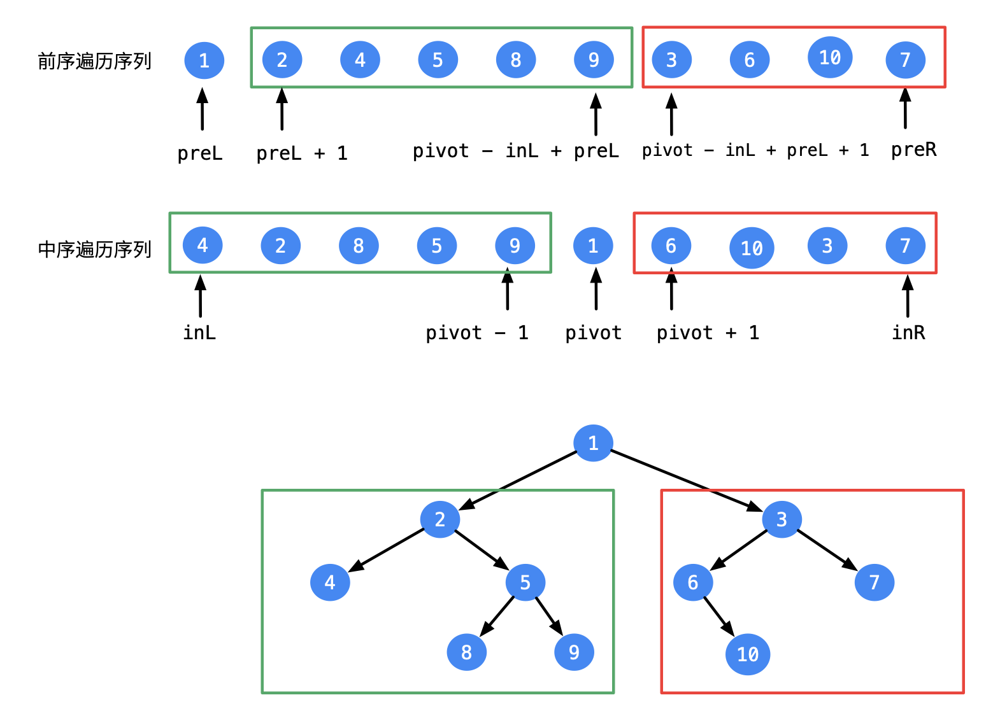

#### 原题链接：

https://leetcode-cn.com/problems/zhong-jian-er-cha-shu-lcof/


#### 题目描述：

输入某二叉树的前序遍历和中序遍历的结果，请重建该二叉树。假设输入的前序遍历和中序遍历的结果中都不含重复的数字。

```
例如，给出

前序遍历 preorder = [3,9,20,15,7]
中序遍历 inorder = [9,3,15,20,7]

返回如下的二叉树：

    3
   / \
  9  20
    /  \
   15   7


限制：

0 <= 节点个数 <= 5000


```


#### 解题思路：

- 前序遍历的第一个元素就是根节点, 则在中序数组中找到该元素左边的序列就是左子树的中序遍历, 右边的序列就是右子树的中序遍历
- 同样, 我们获得左子树的中序遍历的长度, 可知在前序数组中, 除去第一个元素之后, 前该长度的数列就是左子树的前序遍历, 该长度之后的数列就是右子树的中序遍历
- 则我们得到了根节点以及左右子树的前中序遍历。找出左右子树的根节点,作为最开始的根节点的左右子节点递归调用，每次执行函数返回一个root，最后输出层次遍历的序列




**代码演示：**

```go
/**
 * Definition for a binary tree node.
 * type TreeNode struct {
 *     Val int
 *     Left *TreeNode
 *     Right *TreeNode
 * }
 */
func buildTree(preorder []int, inorder []int) *TreeNode {
    if len(preorder)==0{
        return nil
    }
     root := &TreeNode{
        Val:    preorder[0] ,
        Left:   nil ,
        Right:  nil ,
    }
    
    var index int
    for i := range inorder{
        if inorder[i]==preorder[0]{
            index = i
            break   
        
        }
    }
    // 注意在golang切片中slice[a:b]表示切片中的第a+1个元素slice[a]到第b个元素slice[b-1](不包含slice(b))
    
    root.Left = buildTree(preorder[1:index+1],inorder[:index])
    root.Right = buildTree(preorder[index+1:],inorder[index+1:])
    return root
}
```

> 时间复杂度：O(n)     空间复杂度：O(n)
>
> 执行用时 :4 ms, 在所有 Go 提交中击败了95.51%的用户
>
> 内存消耗 :3.9 MB, 在所有 Go 提交中击败了100.00%的用户