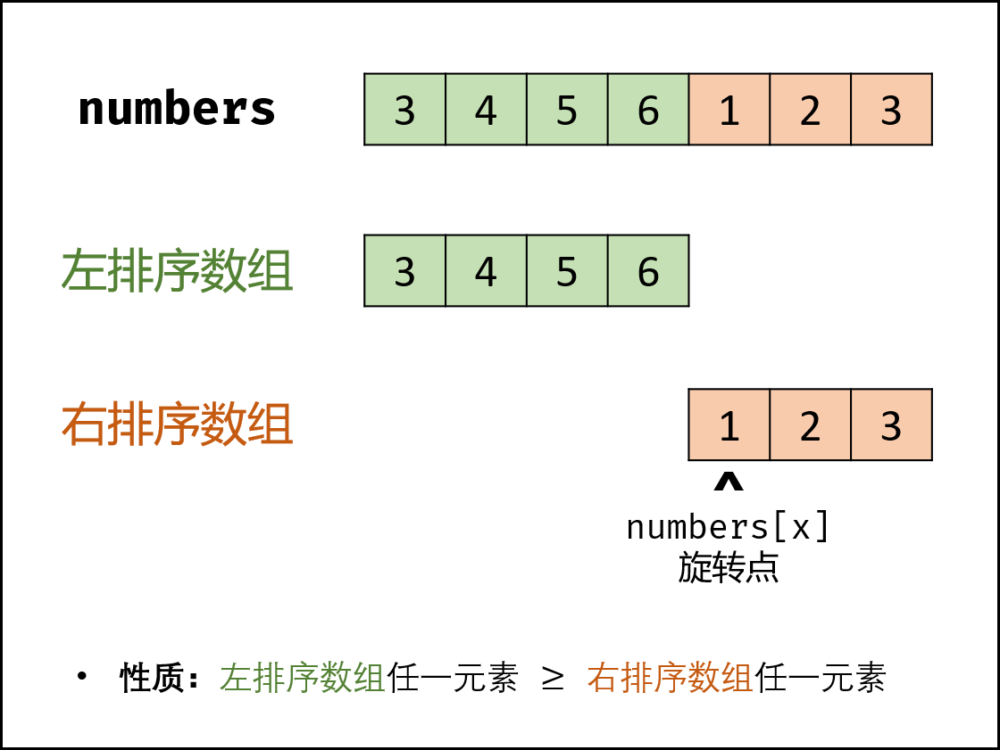
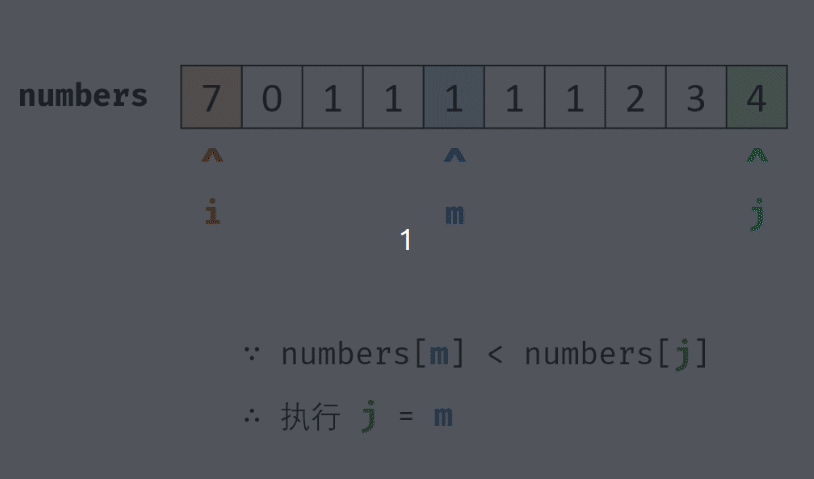
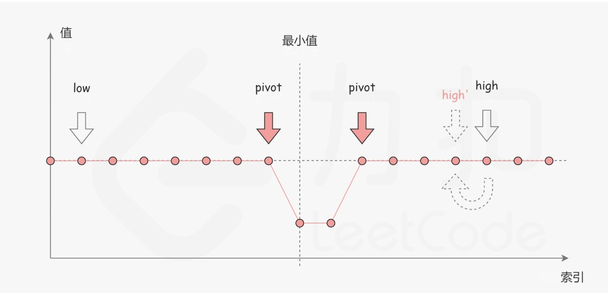

#### 原题链接：

https://leetcode-cn.com/problems/xuan-zhuan-shu-zu-de-zui-xiao-shu-zi-lcof/


#### 题目描述：

把一个数组最开始的若干个元素搬到数组的末尾，我们称之为数组的旋转。输入一个递增排序的数组的一个旋转，输出旋转数组的最小元素。例如，数组 [3,4,5,1,2] 为 [1,2,3,4,5] 的一个旋转，该数组的最小值为1。  

```
示例 1：
输入：[3,4,5,1,2]
输出：1

示例 2：
输入：[2,2,2,0,1]
输出：0

```


#### 解题思路：

**解法一：**最直观解

就找到第一个不满足递增的数字下标，因为是递增数列旋转，则下一个就是最小的值

**代码演示：**

```go
func minArray(numbers []int) int {
		for i := 0; i < len(numbers)-1; i++ {
		if numbers[i] > numbers[i+1]{
			return numbers[i+1]
		}
	}
	return numbers[0]
}

```

> 时间复杂度：O(n)  空间复杂度：O(1)
>
> 执行用时 :4 ms, 在所有 Go 提交中击败了91.92%的用户
>
> 内存消耗 :3.1 MB, 在所有 Go 提交中击败了100.00%的用户


解法二：二分法

如下图所示，寻找旋转数组的最小元素即为寻找 右排序数组 的首个元素 numbers[x] ，称 x 为 旋转点 。
排序数组的查找问题首先考虑使用二分法 解决，其可将遍历法的线性级别 时间复杂度降低至对数级别 。（不过测试结果与解法一是一样的，估计是测试样例数组个数太少了。）



（图源：https://pic.leetcode-cn.com/5884538fb9541a31a807d59c81226ded3dcd61df66efcdeb000165036ea68bb9-Picture1.png）

动画图解：



```go
func minArray(numbers []int) int {
    low := 0
    high := len(numbers) - 1
    for low<high{
        mid := (low+high) / 2
        //有序数组
        if numbers[low] < numbers[high] {
            return numbers[low]
        }
        //如果numbers[mid]大于numbers[low],说明mid左边是递增有序数组
        //而又因numbers[low]大于numbers[high]，说明最小值不在左边
        //所以舍弃包括mid左边的子数组
        if numbers[mid]>numbers[low]{
            low=mid+1
        }else if numbers[mid]<numbers[low]{
            high=mid
        //如果numbers[mid]==numbers[low]，则移动左边的下标即可
        }else{
            low++
        }
    }
    return numbers[low]
}
```

> 时间复杂度 O(log N) ： 在特例情况下（例如 [1, 1, 1, 1][1,1,1,1]），会退化到 O(N)。
> 空间复杂度 O(1)O(1) ：指针使用常数大小的额外空间。
>
> 执行用时 :4 ms, 在所有 Go 提交中击败了91.92%的用户
>
> 内存消耗 :3.1 MB, 在所有 Go 提交中击败了100.00%的用户


解法二：

二分法分为以下几种情况：

- numbers[mid] > numbers[l]：mid左侧数组一定有序，则l=mid+1；
- numbers[mid] < numbers[r]：mid右侧数组一定有序，则r=mid（因为最小值可能是mid）；
- numbers[mid] == numbers[l]：如下图，旋转点可能在mid左侧也可能在右侧，无法判断，使l++；

