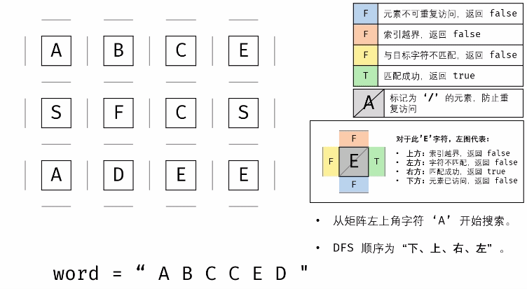

#### 题目链接：

https://leetcode-cn.com/problems/ju-zhen-zhong-de-lu-jing-lcof/


#### 题目描述：

请设计一个函数，用来判断在一个矩阵中是否存在一条包含某字符串所有字符的路径。路径可以从矩阵中的任意一格开始，每一步可以在矩阵中向左、右、上、下移动一格。如果一条路径经过了矩阵的某一格，那么该路径不能再次进入该格子。例如，在下面的3×4的矩阵中包含一条字符串“bfce”的路径（路径中的字母用加粗标出）。

[["a","b","c","e"],
["s","f","c","s"],
["a","d","e","e"]]

但矩阵中不包含字符串“abfb”的路径，因为字符串的第一个字符b占据了矩阵中的第一行第二个格子之后，路径不能再次进入这个格子。

```
示例 1：

输入：board = [["A","B","C","E"],["S","F","C","S"],["A","D","E","E"]], word = "ABCCED"
输出：true
示例 2：

输入：board = [["a","b"],["c","d"]], word = "abcd"
输出：false
提示：

1 <= board.length <= 200
1 <= board[i].length <= 200


```


#### 解题思路：

典型的矩阵搜索问题，可使用**深度优先搜索（DFS）+ 剪枝** 解决。

**算法原理：**
深度优先搜索： 可以理解为暴力法遍历矩阵中所有字符串可能性。DFS 通过递归，先朝一个方向搜到底，再回溯至上个节点，沿另一个方向搜索，以此类推。
剪枝： 在搜索中，遇到 这条路不可能和目标字符串匹配成功 的情况（例如：此矩阵元素和目标字符不同、此元素已被访问），则应立即返回，称之为 可行性剪枝 。

**算法剖析**：

- 递归参数： 当前元素在矩阵 board 中的行列索引 i 和 j ，当前目标字符在 word 中的索引 k 。
- 终止条件：
  返回 false ： ① 行或列索引越界 或 ② 当前矩阵元素与目标字符不同 或 ③ 当前矩阵元素已访问过 （③ 可合并至 ② ） 。
  返回 true ： 字符串 word 已全部匹配，即 k = len(word) - 1 。

**递推工作：**

标记当前矩阵元素： 将 board[i][j]值暂存于变量 tmp ，并修改为字符 '/' ，代表此元素已访问过，防止之后搜索时重复访问。 搜索下一单元格： 朝当前元素的 上、下、左、右 四个方向开启下层递归，使用 或 连接 （代表只需一条可行路径）,找到后返回true。

**动画图解：**




代码演示：

```go
func exist(board [][]byte, word string) bool {
    //记录行列长度
	m, n := len(board), len(board[0])
    //外循环，遍历矩阵，找到满足word第一个元素的入口
	for i := 0; i < m; i++ {
		for j := 0; j < n; j++ {
			if dfs(board, i, j, word, 0) {
				return true
			}
		}
	}
	return false
}

func dfs(board [][]byte, i int, j int, word string, k int) bool {
	// 判断矩阵的元素是否是word的第k个元素，不是返回false
    if board[i][j] != word[k] {
		return false
	}
    //k记录的是word最后一个元素
	if k == len(word)-1 {
		return true
	}
    //将元素标记为空，以防重复访问
	temp := board[i][j]
	board[i][j] = byte('/')
    // 上，如果左上角开始，越界，不会返回true，递归搜索
	if 0 <= i-1 && dfs(board, i-1, j, word, k+1) {
		return true
	}
    //判断位于下面的元素是否对应word的下一个元素
	if i+1 < len(board) && dfs(board, i+1, j, word, k+1) {
		return true
	}
    //右
    if j+1 < len(board[0]) && dfs(board, i, j+1, word, k+1) {
		return true
	}
    //左
	if 0 <= j-1 && dfs(board, i, j-1, word, k+1) {
		return true
	}
    //注意将元素从空恢复过来，以免影响下一次的DFS搜索
	board[i][j] = temp
	return false
}


```

> 时间复杂度 ：==O(3 ^K^ MN)== 
>
> 最差情况下，需要遍历矩阵中长度为 KK 字符串的所有方案，时间复杂度为 O(3^K^)；矩阵中共有 MN个起点，时间复杂度为 O(MN) 。
> 方案数计算： 设字符串长度为 K，搜索中每个字符有上、下、左、右四个方向可以选择，舍弃回头（上个字符）的方向，剩下 3种选择，因此方案数的复杂度为 O(3^K)。
> 空间复杂度：==O(K)== 
>
> 搜索过程中的递归深度不超过 K ，因此系统因函数调用累计使用的栈空间占用 O(K)（因为函数返回后，系统调用的栈空间会释放）。最坏情况下 K = MN，递归深度为 MN ，此时系统栈使用 O(MN)的额外空间。
>
> 执行用时 :4 ms, 在所有 Go 提交中击败了97.24%的用户。
>
> 内存消耗 :3.5 MB, 在所有 Go 提交中击败了100.00%的用户。


