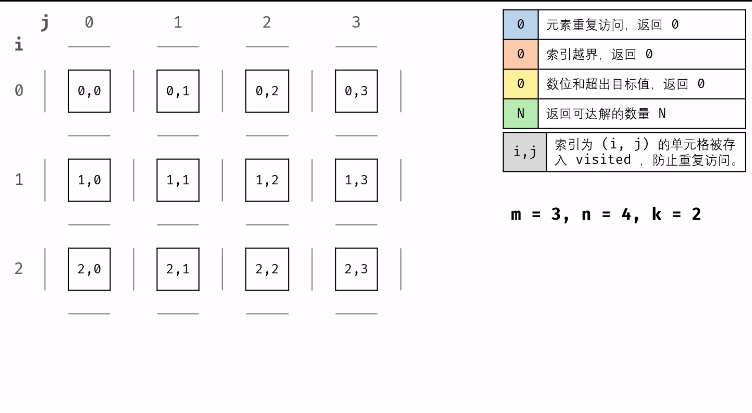

#### 原题链接：

https://leetcode-cn.com/problems/ji-qi-ren-de-yun-dong-fan-wei-lcof/


#### 题目描述：

地上有一个m行n列的方格，从坐标 [0,0] 到坐标 [m-1,n-1] 。一个机器人从坐标 [0, 0] 的格子开始移动，它每次可以向左、右、上、下移动一格（不能移动到方格外），也不能进入行坐标和列坐标的数位之和大于k的格子。例如，当k为18时，机器人能够进入方格 [35, 37] ，因为3+5+3+7=18。但它不能进入方格 [35, 38]，因为3+5+3+8=19。请问该机器人能够到达多少个格子？

```
示例 1：

输入：m = 2, n = 3, k = 1
输出：3
示例 1：

输入：m = 3, n = 1, k = 0
输出：1
提示：

1 <= n,m <= 100
0 <= k <= 20
```


#### 解题思路：

我们将行坐标和列坐标数位之和大于 k 的格子看作障碍物，那么这道题就是一道很传统的搜索题目，我们可以使用广度优先搜索或者深度优先搜索来解决它。

**优化：**

- 只需要对数 x 每次对 10 取余，就能知道数 x 的个位数是多少，然后再将 x 除 10，这个操作等价于将 x 的十进制数向右移一位，删除个位数（类似于二进制中的 >> 右移运算符），不断重复直到 x 为 0 时结束。
- 我们在搜索的过程中搜索方向可以缩减为向右和向下，而不必再向上和向左进行搜索。随着限制条件 k 的增大，(0, 0) 所在的区域内新加入的非障碍方格都可以由上方或左方的格子移动一步得到。而其他不连通的区域会随着 k 的增大而连通，且连通的时候也是由上方或左方的格子移动一步得到，因此我们可以将我们的搜索方向缩减为向右或向下。


算法解析：

**递归参数**： 当前元素在矩阵中的行列索引 i 和 j ，两者的数位和 si, sj 。
**终止条件：** 当 ① 行列索引越界 或 ② 数位和超出目标值 k 或 ③ 当前元素已访问过 时，返回 0 ，代表不计入可达解。
**递推工作：**
标记当前单元格 ：将索引 (i, j) 存入 Set visited 中，代表此单元格已被访问过。
搜索下一单元格： 计算当前元素的 下、右 两个方向元素的数位和，并开启下层递归 。
回溯返回值： 返回 1 + 右方搜索的可达解总数 + 下方搜索的可达解总数，代表从本单元格递归搜索的可达解总数。

动画图解：



**代码演示：**

```go
func movingCount(m int, n int, k int) int {
    //设置一个二维切片，标记每个位置是否被访问过
	visited := make([][]int, m+1)
	for i := range visited {
		visited[i] = make([]int, n+1)
	}

	return dfs(m, n, 0, 0, k, visited)
}

func dfs(m, n, i, j, k int, visited [][]int) int {
    // 如越界 || 已访问过 || 数位和大于k返回0
	if i < 0 || j < 0 || i >= m || j >= n || visited[i][j] == 1 || (sumPos(i)+sumPos(j)) > k {
		return 0
	}
    //将访问位置1，表示已访问过
	visited[i][j] = 1
    //每次递归自动＋1，最终返回的是总的个数
    return dfs(m, n , i , j+1 , k, visited)+dfs(m, n , i +1, j , k, visited)+1
}

// 求所有位之和,行列大于10会延后
func sumPos(n int) int {
	var sum int

	for n > 0 {
		sum += n % 10
		n = n / 10
	}

	return sum
}
```

> 时间复杂度：O(mn)，其中 m 为方格的行数，n 为方格的列数。考虑所有格子都能进入，那么搜索的时候一个格子最多会被访问的次数为常数，所以时间复杂度为 O(2mn)=O(mn)。
>
> 空间复杂度：O(mn)，其中 m 为方格的行数，n 为方格的列数。搜索的时候需要一个大小为 O(mn) 的标记结构用来标记每个格子是否被走过。
>
> 执行用时 :0 ms, 在所有 Go 提交中击败了100.00%的用户
>
> 内存消耗 :2.3 MB, 在所有 Go 提交中击败了100.00%的用户