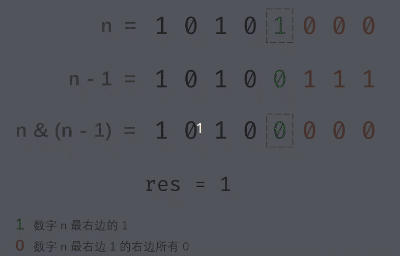

#### 原题链接：

https://leetcode-cn.com/problems/er-jin-zhi-zhong-1de-ge-shu-lcof/


#### 题目描述：

请实现一个函数，输入一个整数，输出该数二进制表示中 1 的个数。例如，把 9 表示成二进制是 1001，有 2 位是 1。因此，如果输入 9，则该函数输出 2。

```
示例 ：

输入：00000000000000000000000000001011
输出：3
解释：输入的二进制串 00000000000000000000000000001011 中，共有三位为 '1'。
```


#### 解题思路：

**解法一：**

**将num转化为二进制字符串再进行遍历统计**，附上fmt.Sprintf()输出格式表：


代码演示：

```go
func hammingWeight(num uint32) int {
    nums := fmt.Sprintf("%b" , num)
    var count int
    //整型以二进制方式显示
    for _, v := range nums {
        if v =='1' {
            count++
        }
    }
    return count
    
}
```

> 时间复杂度：O(n)	空间复杂度：O(1)
>
> 执行用时 :0 ms, 在所有 Go 提交中击败了100.00%的用户
>
> 内存消耗 :2 MB, 在所有 Go 提交中击败了100.00%的用户


解法二：位运算

巧用**n \& (n - 1)**

- 初始化数量统计变量 res。
- 循环消去最右边的 1 ：当 n = 0时跳出。返回统计数量 res 。


动画图解：




代码演示：

```go
func hammingWeight(num uint32) int {
    var count int
    //当num不为0时返回count，即循环一次统计一个1
    for num !=0 {
        num = num & (num - 1)
        count++
    }
    return count
}
```

> 时间复杂度：O(m), m表示1的个数
>
> 空间复杂度：O(1)
>
> 执行用时 :0 ms, 在所有 Go 提交中击败了100.00%的用户
>
> 内存消耗 :2 MB, 在所有 Go 提交中击败了100.00%的用户

