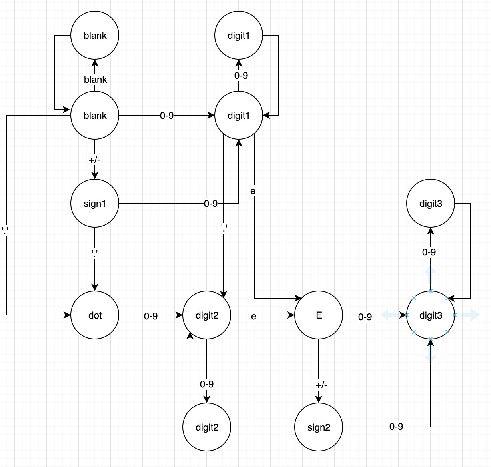

原题链接：

https://leetcode-cn.com/problems/biao-shi-shu-zhi-de-zi-fu-chuan-lcof/


#### 题目描述：

请实现一个函数用来判断字符串是否表示数值（包括整数和小数）。

例如:

```
"0" => true
" 0.1 " => true
"abc" => false
"1 a" => false
"2e10" => true
" -90e3   " => true
" 1e" => false
"e3" => false
" 6e-1" => true
" 99e2.5 " => false
"53.5e93" => true
" --6 " => false
"-+3" => false
"95a54e53" => false
```

测试用例：

```c
string s1 = "0"; // True
string s2 = " 0.1 "; // True
string s3 = "abc"; // False
string s4 = "1 a"; // False
string s5 = "2e10"; // True

string s6 = "-e10"; // False
string s7 = " 2e-9 "; // True
string s8 = "+e1"; // False
string s9 = "1+e"; // False
string s10 = " "; // False

string s11 = "e9"; // False
string s12 = "4e+"; // False
string s13 = " -."; // False
string s14 = "+.8"; // True
string s15 = " 005047e+6"; // True

string s16 = ".e1"; // False
string s17 = "3.e"; // False
string s18 = "3.e1"; // True
string s19 = "+1.e+5"; // True
string s20 = " -54.53061"; // True

string s21 = ". 1"; // False
```

说明: 我们有意将问题陈述地比较模糊。在实现代码之前，你应当事先思考所有可能的情况。这里给出一份可能存在于有效十进制数字中的字符列表：

数字 0-9
指数 - "e"
正/负号 - "+"/"-"
小数点 - "."
当然，在输入中，这些字符的上下文也很重要。


#### 解题思路：

解法一：一般思路

所有的字符可以分为六大类，空格，符号，数字，小数点，自然底数和其他字符，我们需要五个标志变量，num, dot, exp, sign分别表示数字，小数点，自然底数和符号是否出现，numAfterE表示自然底数后面是否有数字，那么我们分别来看各种情况：

- 空格： 我们需要排除的情况是，当前位置是空格而后面一位不为空格，但是之前有数字，小数点，自然底数或者符号出现时返回false。
-  符号：符号前面如果有字符的话必须是空格或者是自然底数，标记sign为true。
- 数字：标记num和numAfterE为true。
- 小数点：如果之前出现过小数点或者自然底数，返回false，否则标记dot为true。
- 自然底数：如果之前出现过自然底数或者之前从未出现过数字，返回false，否则标记exp为true，numAfterE为false。
- 其他字符：返回false。

最后返回num && numAfterE即可。


**代码演示：**

```go

func isNumber(s string) bool {
    var (
	    num = false
        numAfterE = true
        dot = false
        exp = false
        sign = false
    )
    n := len(s)
    for  i := 0; i < n; i++  {
        //s起始位置为空格时
        if s[i] == ' ' {
            //当前位置是空格而后面一位不为空格，但是之前有数字，小数点，自然底数或者符号出现时返回false
            //如3 0这种情况不被允许
             if i < n - 1 && s[i + 1] != ' ' && (num || dot || exp || sign) {
                return false
            } 
        }else if s[i] == '+' || s[i] == '-' {
            //符号前面如果有字符的话必须是空格或者是自然底数
            //如8+2不被允许
            if i > 0 && s[i - 1] != 'e' && s[i - 1] != ' '{
                return false
            } 
            sign = true
        }else if s[i] >= '0' && s[i] <= '9' {
            num = true
            //numAfterE表示自然底数后面是否有数字
            numAfterE = true
        } else if s[i] == '.'  {
            //如果之前出现过小数点或者自然底数，返回false
            if dot || exp {
                return false
            }
            dot = true
         } else if s[i] == 'e' {
            //如果之前出现过自然底数或者之前从未出现过数字，返回false
            if exp || !num {
                return false
              }
             exp = true
            //如果自然底数e后面没有数字，返回false
            numAfterE = false
        } else {
            return false
       }
   }
    return num && numAfterE
}
```

> 执行用时 :4 ms, 在所有 Go 提交中击败了59.22%的用户
>
> 内存消耗 :2.3 MB, 在所有 Go 提交中击败了100.00%的用户


解法二：正则表达式

​																						

| 字符 |                             描述                             |
| :--- | :----------------------------------------------------------: |
| \cx  | 匹配由x指明的控制字符。例如， \cM 匹配一个 Control-M 或回车符。x 的值必须为 A-Z 或 a-z 之一。否则，将 c 视为一个原义的 'c' 字符。 |
| \f   |             匹配一个换页符。等价于 \x0c 和 \cL。             |
| \n   |             匹配一个换行符。等价于 \x0a 和 \cJ。             |
| \r   |             匹配一个回车符。等价于 \x0d 和 \cM。             |
| \s   | 匹配任何空白字符，包括空格、制表符、换页符等等。等价于 [ \f\n\r\t\v]。注意 Unicode 正则表达式会匹配全角空格符。 |
| \S   |         匹配任何非空白字符。等价于 [^ \f\n\r\t\v]。          |
| \t   |             匹配一个制表符。等价于 \x09 和 \cI。             |
| \v   |           匹配一个垂直制表符。等价于 \x0b 和 \cK。           |


| 特别字符 |                             描述                             |
| :------- | :----------------------------------------------------------: |
| $        | 匹配输入字符串的结尾位置。如果设置了 RegExp 对象的 Multiline 属性，则 $ 也匹配 '\n' 或 '\r'。要匹配 $ 字符本身，请使用 \$。 |
| ( )      | 标记一个子表达式的开始和结束位置。子表达式可以获取供以后使用。要匹配这些字符，请使用 \( 和 \)。 |
| *        |   匹配前面的子表达式零次或多次。要匹配 * 字符，请使用 \*。   |
| +        |   匹配前面的子表达式一次或多次。要匹配 + 字符，请使用 \+。   |
| .        |  匹配除换行符 \n 之外的任何单字符。要匹配 . ，请使用 \. 。   |
| [        |      标记一个中括号表达式的开始。要匹配 [，请使用 \[。       |
| ?        | 匹配前面的子表达式零次或一次，或指明一个非贪婪限定符。要匹配 ? 字符，请使用 \?。 |
| \        | 将下一个字符标记为或特殊字符、或原义字符、或向后引用、或八进制转义符。例如， 'n' 匹配字符 'n'。'\n' 匹配换行符。序列 '\\' 匹配 "\"，而 '\(' 则匹配 "("。 |
| ^        | 匹配输入字符串的开始位置，除非在方括号表达式中使用，当该符号在方括号表达式中使用时，表示不接受该方括号表达式中的字符集合。要匹配 ^ 字符本身，请使用 \^。 |
| {        |        标记限定符表达式的开始。要匹配 {，请使用 \{。         |
| \|       |        指明两项之间的一个选择。要匹配 \|，请使用 \|。        |

| 字符  |                             描述                             |
| :---: | :----------------------------------------------------------: |
|   *   | 匹配前面的子表达式零次或多次。例如，zo* 能匹配 "z" 以及 "zoo"。* 等价于{0,}。 |
|   +   | 匹配前面的子表达式一次或多次。例如，'zo+' 能匹配 "zo" 以及 "zoo"，但不能匹配 "z"。+ 等价于 {1,}。 |
|   ?   | 匹配前面的子表达式零次或一次。例如，"do(es)?" 可以匹配 "do" 、 "does" 中的 "does" 、 "doxy" 中的 "do" 。? 等价于 {0,1}。 |
|  {n}  | n 是一个非负整数。匹配确定的 n 次。例如，'o{2}' 不能匹配 "Bob" 中的 'o'，但是能匹配 "food" 中的两个 o。 |
| {n,}  | n 是一个非负整数。至少匹配n 次。例如，'o{2,}' 不能匹配 "Bob" 中的 'o'，但能匹配 "foooood" 中的所有 o。'o{1,}' 等价于 'o+'。'o{0,}' 则等价于 'o*'。 |
| {n,m} | m 和 n 均为非负整数，其中n <= m。最少匹配 n 次且最多匹配 m 次。例如，"o{1,3}" 将匹配 "fooooood" 中的前三个 o。'o{0,1}' 等价于 'o?'。请注意在逗号和两个数之间不能有空格。 |

| 字符 |                             描述                             |
| :--: | :----------------------------------------------------------: |
|  ^   | 匹配输入字符串开始的位置。如果设置了 RegExp 对象的 Multiline 属性，^ 还会与 \n 或 \r 之后的位置匹配。 |
|  $   | 匹配输入字符串结尾的位置。如果设置了 RegExp 对象的 Multiline 属性，$ 还会与 \n 或 \r 之前的位置匹配。 |
|  \b  |            匹配一个单词边界，即字与空格间的位置。            |
|  \B  |                       非单词边界匹配。                       |

**代码演示：**

```go
import (
	"regexp"
	"strings"
)
// ^表示字符串起始    $表示字符串结束
// 小数：必定有小数点.  故(\d+)?\.\d+
//整数：没有小数点时候，故\d+(\.)?  此时？表示0个小数点
var re = regexp.MustCompile(`^[+-]?((\d+)?\.\d+|\d+(\.)?)(e[+-]?\d+)?$`)

func isNumber(s string) bool {
    // strings.TrimSpace(s)表示字符串s去除前后空格，中间的空格不会去掉
	return re.MatchString(strings.TrimSpace(s))
}

```

> 执行用时 :4 ms, 在所有 Go 提交中击败了59.22%的用户
>
> 内存消耗 :2.6 MB, 在所有 Go 提交中击败了60.00%的用户


解法三：有限状态机



**代码演示：**

```go
var (
	blank  = 0 // 空格
	digit1 = 1 // 数字(0-9) 无前缀
	sign1  = 2 // +/- 无e前缀
	point  = 4 // '.'
	digit2 = 5 // 数字(0-9) 有符号前缀
	e      = 6 // 'e'
	sign2  = 7 // +/- 有e前缀
	digit3 = 8 // 数字(0-9) 有e前缀
)

func isNumber(s string) bool {
	s = strings.TrimRight(s, " ")
	dfa := [][]int{
		[]int{blank, digit1, sign1, point, -1},
		[]int{-1, digit1, -1, digit2, e},
		[]int{-1, digit1, -1, point, -1},
		[]int{-1, digit2, -1, -1, e},
		[]int{-1, digit2, -1, -1, -1},
		[]int{-1, digit2, -1, -1, e},
		[]int{-1, digit3, sign2, -1, -1},
		[]int{-1, digit3, -1, -1, -1},
		[]int{-1, digit3, -1, -1, -1},
	}

	state := 0 // blank start
	for i := 0; i < len(s); i++ {
		var newState int
		switch s[i] {
		case ' ':
			newState = 0
		case '0', '1', '2', '3', '4', '5', '6', '7', '8', '9':
			newState = 1
		case '+', '-':
			newState = 2
		case '.':
			newState = 3
		case 'e':
			newState = 4
		default:
			return false
		}
		state = dfa[state][newState]
		if state == -1 {
			return false
		}
	}
	return state == digit1 || state == digit2 || state == digit3
}
```

> 执行用时 :0 ms, 在所有 Go 提交中击败了100.00%的用户
>
> 内存消耗 :2.3 MB, 在所有 Go 提交中击败了60.00%的用户