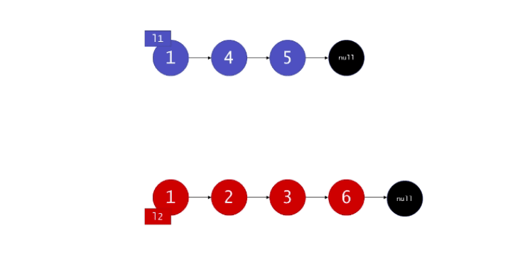

#### 原题链接：

https://leetcode-cn.com/problems/he-bing-liang-ge-pai-xu-de-lian-biao-lcof/


#### 题目描述：

输入两个递增排序的链表，合并这两个链表并使新链表中的节点仍然是递增排序的。

```
示例1：

输入：1->2->4, 1->3->4
输出：1->1->2->3->4->4
限制：

0 <= 链表长度 <= 1000
```


解题思路：

解法一：递归

我们可以如下递归地定义在两个链表里的 merge 操作（忽略边界情况，比如空链表等）：


也就是说，两个链表头部较小的一个与剩下元素的 merge 操作结果合并。
首先考虑边界情况。
特殊的，如果 l1 或者 l2 一开始就是 nil ，那么没有任何操作需要合并，所以我们只需要返回非空链表。否则，我们要判断 l1 和 l2 哪一个的头元素更小，然后递归地决定下一个添加到结果里的值。如果两个链表都是空的，那么过程终止，所以递归过程最终一定会终止。


代码演示：

```go
func mergeTwoLists(l1 *ListNode, l2 *ListNode) *ListNode {
	if l1 == nil &&l2 == nil {
        return nil
    }
    if l1 == nil && l2 != nil{
        return l2
    }
    if l1 != nil && l2 == nil{
        return l1
    }

    if l1.Val < l2.Val {
        l1.Next = mergeTwoLists(l1.Next, l2)
        return l1
    } else {
        l2.Next = mergeTwoLists(l1, l2.Next)
        return l2
    }
}

```

> 时间复杂度：O(n + m)。 因为每次调用递归都会去掉 l1 或者 l2 的头元素（直到至少有一个链表为空），函数 mergeTwoList 中只会遍历每个元素一次。所以，时间复杂度与合并后的链表长度为线性关系。
>
> 空间复杂度：O(n + m)。调用 mergeTwoLists 退出时 l1 和 l2 中每个元素都一定已经被遍历过了，所以 n + m 个栈帧会消耗 O(n + m) 的空间。
>
> 执行用时 :0 ms, 在所有 Go 提交中击败了100.00%的用户
>
> 内存消耗 :2.6 MB, 在所有 Go 提交中击败了63.64%的用户


解法二：迭代法：

假设 l1 元素严格比 l2元素少，我们可以将 l2 中的元素逐一插入 l1 中正确的位置。

- 首先，我们设定一个哨兵节点 "prehead" ，这可以在最后让我们比较容易地返回合并后的链表。
- 维护一个 prev 指针，我们需要做的是调整它的 next 指针。
- 重复以下过程，直到 l1 或者 l2 指向了 null ：
  - 如果 l1 当前位置的值小于等于 l2 ，我们就把 l1 的值接在 prev 节点的后面同时将 l1 指针往后移一个。
  - 否则，我们对 l2 做同样的操作。不管我们将哪一个元素接在了后面，我们都把 prev 向后移一个元素。

在循环终止的时候， l1 和 l2 至多有一个是非空的。由于输入的两个链表都是有序的，所以不管哪个链表是非空的，它包含的所有元素都比前面已经合并链表中的所有元素都要大。这意味着我们只需要简单地将非空链表接在合并链表的后面，并返回合并链表。

动画图解：



代码演示：

```go
func mergeTwoLists(l1 *ListNode, l2 *ListNode) *ListNode {
    prehead := &ListNode{}
    prev := prehead

    for l1 != nil || l2 != nil {
	    if l1 == nil || (l2 != nil && l1.Val > l2.Val) {
		    prev.Next = l2
		    prev = l2
		    l2 = l2.Next
	    } else {
		    prev.Next = l1
		    prev = l1
		    l1 = l1.Next
	    }
    }
    return prehead.Next

}

```

> 时间复杂度：O(n + m) 。因为每次循环迭代中，l1 和 l2 只有一个元素会被放进合并链表中， for 循环的次数等于两个链表的总长度。所有其他工作都是常数级别的，所以总的时间复杂度是线性的。
>
> 空间复杂度：O(1) 。迭代的过程只会产生几个指针，所以它所需要的空间是常数级别的。
>
> 执行用时 :4 ms, 在所有 Go 提交中击败了67.63%的用户
>
> 内存消耗 :2.5 MB, 在所有 Go 提交中击败了100.00%的用户


解法三：常规方法

遍历l1、l2重新构造递增链表。

代码演示：

```go
/**
 * Definition for singly-linked list.
 * type ListNode struct {
 *     Val int
 *     Next *ListNode
 * }
 */
func mergeTwoLists(l1 *ListNode, l2 *ListNode) *ListNode {
     if l1 == nil &&l2 == nil {
        return nil
    }
    if l1 == nil && l2 != nil{
        return l2
    }
    if l1 != nil && l2 == nil{
        return l1
    }
    head := &ListNode{}
    cur := head
    for l1 !=nil && l2 != nil {
        if l1.Val < l2.Val{
            cur.Next = l1
            l1 = l1.Next
        }else {
            cur.Next = l2
            l2 = l2.Next
        }
        cur = cur.Next
    }
    if l1 != nil {
        cur.Next = l1
    }
    if l2 !=nil {
        cur.Next = l2
    }
    return head.Next
}


```

> 时间复杂度：O(min(m.n))   空间复杂度：O(m+n)
>
> 执行用时 :0 ms, 在所有 Go 提交中击败了100.00%的用户
>
> 内存消耗 :2.5 MB, 在所有 Go 提交中击败了72.73%的用户