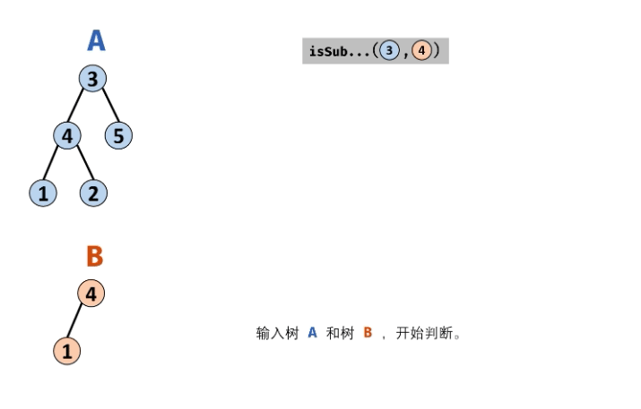

#### 原题链接：

https://leetcode-cn.com/problems/shu-de-zi-jie-gou-lcof/


#### 题目描述：

输入两棵二叉树A和B，判断B是不是A的子结构。(约定空树不是任意一个树的子结构)

B是A的子结构， 即 A中有出现和B相同的结构和节点值。

```
例如:
给定的树 A:
     3
    / \
   4   5
  / \
 1   2
给定的树 B：
   4 
  /
 1
返回 true，因为 B 与 A 的一个子树拥有相同的结构和节点值。

示例 1：
输入：A = [1,2,3], B = [3,1]
输出：false

示例 2：
输入：A = [3,4,5,1,2], B = [4,1]
输出：true
限制：

0 <= 节点个数 <= 10000
```


#### 解题思路：

若树 B是树 A的子结构，则子结构的根节点可能为树 A 的任意一个节点。因此，判断树 B 是否是树 A 的子结构，需完成以下两步工作：

1. 先序遍历树 A 中的每个节点 n~A~ ；（对应函数 isSubStructure(A, B)）
2. 判断树 A 中 以 n~A~  为根节点的子树 是否包含树 B 。（对应函数 recur(A, B)）

**recur(A, B) 函数：**

终止条件：
当节点 B 为空：说明树 B 已匹配完成（越过叶子节点），因此返回 true ；
当节点 A 为空：说明已经越过树 A 叶子节点，即匹配失败，返回 false ；
当节点 A 和 B 的值不同：说明匹配失败，返回 false ；
返回值：
判断 A 和 B 的左子节点是否相等，即 recur(A.left, B.left) ；
判断 A 和 B 的右子节点是否相等，即 recur(A.right, B.right) ；

**isSubStructure(A, B) 函数：**

1. 特例处理： 当 树 A 为空 或 树 B 为空 时，直接返回 false ；

2. 返回值： 若树 B 是树 A 的子结构，则必满足以下三种情况之一，因此用或 || 连接；

   1. 以 节点 A 为根节点的子树 包含树 B ，对应 recur(A, B)；

   2. 树 B 是 树 A 左子树 的子结构，对应 isSubStructure(A.left, B)；

   3. 树 B 是 树 A 右子树 的子结构，对应 isSubStructure(A.right, B)；

      以上 2. 3. 实质上是在对树 A 做 先序遍历 。

动画图解：



代码演示：

```go
/**
 * Definition for a binary tree node.
 * type TreeNode struct {
 *     Val int
 *     Left *TreeNode
 *     Right *TreeNode
 * }
 */
func isSubStructure(A *TreeNode, B *TreeNode) bool {
    //当 树 A 为空 或 树 B 为空 时，直接返回 false 
    if B == nil || A == nil {
        return false
    }
    //以 节点 A 为根节点的子树 包含树 B ，对应 recur(A, B)
    //进行先序遍历（递归）
    return recur(A , B) || isSubStructure(A.Left , B) || isSubStructure(A.Right , B)
}

func recur(A *TreeNode , B *TreeNode) bool {
    if B == nil {
        return true
    }
    if A == nil {
        return false
    }
    if A.Val != B.Val{
        return false
    }
    //递归遍历对应节点是否相等
    return recur(A.Left , B.Left) && recur(A.Right , B.Right)
}
```

> **时间复杂度 O(MN) ：** 其中 M,N 分别为树 A和 树 B 的节点数量；先序遍历树 A 占用 O(M)，每次调用 recur(A, B) 判断占用 O(N) 。
> **空间复杂度 O(M) ：** 当树 A 和树 B 都退化为链表时，递归调用深度最大。当 M≤N 时，遍历树 A 与递归判断的总递归深度为 M ；当M>N 时，最差情况为遍历至树 A 叶子节点，此时总递归深度为 M。
>
> 执行用时 :28 ms, 在所有 Go 提交中击败了73.29%的用户
>
> 内存消耗 :6.6 MB, 在所有 Go 提交中击败了100.00%的用户