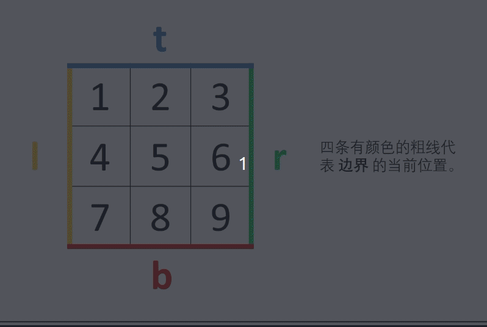

#### 原题链接：

https://leetcode-cn.com/problems/shun-shi-zhen-da-yin-ju-zhen-lcof/


#### 题目描述：

```
输入一个矩阵，按照从外向里以顺时针的顺序依次打印出每一个数字。

示例 1：
输入：matrix = [[1,2,3],[4,5,6],[7,8,9]]
输出：[1,2,3,6,9,8,7,4,5]

示例 2：
输入：matrix = [[1,2,3,4],[5,6,7,8],[9,10,11,12]]
输出：[1,2,3,4,8,12,11,10,9,5,6,7]

限制：
0 <= matrix.length <= 100
0 <= matrix[i].length <= 100
```


#### 解题思路：

- 空值处理： 当 matrix 为空时，直接返回空列表 [] 即可。
- 初始化： 矩阵 左、右、上、下 四个边界 left , righht , top , bottom ，用于打印的结果列表 res 。
- 循环打印： “从左向右、从上向下、从右向左、从下向上” 四个方向循环，每个方向打印中做以下三件事 （各方向的具体信息见下表） ；
  - 根据边界打印，即将元素按顺序添加至列表 res 尾部；
  - 边界向内收缩 1 （代表已被打印）；
  - 判断是否打印完毕（边界是否相遇），若打印完毕则跳出。

动画图解：



解法一：切片使用append

代码演示：

```go
func spiralOrder(matrix [][]int) []int {
    rows := len(matrix)
    if rows == 0 {
        return nil
    }
    cols := len(matrix[0])
    top := 0
    bottom := rows - 1
    left := 0
    right := cols - 1 
    //注意如果使用appnd的话，切片的长度应该为0，不然会出现len(res)个0
    res := make([]int, 0)
    for {
        //从左到右
        for i:= left ; i<=right; i++{
            res = append(res , matrix[top][i] )
        } 
        top++
        //边界条件
        if top > bottom {
            break;
        }
        //从上到下
        for i:= top ; i<=bottom; i++{
            res = append(res , matrix[i][right] )
        } 
        right--
        if left > right {
            break;
        }
        //从右到左
        for i:= right ; i >=left; i--{
            res = append(res , matrix[bottom][i] )
        } 
        bottom--
        if top > bottom {
            break;
        }
        //从下到上
        for i:= bottom ; i >= top; i--{
            res = append(res , matrix[i][left] )
        } 
        left++
        if left > right {
            break;
        }                      
    }
    return res
}
```

> 时间复杂度 O(MN) ： M, N 分别为矩阵行数和列数。
> 空间复杂度 O(1) ： 四个边界 left , right , top , bottom使用常数大小的额外空间（ res 为必须使用的空间）。
>
> 执行用时 :16 ms, 在所有 Go 提交中击败了66.22%的用户
>
> 内存消耗 :6.1 MB, 在所有 Go 提交中击败了100.00%的用户


解法二：不使用append，直接初始化切片修改其位置的值

针对append操作：

每次 append 操作都会检查 slice 是否有足够的容量，如果足够会直接在原始数组上追加元素并返回一个新的 slice，底层数组不变
而若容量不够，会创建一个新的容量足够的底层数组，先将之前数组的元素复制过来，再将新元素追加到后面，然后返回新的 slice，底层数组改变
而这里对新数组的容量定义是按 `乘以2` 的机制增加


相较于解法一，或许是append操作会创建新的数组再将数组元素复制过来，所以相对要慢很多

代码演示：

```go
func spiralOrder(matrix [][]int) []int {
    rows := len(matrix)
    if rows == 0 {
        return nil
    }
    cols := len(matrix[0])
    k :=0
    top := 0
    bottom := rows - 1
    left := 0
    right := cols - 1 
    //不使用appnd的话，切片的长度应该为原数组的长度，初始化为0，再修改相应元素
    res := make([]int, cols*rows)
    for {
        //从左到右
        for i:= left ; i<=right; i++{
            res[k] = matrix[top][i] 
            k++
        } 
        top++
        //边界条件
        if top > bottom {
            break;
        }
        //从上到下
        for i:= top ; i<=bottom; i++{
            res[k] =  matrix[i][right] 
            k++
        } 
        right--
        if left > right {
            break;
        }
        //从右到左
        for i:= right ; i >=left; i--{
            res[k] = matrix[bottom][i] 
            k++
        } 
        bottom--
        if top > bottom {
            break;
        }
        //从下到上
        for i:= bottom ; i >= top; i--{
            res[k] = matrix[i][left] 
            k++
        } 
        left++
        if left > right {
            break;
        }                      
    }
    return res
}
```

> 执行用时 :12 ms, 在所有 Go 提交中击败了93.65%的用户
>
> 内存消耗 :6 MB, 在所有 Go 提交中击败了100.00%的用户