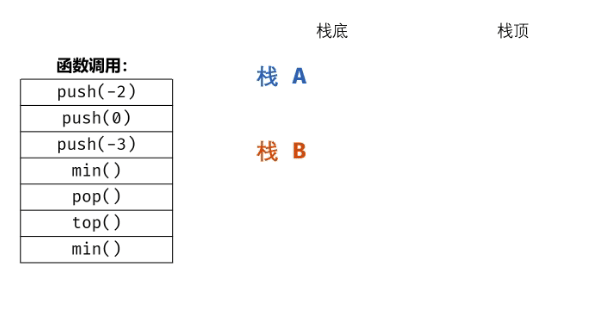

#### 原题链接：

https://leetcode-cn.com/problems/bao-han-minhan-shu-de-zhan-lcof/


#### 题目描述：

定义栈的数据结构，请在该类型中实现一个能够得到栈的最小元素的 min 函数在该栈中，调用 min、push 及 pop 的时间复杂度都是 O(1)。

```
示例:
MinStack minStack = new MinStack();
minStack.push(-2);
minStack.push(0);
minStack.push(-3);
minStack.min();   --> 返回 -3.
minStack.pop();
minStack.top();      --> 返回 0.
minStack.min();   --> 返回 -2.


提示：
各函数的调用总次数不超过 20000 次
```


#### 解题思路：

普通栈的 push() 和 pop() 函数的复杂度为 O(1) ；而获取栈最小值 min() 函数需要遍历整个栈，复杂度为 O(N) 。

本题难点： 将 min() 函数复杂度降为 O(1)) ，可通过建立辅助栈实现；
数据栈 A ： 栈 A 用于存储所有元素，保证入栈 push() 函数、出栈 pop() 函数、获取栈顶 top() 函数的正常逻辑。
辅助栈 B ： 栈 B 中存储栈 A 中所有 非严格降序 的元素，则栈 A 中的最小元素始终对应栈 B 的栈顶元素，即 min() 函数只需返回栈 B 的栈顶元素即可。
因此，只需设法维护好栈 B 的元素，使其保持非严格降序，即可实现 min() 函数的O(1) 复杂度。

动画图解：




代码演示：

```go
type MinStack struct {
    elems []int 
    mins []int 
}


/** initialize your data structure here. */
func Constructor() MinStack {
    return MinStack{
        elems: make([]int, 0),
        mins: make([]int, 0),
    }
}


func (this *MinStack) Push(x int)  {
    this.elems = append(this.elems, x)
    if len(this.mins) == 0 {
        this.mins = append(this.mins, x)
    } else {
        // 辅助栈栈顶存放最小值
        if this.mins[len(this.mins) - 1] >= x {
            this.mins = append(this.mins, x)
        }
    }
}


func (this *MinStack) Pop()  {
    elem := this.elems[len(this.elems) - 1]
    this.elems = this.elems[:len(this.elems)-1]
    //如果出栈元素是最小值，将辅助栈的栈顶元素一起出栈
    if elem == this.mins[len(this.mins)-1] {
        this.mins = this.mins[:len(this.mins)-1]
    }
}


func (this *MinStack) Top() int {
    return this.elems[len(this.elems)-1]
}


func (this *MinStack) Min() int {
    return this.mins[len(this.mins)-1]
}


/**
 * Your MinStack object will be instantiated and called as such:
 * obj := Constructor();
 * obj.Push(x);
 * obj.Pop();
 * param_3 := obj.Top();
 * param_4 := obj.GetMin();
 */
```

> 时间复杂度 O(1) ： push(), pop(), top(), min() 四个函数的时间复杂度均为常数级别。
> 空间复杂度 O(N)) ： 当共有 N 个待入栈元素时，辅助栈 B 最差情况下存储 N 个元素，使用 O(N) 额外空间。
>
> 执行用时 :20 ms, 在所有 Go 提交中击败了85.53%的用户
>
> 内存消耗 :8.6 MB, 在所有 Go 提交中击败了100.00%的用户

