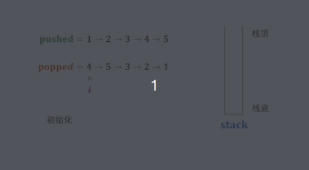

#### 原题链接：

https://leetcode-cn.com/problems/zhan-de-ya-ru-dan-chu-xu-lie-lcof/


#### 题目描述：

```
输入两个整数序列，第一个序列表示栈的压入顺序，请判断第二个序列是否为该栈的弹出顺序。假设压入栈的所有数字均不相等。例如，序列 {1,2,3,4,5} 是某栈的压栈序列，序列 {4,5,3,2,1} 是该压栈序列对应的一个弹出序列，但 {4,3,5,1,2} 就不可能是该压栈序列的弹出序列。

示例 1：
输入：pushed = [1,2,3,4,5], popped = [4,5,3,2,1]
输出：true
解释：我们可以按以下顺序执行：
push(1), push(2), push(3), push(4), pop() -> 4,
push(5), pop() -> 5, pop() -> 3, pop() -> 2, pop() -> 1

示例 2：
输入：pushed = [1,2,3,4,5], popped = [4,3,5,1,2]
输出：false
解释：1 不能在 2 之前弹出。
 
提示：
1. 0 <= pushed.length == popped.length <= 1000
2. 0 <= pushed[i], popped[i] < 1000
3. pushed 是 popped 的排列。
```


#### 解题思路：

考虑借用一个辅助栈 stack，模拟 压入 / 弹出操作的排列。根据是否模拟成功，即可得到结果。

入栈操作： 按照压栈序列的顺序执行。
出栈操作： 每次入栈后，循环判断 “栈顶元素 == 弹出序列的当前元素” 是否成立，将符合弹出序列顺序的栈顶元素全部弹出。
由于题目规定 栈的所有数字均不相等 ，因此在循环入栈中，每个元素出栈的位置的可能性是唯一的（若有重复数字，则具有多个可出栈的位置）。因而，在遇到 “栈顶元素 == 弹出序列的当前元素” 就应立即执行出栈。

算法流程：

1. 初始化： 辅助栈 stack ，弹出序列的索引 i ；
2. 遍历压栈序列： 各元素记为 num ；
   1. 元素 num 入栈；
   2. 循环出栈：若 stack 的栈顶元素 == 弹出序列元素 popped[i] ，则执行出栈与 i++ ；
3. 返回值： 若 stack 为空，则此弹出序列合法。


动画图解：



代码演示：

```go
func validateStackSequences(pushed []int, popped []int) bool {
    var i int 
    stack := make([]int, 0)
    for num := 0 ; num < len(pushed); num++ {
        stack = append(stack, pushed[num])
        //若 stack 的栈顶元素 == 弹出序列元素 popped[i] ，则执行出栈与 i++,注意这个是for循环而不是if
        for len(stack)>0&&stack[len(stack)-1] == popped[i] {
            stack = stack[:len(stack)-1]
            i++
        }
    }
    if len(stack)==0 {
        return true
    }else{
        return false
    } 
}

```

> 时间复杂度 O(N) ：  N 为列表 pushed 的长度；每个元素最多入栈与出栈一次，即最多共2N次出入栈操作。
> 空间复杂度 O(N) ： 辅助栈 stack 最多同时存储 N 个元素。
>
> 执行用时 :8 ms, 在所有 Go 提交中击败了86.61%的用户
>
> 内存消耗 :3.8 MB, 在所有 Go 提交中击败了100.00%的用户