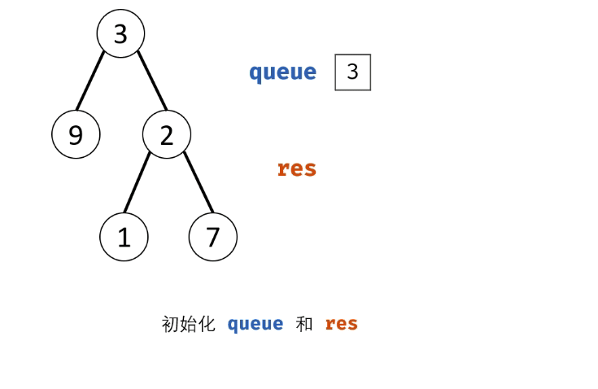

#### 原题链接：

https://leetcode-cn.com/problems/cong-shang-dao-xia-da-yin-er-cha-shu-lcof/


#### 题目描述：

从上到下打印出二叉树的每个节点，同一层的节点按照从左到右的顺序打印。

```
例如:
给定二叉树: [3,9,20,null,null,15,7],

    3
   / \
  9  20
    /  \
   15   7

返回：
[3,9,20,15,7]

提示：
节点总数 <= 1000
```


#### 解题思路：

- 题目要求的二叉树的 **从上至下** 打印（即按层打印），又称为二叉树的 **广度优先搜索**（BFS）。
- BFS 通常借助 **队列** 的先入先出特性来实现。

动画图解：




代码演示：

```go
/**
 * Definition for a binary tree node.
 * type TreeNode struct {
 *     Val int
 *     Left *TreeNode
 *     Right *TreeNode
 * }
 */
func levelOrder(root *TreeNode) []int {
    res := make([]int , 0)
    queue := make([]*TreeNode , 0)
    queue = append(queue,root)
    if root == nil{
        return res
    }
        for 0<len(queue){
            res = append(res,queue[0].Val)
            if queue[0].Left != nil{
                queue = append(queue,queue[0].Left)
            }
            if queue[0].Right != nil{
                queue = append(queue, queue[0].Right)
            }
            queue = queue[1:]
        }
    return res
}
```

> 时间复杂度 O(N) ： N 为二叉树的节点数量，即 BFS 需循环 N 次。
> 空间复杂度 O(N) ： 最差情况下，即当树为平衡二叉树时，最多有 N/2 个树节点同时在 queue 中，使用 O(N) 大小的额外空间。