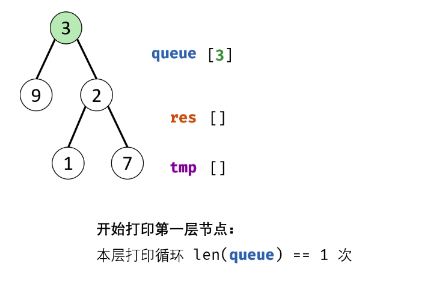

#### 原题链接：

https://leetcode-cn.com/problems/cong-shang-dao-xia-da-yin-er-cha-shu-ii-lcof/


#### 题目描述：

从上到下按层打印二叉树，同一层的节点按从左到右的顺序打印，每一层打印到一行。 

```
例如:
给定二叉树: [3,9,20,null,null,15,7],

    3
   / \
  9  20
    /  \
   15   7
   
返回其层次遍历结果：
[
  [3],
  [9,20],
  [15,7]
]

提示：
节点总数 <= 1000
```

#### 解题思路：

1. 特例处理： 当根节点为空，则返回空列表 [] ；
2. 初始化： 打印结果列表 res = [] ，包含根节点的队列 queue = [root] ；
3. BFS 循环： 当队列 queue 为空时跳出；
   1. 新建一个临时列表 tmp ，用于存储当前层打印结果；
   2. 当前层打印循环： 循环次数为当前层节点数（即队列 queue 长度）；
      1. 出队： 队首元素出队，记为 node；
      2. 打印： 将 node.val 添加至 tmp 尾部；
      3. 添加子节点： 若 node 的左（右）子节点不为空，则将左（右）子节点加入队列 queue ；
   3. 将当前层结果 tmp 添加入 res 。
4. **返回值：** 返回打印结果列表 `res` 即可。


动画图解：



代码演示：

```go
/**
 * Definition for a binary tree node.
 * type TreeNode struct {
 *     Val int
 *     Left *TreeNode
 *     Right *TreeNode
 * }
 */
func levelOrder(root *TreeNode) [][]int {
    var res [][]int
    var queue []*TreeNode

    if root == nil {
        return res
    }
    queue = append(queue,root)
    for 0 < len(queue) {
        length := len(queue)
        var tmp []int
        //内层循环结束标志为一层节点遍历完
        for 0<length{
            length--
            tmp = append(tmp, queue[0].Val)
            if queue[0].Left != nil {
                queue = append(queue,queue[0].Left)
            }
            if queue[0].Right != nil {
                queue = append(queue,queue[0].Right)
            }
            queue = queue[1:]
        }
        //tmp记录每一层的节点数值
        res = append(res,tmp)
    }
    return res
}
```

> 时间复杂度：O(N)
>
> 空间复杂度：O(N)
>
> 执行用时 :0 ms, 在所有 Go 提交中击败了100.00%的用户
>
> 内存消耗 :2.8 MB, 在所有 Go 提交中击败了100.00%的用户