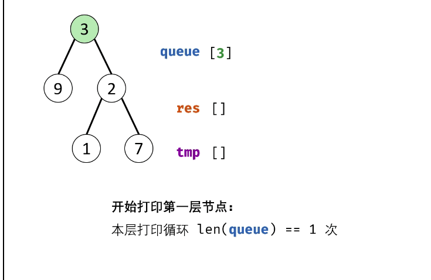

#### 原题链接：

https://leetcode-cn.com/problems/cong-shang-dao-xia-da-yin-er-cha-shu-iii-lcof/


#### 题目描述：

请实现一个函数按照之字形顺序打印二叉树，即第一行按照从左到右的顺序打印，第二层按照从右到左的顺序打印，第三行再按照从左到右的顺序打印，其他行以此类推。 

```
例如:
给定二叉树: [3,9,20,null,null,15,7],

    3
   / \
  9  20
    /  \
   15   7
返回其层次遍历结果：

[
  [3],
  [20,9],
  [15,7]
]

提示：
节点总数 <= 1000
```


#### 解题思路：

在上一题的基础上，设置level记录层数，奇数层不变，偶数层对tmp进行倒序操作

动画题解：



代码演示：

```go
/**
 * Definition for a binary tree node.
 * type TreeNode struct {
 *     Val int
 *     Left *TreeNode
 *     Right *TreeNode
 * }
 */
func levelOrder(root *TreeNode) [][]int {
    var res [][]int
    var queue []*TreeNode
    level := 1

    if root == nil {
        return res
    }
    queue = append(queue,root)
    for 0 < len(queue) {
        length := len(queue)
        var tmp []int
        //内层循环结束标志为一层节点遍历完
        for 0<length{
            length--
            tmp = append(tmp, queue[0].Val)
            if queue[0].Left != nil {
                queue = append(queue,queue[0].Left)
            }
            if queue[0].Right != nil {
                queue = append(queue,queue[0].Right)
            }
            queue = queue[1:]
        }
        //tmp记录每一层的节点数值，奇数层不变，偶数层反转tmp的值
        if level%2 !=0{
            res = append(res,tmp)
        }
        if level%2 ==0 {
            tmp = reverse(tmp)
            res = append(res,tmp)
        }
        level++

    }
    return res
}
//反转切片内部的值
func reverse(s []int) []int {
    for i, j := 0, len(s)-1; i < j; i, j = i+1, j-1 {
        s[i], s[j] = s[j], s[i]
    }
    return s
}
```

> 时间复杂度：O(N)
>
> 空间复杂度：O(N)
>
> 执行用时 :0 ms, 在所有 Go 提交中击败了100.00%的用户
>
> 内存消耗 :2.8 MB, 在所有 Go 提交中击败了100.00%的用户