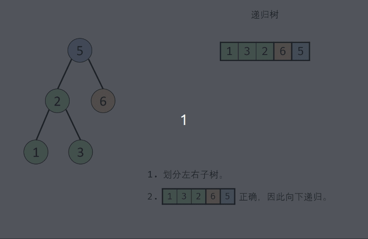
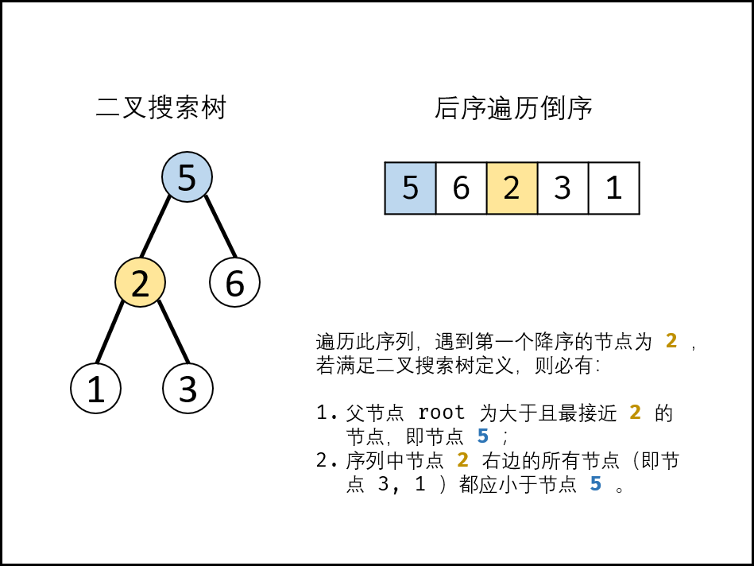

#### 原题链接：

https://leetcode-cn.com/problems/er-cha-sou-suo-shu-de-hou-xu-bian-li-xu-lie-lcof/


#### 题目描述：

输入一个整数数组，判断该数组是不是某二叉搜索树的后序遍历结果。如果是则返回 true，否则返回 false。假设输入的数组的任意两个数字都互不相同。

 

```
参考以下这颗二叉搜索树：
     5
    / \
   2   6
  / \
 1   3
 
示例 1：
输入: [1,6,3,2,5]
输出: false

示例 2：
输入: [1,3,2,6,5]
输出: true

提示：
数组长度 <= 1000

```


#### 解题思路：

**方法一：递归分治**

根据二叉搜索树的定义，可以通过递归，判断所有子树的 正确性 （即其后序遍历是否满足二叉搜索树的定义） ，若所有子树都正确，则此序列为二叉搜索树的后序遍历。
递归解析：
终止条件： 当 i≥j ，说明此子树节点数量 ≤1 ，无需判别正确性，因此直接返回 true ；
递推工作：

1. 划分左右子树： 遍历后序遍历的 [i, j][i,j] 区间元素，寻找 第一个大于根节点 的节点，索引记为 m 。此时，可划分出左子树区间 [i,m-1] 、右子树区间 [m, j - 1] 、根节点索引 j 。
2. 判断是否为二叉搜索树： 
   - 左子树区间 [i, m - 1]内的所有节点都应<postorder[j] 。而第 ==1.划分左右子树==步骤已经保证左子树区间的正确性，因此只需要判断右子树区间即可。
   - 右子树区间 [m, j-1] 内的所有节点都应 >postorder[j] 。实现方式为遍历，当遇到≤postorder[j] 的节点则跳出；则可通过 p = j 判断是否为二叉搜索树。

返回值： 所有子树都需正确才可判定正确，因此使用 与逻辑符 && 连接。

- p = j ： 判断 此树是否正确。
- recur(i,m−1) ： 判断此树的左子树是否正确。
- recur(m,j−1) ：判断此树的右子树是否正确。

动画图解：



代码演示：

```go
func verifyPostorder(postorder []int) bool {
    return recur(postorder , 0, len(postorder)-1)
}

func recur(postorder []int , i int, j int) bool {
    //此子树节点数量 ≤1 ，无需判别正确性，因此直接返回 true
     if i >= j {
         return true
     }
    var p = i 
    for postorder[p] < postorder[j] {
        p++
    }
    //0～m-1为根节点对应的左子树
    var m = p
    //继续判断是否所有右子树节点均大于根节点
    for postorder[p] > postorder[j] {
        p++
    }
    //判断p与j是否相等，即判断是否每次后序遍历最后一个值是对应子树根节点
    //返回左右子树
    return p == j && recur(postorder, i, m - 1) && recur(postorder, m, j - 1)
}
```

> 时间复杂度 O(N^2) ： 每次调用 recur(i,j) 减去一个根节点，因此递归占用 O(N) ；最差情况下（即当树退化为链表），每轮递归都需遍历树所有节点，占用 O(N) 。
> 空间复杂度 O(N) ： 最差情况下（即当树退化为链表），递归深度将达到 N 。
>
> 执行用时 :0 ms, 在所有 Go 提交中击败了100.00%的用户
>
> 内存消耗 :2.1 MB, 在所有 Go 提交中击败了100.00%的用户


**方法二：辅助单调栈**

遍历 “后序遍历的倒序” 会多次遇到递减节点r~i~，若所有的递减节点 r~i~对应的父节点 root 都满足以上条件，则可判定为二叉搜索树。

- 设后序遍历倒序列表为 [r~n~, r_~n-1~,...,r~1~]，遍历此列表，设索引为 i ，若为 二叉搜索树 ，则有：_
  - _当节点值 r~i~ > r~i+1~时： 节点 r~i~一定是节点 r_~i+1~的右子节点。
  - 当节点值 r~i~ < r~i+1~时： 节点 r~i~一定是某节点root 的左子节点，且 root 为节点 r~i+1~, r~i+2~,..., r~n~ 中值大于且最接近 r~i~的节点（∵ root 直接连接左子节点 r~i~）。

- 当遍历时遇到递减节点 r~i~ < r~i+1~，若为二叉搜索树，则对于后序遍历中节点 r~i~右边的任意节点*r~x~*∈[*r~i−1~,r~i−2~,...,*r~1~]，必有节点值 r~x~ < root。

> 节点 r~x~只可能为以下两种情况：① r~x~为 r~i~的左、右子树的各节点；② r~x~ 为 root 的父节点或更高层父节点的左子树的各节点。在二叉搜索树中，以上节点都应小于root 。



1. 借助一个单调栈 stack 存储值递增的节点；
2. 每当遇到值递减的节点 r~i~，则通过出栈来更新节点r~i~的父节点 root ；
3. 每轮判断r~i~和 root 的值关系：
   1. 若 r~i~ > root，则说明不满足二叉搜索树定义，直接返回 false 。
   2. 若 r~i~ < root，则说明满足二叉搜索树定义，则继续遍历。

算法流程：

1. 初始化： 单调栈 stack ，父节点值 root=+∞ （初始值为正无穷大，可把树的根节点看为此无穷大节点的左孩子）；
2. 倒序遍历 postorder ：记每个节点为 r~i~；
   1. 判断： r~i~ > root ，说明此后序遍历序列不满足二叉搜索树定义，直接返回 false ；
   2. 更新父节点 root ： 当栈不为空 且 r~i~ < 栈顶元素时，循环执行出栈，并将出栈节点赋给 root 。
   3. 入栈： 将当前节点r~i~入栈；
3.  若遍历完成，则说明后序遍历满足二叉搜索树定义，返回true 。

动画图解：


代码演示：

```go
import "math"
func verifyPostorder(postorder []int) bool {
    var Stack []int
    //初始化root为最大值
    var root = math.MaxInt64
    //倒序后序遍历，序列为root-right-left
    for i := len(postorder) - 1; i >= 0; i-- {
        if postorder[i] > root {
            return false
        }
        //当栈非空&&栈顶元素大于序列当前元素
        //出栈，直到找到当前元素的根节点         
        for len(Stack) !=0 && Stack[len(Stack)-1] > postorder[i]{
        	root = Stack[len(Stack)-1]
            Stack = Stack[:len(Stack)-1]
        }
        //节点入栈    
        Stack = append(Stack, postorder[i])
    }
    return true
}

```

> 时间复杂度 O(N) ： 遍历 postorder 所有节点，各节点均入栈 / 出栈一次，使用O(N) 时间。
> 空间复杂度 O(N) ： 最差情况下，单调栈 stack 存储所有节点，使用O(N) 额外空间。
>
> 执行用时 :0 ms, 在所有 Go 提交中击败了100.00%的用户
>
> 内存消耗 :2.1 MB, 在所有 Go 提交中击败了100.00%的用户