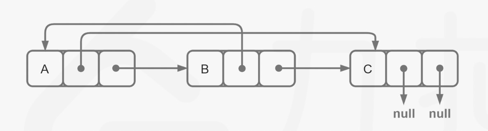

#### [剑指 Offer 35. 复杂链表的复制](https://leetcode.cn/problems/fu-za-lian-biao-de-fu-zhi-lcof/)

请实现 `copyRandomList` 函数，复制一个复杂链表。在复杂链表中，每个节点除了有一个 next 指针指向下一个节点，还有一个 random 指针指向链表中的任意节点或者 null。

 

示例 1：


```
输入：head = [[7,null],[13,0],[11,4],[10,2],[1,0]]
输出：[[7,null],[13,0],[11,4],[10,2],[1,0]]
```


示例 2：


```
输入：head = [[1,1],[2,1]]
输出：[[1,1],[2,1]]
```


示例 3：


```
输入：head = [[3,null],[3,0],[3,null]]
输出：[[3,null],[3,0],[3,null]]
```


```
示例 4：

输入：head = []
输出：[]
解释：给定的链表为空（空指针），因此返回 null。
```

```
提示：

-10000 <= Node.val <= 10000
Node.random 为空（null）或指向链表中的节点。
节点数目不超过 1000 。
```

#### 解题思路

##### 方法一：哈希表+两次遍历

哈哈哈一开始以为直接赋值就好，结果不能引用，相当于此题考的是指针类型的深拷贝。

一般情况下，如果是普通链表，我们可以直接按照遍历的顺序创建链表节点。即每次给新建的节点赋值，继续创建下一个节点赋值，并把前一个节点的next指针指到当前节点。

而本题中因为随机指针的存在，当我们拷贝节点时，「**当前节点的随机指针指向的节点」** 可能还没创建，因此我们需要变换思路：

1. 确保创建好所有节点并赋值；
2. 创建节点的next指针索引；
3. 创建节点的random指针索引。

值得一提的是，我们每轮操作都从头结点开始，因此需要创建原有的节点到新建的节点之间的映射，并每次对新建的节点赋值时，需要准确找到新建的链表的头结点。因此：

1. 建立哈希表索引每个节点；
2. 每次遍历给新链表头结点重新赋值，不要移动新链表头结点。

##### 方法二：空间优化

注意到方法一需要使用哈希表记录每一个节点对应新节点的创建情况，而我们可以使用一个小技巧来省去哈希表的空间。

我们首先将该链表中每一个节点拆分为两个相连的节点，例如对于链表 A→B→C，我们可以将其拆分为 A→A′→B→B′→C→C′。对于任意一个原节点 S，其拷贝节点 S'即为其后继节点。

这样，我们可以直接找到每一个拷贝节点 S' 的随机指针应当指向的节点，即为其原节点 S 的随机指针指向的节点 T 的后继节点 T′。需要注意原节点的随机指针可能为空，我们需要特别判断这种情况。

当我们完成了拷贝节点的随机指针的赋值，我们只需要将这个链表按照原节点与拷贝节点的种类进行拆分即可，只需要遍历一次。同样需要注意最后一个拷贝节点的后继节点为空，我们需要特别判断这种情况。




#### 代码演示

```go
func copyRandomList(head *Node) *Node {
	if head == nil {
		return nil
	}
	// 建立一个哈希表，为原节点到新节点的映射关系
	m := map[*Node]*Node{}
	m[nil] = nil

	// 建立头部节点，用于返回，同时创建映射关系
	copyRoot := &Node{
		Val : head.Val,
	}
	m[head] = copyRoot

	// 建立临时节点，用于第一次迭代
	prev := copyRoot
	to := head.Next

	// 第一次迭代，创建层层相连的单链表，也就是创建节点并用Next穿起来
	for to != nil {
		node := &Node{}
		prev.Next = node
		m[to] = node

		node.Val = to.Val
		to = to.Next
		prev = node
	}

	// 第二次迭代，去哈希表中找原节点对于的新节点，用Random穿起来
	curr := copyRoot
	for head != nil {
		curr.Random = m[head.Random]
		curr = curr.Next
		head = head.Next
	}


	return copyRoot
}
```

> 时间复杂度：O(n)，其中 n 是链表的长度。对于每个节点，我们至多访问其「后继节点」和「随机指针指向的节点」各一次，均摊每个点至多被访问两次。
>
> 空间复杂度：O(n)，其中 n 是链表的长度。为哈希表的空间开销。
>


```go
func copyRandomList(head *Node) *Node {
    if head == nil {
        return nil
    }
    node := head
    for node != nil {
        nextNode := node.Next
        copyNode := &Node{Val: node.Val, Next: node.Next}
        node.Next = copyNode
        node = nextNode
    }
    
    node = head
    for node != nil {
        // 建立新链表的random链接
        if node.Random != nil {
            newNode.Random = node.Random.Next
        }
        node.Next = copyNode
        node = nextNode
    }
    
    // 记录头结点
    newHead := head.Next
    for node := head; node != nil; node = node.Next {
        newNode := node.Next
        // 恢复原链表的链接
        node.Next = node.Next.Next
        if newNode.Next != nil {
            // 建立新链表的next链接
            newNode.Next = newNode.Next.Next
        }

    }
    return newHead
}
```

> 时间复杂度：O(n)，其中 n 是链表的长度。我们只需要遍历该链表三次。
>
> 读者们也可以自行尝试在计算拷贝节点的随机指针的同时计算其后继指针，这样只需要遍历两次。
> 空间复杂度：O(1)。注意返回值不计入空间复杂度。

