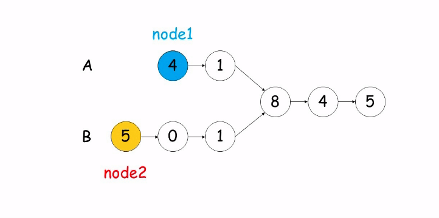

#### 原题链接：

https://leetcode-cn.com/problems/liang-ge-lian-biao-de-di-yi-ge-gong-gong-jie-dian-lcof/

#### 题目描述：

输入两个链表，找出他们的第一个公共节点，示例：

输入：intersectVal = 8, listA = [4,1,8,4,5], listB = [5,0,1,8,4,5], skipA = 2, skipB = 3
输出：Reference of the node with value = 8
输入解释：相交节点的值为 8 （注意，如果两个列表相交则不能为 0）。从各自的表头开始算起，链表 A 为 [4,1,8,4,5]，链表 B 为 [5,0,1,8,4,5]。在 A 中，相交节点前有 2 个节点；在 B 中，相交节点前有 3 个节点。

#### 解题思路：

##### 解法一：双指针法

使用两个指针 node1，node2 分别指向两个链表 headA，headB 的头结点，然后同时分别逐结点遍历，当 node1 到达链表 headA 的末尾时，重新定位到链表 headB 的头结点；当 node2 到达链表 headB 的末尾时，重新定位到链表 headA 的头结点。

这样，当它们相遇时，所指向的结点就是第一个公共结点。

**动画图解：**



**代码演示：**

```go
func getIntersectionNode(headA, headB *ListNode) *ListNode {
    node1, node2 := headA, headB
    for node1 != node2 {
      if node1 != nil {
        node1 = node1.Next
      } else {
        node1 = headB
      }
      if node2 != nil {
        node2 = node2.Next
      } else {
        node2 = headA
      }
    }
    return node2
}

```

> 执行用时 :44 ms, 在所有 Go 提交中击败了88.52%的用户
>
> 内存消耗 :8.5 MB, 在所有 Go 提交中击败了100.00%的用户

##### 解法二：构造切片从尾到头法：

将双链分别存储在对应切片中，从切片最尾端开始遍历，直到遍历到不相同的值，此时的点为第一个相遇的点

**代码演示：** 

```go
func getIntersectionNode(headA, headB *ListNode) *ListNode {
    slideA := []*ListNode{}
    slideB := []*ListNode{}
    for headA != nil || headB != nil {
      if headA != nil {
        slideA = append(slideA, headA)
        headA = headA.Next
      }
      if headB != nil {
        slideB = append(slideB, headB)
        headB = headB.Next
      }
    }
    a := len(slideA)
    b := len(slideB)
   
    if a == 0 || b == 0 {
      return nil
    }
    nodeCount := 0
    for a > 0 && b > 0 && slideA[a-1] == slideB[b-1] {
      a--
      b--
      nodeCount++
    }
    if nodeCount == 0 {
      return nil
    }
    return slideA[a]
}
```

> 执行用时 :40 ms, 在所有 Go 提交中击败了98.77%的用户
>
> 内存消耗 :7 MB, 在所有 Go 提交中击败了100.00%的用户

