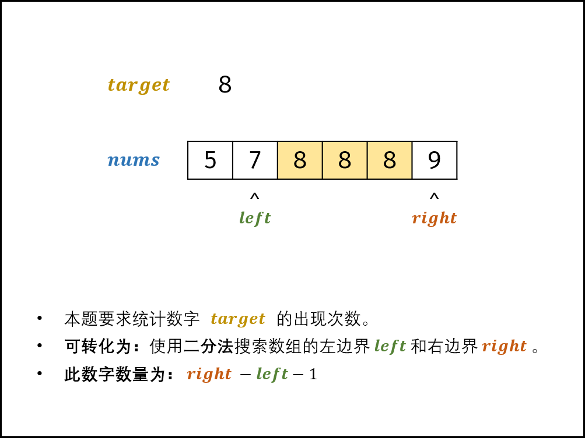

#### 原题链接：

https://leetcode-cn.com/problems/zai-pai-xu-shu-zu-zhong-cha-zhao-shu-zi-lcof/


#### 题目描述：

统计一个数字在排序数组中出现的次数。

**示例 :**

```
输入: nums = [5,7,7,8,8,10], target = 8
输出: 2
```


#### 解题思路：

利用折半查找到target，然后找到target的左右边界，则target数量为right - left -1，如图：




**代码演示：**

```go
func search(nums []int, target int) int {
    if len(nums)==0{
        return 0
    }
    low , high := 0 , len(nums) - 1
     mid := (low + high ) / 2
         count :=0
     for low <=  high {
         if nums[mid] < target {
             low = mid + 1
         }else if nums[mid] > target {
             high = mid  - 1
         }
         mid = (low + high ) / 2
        if nums[mid] == target {
            count++
            break
        }
     }

    for right := mid+1; right < len(nums) && nums[right] == target ; right++{
        count++
    }
    for left:= mid-1 ; left >= 0 && nums[left] == target ; left--{
        count++
    }
    return count
}
```

> 执行用时 :8 ms, 在所有 Go 提交中击败了93.10%的用户
>
> 内存消耗 :4.1 MB, 在所有 Go 提交中击败了100.00%的用户