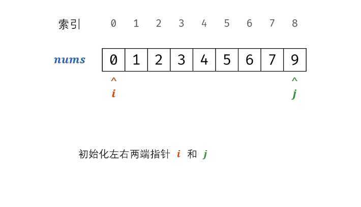

#### 原题链接：

https://leetcode-cn.com/problems/que-shi-de-shu-zi-lcof/


#### 题目描述：

一个长度为n-1的递增排序数组中的所有数字都是唯一的，并且每个数字都在范围0～n-1之内。在范围0～n-1内的n个数字中有且只有一个数字不在该数组中，请找出这个数字。

**示例 :**

```
输入: [0,1,2,3,4,5,6,7,9]
输出: 8
```


#### 解题思路：

- 定义i:=0 j:=len(nums) -1用来确定数组的 m
- 因为nums是有序数组，如果m下标的值和m不相同就在左边查找
- 如果 nums[m]==m ，说明左边是连续的有序数组，缺失的数字就在右边查找
- 当i >j 时退出循环，返回i


**动画图解：**



**代码演示：**

```go
func missingNumber(nums []int) int {
    if len(nums) == 0  {
        return 0
    }
    i , j := 0 , len(nums)-1
    m := (i + j ) / 2
    for i <=j {
        if nums[m] == m {
             i = m + 1
         }else {
             j = m - 1
         }
        m = (i + j ) / 2
    }
    return i
}
```

> 执行用时 :20 ms, 在所有 Go 提交中击败了76.56%的用户
>
> 内存消耗 :6 MB, 在所有 Go 提交中击败了100.00%的用户