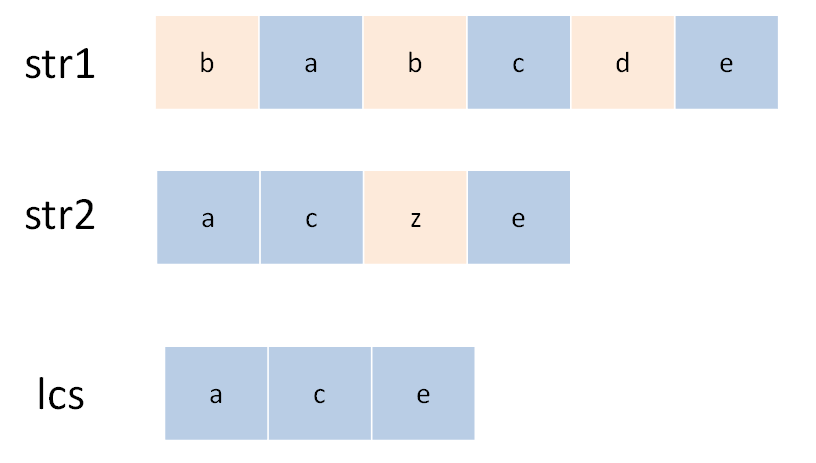

#### [1143. 最长公共子序列](https://leetcode-cn.com/problems/longest-common-subsequence/)

给定两个字符串 text1 和 text2，返回这两个字符串的最长公共子序列的长度。

一个字符串的 子序列 是指这样一个新的字符串：它是由原字符串在不改变字符的相对顺序的情况下删除某些字符（也可以不删除任何字符）后组成的新字符串。
例如，"ace" 是 "abcde" 的子序列，但 "aec" 不是 "abcde" 的子序列。两个字符串的「公共子序列」是这两个字符串所共同拥有的子序列。

若这两个字符串没有公共子序列，则返回 0。

 

```
示例 1:

输入：text1 = "abcde", text2 = "ace" 
输出：3  
解释：最长公共子序列是 "ace"，它的长度为 3。
示例 2:

输入：text1 = "abc", text2 = "abc"
输出：3
解释：最长公共子序列是 "abc"，它的长度为 3。
示例 3:

输入：text1 = "abc", text2 = "def"
输出：0
解释：两个字符串没有公共子序列，返回 0。


提示:

1 <= text1.length <= 1000
1 <= text2.length <= 1000
输入的字符串只含有小写英文字符。
```


**解题思路：**

最长公共子序列（Longest Common Subsequence，简称 LCS）是一道非常经典的面试题目，因为它的解法是典型的二维动态规划，大部分比较困难的字符串问题都和这个问题一个套路，比如说编辑距离。而且，这个算法稍加改造就可以用于解决其他问题，所以说LCS算法是值得掌握的。

所谓子序列，就是要保留原始顺序，但可以是不连续的。审题之后你可能会有疑问，这个问题为啥就是动态规划来解决呢？因为子序列类型的问题，穷举出所有可能的结果都不容易，而动态规划算法做的就是穷举 + 剪枝，它俩天生一对儿。所以可以说只要涉及子序列问题，十有八九都需要动态规划来解决。

1. **明确 dp 数组的含义**

   对于两个字符串的动态规划问题，套路是通用的。

   比如说对于字符串 s1 和 s2，它们的长度分别是 m、n，一般来说都要构造一个这样的 DP table：int[][] dp = new int[m+1][n+1]。

   这里**为什么要加1**，原因是你可以不加1，但是不加1你就会用其它限制条件来确保这个index是有效的，而当你加1之后你就不需要去判断只是让索引为0的行和列表示空串。


2. **定义 base case**
   我们专门让索引为0的行和列表示空串，dp[0][...] 和 dp[...][0] 都应该初始化为0，这就是base case。

3. **找状态转移方程**
   这是动态规划最难的一步，我们来通过案例推导出来。求 s1 和 s2 的最长公共子序列，不妨称这个子序列为 lcs。那么对于 s1 和 s2 中的每个字符，有什么选择？很简单，两种选择，要么在 lcs 中，要么不在。

   

这个「在」和「不在」就是选择，关键是，应该如何选择呢？如果某个字符应该在 lcs 中，那么这个字符肯定同时存在于 s1 和 s2 中，所以本题的思路是这样：

- 用两个指针 i 和 j 从后往前遍历 s1 和 s2，如果 s1[i]==s2[j]，那么这个字符一定在 lcs 中，去找它们前面各退一格的值加1即可：`dp[i+1][j+1] = dp[i][j] + 1;`
- 对比的这两个字符不相同的，那么我们要取它的「要么是s1往前退一格，要么是s2往前退一格，两个的最大值」
  dp[i + 1][j + 1] = Math.max(dp[i+1][j], dp[i][j+1]);

动态数组如下，其中d[2][4] 的含义就是：对于 `"ac"` 和 `"babc"`，它们的 LCS 长度是 2。我们最终想得到的答案应该是 `dp[3][6]`。：


代码演示：

```java
class Solution {
    public int  longestCommonSubsequence(String text1, String text2) {
        char[] s1 = text1.toCharArray();
        char[] s2 = text2.toCharArray();
        int length1 = s1.length;
        int length2 = s2.length;
        //dp[i][0] 都应该初始化为0,增加一行一列相当于空串，让base case也能使用状态转移方程
        int[][] dp = new int[length1+1][length2+1];
        for (int i = 1; i < length1 +1; i++) {
            for (int j = 1; j < length2 +1; j++) {
                //因为s1[0]为第一个字符
                if (s1[i-1] == s2[j-1]){
                    // 这边找到一个 lcs 的元素，继续往前找
                    dp[i][j] = 1+ dp[i-1][j-1];
                }else {
                    //谁能让 lcs 最长，就听谁的
                    dp[i][j] = Math.max(dp[i-1][j],dp[i][j-1]);
                }
            }
        }
        return dp[length1][length2];
    }
}
```

> 时间复杂度：O(mn),m、n分别为字符串长度；
> 空间复杂度：O(mn), 即dp数组大小。

